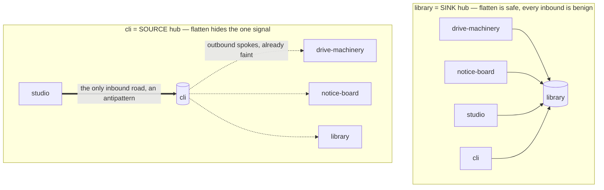

# ADR-0102: A shared island warns flagged antipattern edges instead of flattening them into benign stamps

## Status

proposed — design exploration, escalated to the owner (2026-06-25). The owner has directed that the
`cli` hub should get the shared-island treatment `library` has (off the map, rendered in the permanent
"Shared Islands" panel). This ADR does **not** relitigate that direction; it resolves the
observability gap the move creates, and asks the owner two forks (Decision §4 / §5). It resolves a
slice of the per-edge "flagged smell vs declared edge" matrix
[ADR-0074](0074-enforce-the-organism-boundary-gate-the-cross-story-dependenc.md) left open ("What this
does NOT decide"), and refines the stamp/flatten model of
[ADR-0088](0088-building-class-stories-surface-in-a-permanent-shared-islands.md) (the distributed
stamp originated in [ADR-0076](0076-forest-tree-docked-line-connections-river-trail-roads-retire.md)
§2). **No story is flipped to `render: building` until this lands** — a naive flip alone would hide
the `studio → cli` antipattern (see Context).

## Context

**The shared-island treatment de-noises a hub by REPLACING its roads with a benign stamp.** A story
tagged `render: building` (today only `library`) leaves the laid-out map and renders its full island
in the permanent left "Shared Islands" panel (ADR-0088); every island that connects to it carries a
small bookshelf **stamp** — "this island uses the shared X" — instead of drawing a road (ADR-0076 §2,
`bookshelfConsumers` / `StoryBookshelf`). The map decongests; the relationship survives as
co-location-plus-a-click.

**The whole boundary/forest system exists for observability — visibility over exemption.** ADR-0074
§1 ("every cross-package edge is rendered … **never by dropping edges**") and §2 (an "exempt the
wiring layer" recommendation was **rejected**: "hiding the most-connected nodes hides the most
architecturally important relationships"). ADR-0100 reaffirmed this for consuming **surfaces** and, in
doing so, made the **`studio → cli`** edge visible + enforced: the studio's dev server lazy-imports
`@storytree/cli/build` + `@storytree/cli/secrets` (`apps/studio/server/devApi.ts:105`) — a consuming
UI surface reaching into the CLI composition root for build/secrets plumbing. That is an
architectural antipattern we **want** rendered loudly.

**`cli` is not `library`: it is a SOURCE hub, not a SINK hub. This asymmetry is the whole problem.**

- `library` is a **sink** hub: `depends_on: []`, depended-upon by nearly every story. Its clutter is
  its many **inbound** roads, and they are uniformly **benign** ("everyone draws from the shared
  shelf"). Flattening them all into stamps loses no signal — pure de-noise.
- `cli` is a **source** hub: it depends on nearly every organism (declared provider-side on the spokes
  as `consumed_by: [cli]`), and is depended-upon by almost nothing. In today's tree forest it is
  **already an edgeless node** (its outbound spokes are drawn only faintly, in solar mode). Its
  **only inbound road is `studio → cli` — the antipattern.**

So the same flatten that is pure win for `library` does the opposite for `cli`. Resolved against the
real graph, `bookshelfConsumers({cli})` = `fullConnectionSet(cli).consumedBy` = **`{studio}` and
nothing else** — `studio` is the only story whose `depends_on` names `cli` (every other organism
declares `consumed_by: [cli]`, making it cli's *upstream*, not its consumer). A naive `render:
building` flip would drop the `studio → cli` road from the map entirely (`TreeView.tsx:688` — "the
building's inbound edges never even enter `edgeList`") and replace it with the **same** benign
bookshelf stamp every healthy consumer gets. **100% of cli's flattened inbound signal is the
antipattern** — the de-noise would erase exactly the coupling the system is built to expose. (Owner's
words: "moving it to a shared island feels like it would hide this.")

There is also a deeper modelling mismatch. The stamp model de-noises a hub's **inbound** edges
(consumers). A source hub's clutter is **outbound** (cli → spokes). So even setting the antipattern
aside, the shared-island stamp does not address cli's actual density — it mostly just removes an
already-isolated node. The de-noise benefit for `cli` is thin; the observability risk is concentrated.

## Decision

One principle, one rendering rule, and two owner forks.

### 1. The principle — de-noising removes NOISE, never SIGNAL

A shared island flattens edges into stamps to remove clutter. Clutter is noise; a **flagged
antipattern edge is signal**. Therefore: **a shared island may flatten its benign consumer edges into
bookshelf stamps, but a flagged edge is never flattened — it stays drawn as a distinct, louder
warning.** The de-noise applies to noise; a smell is never stamped away. This generalises to **any**
hub: the shared-island flatten is safe only while every flattened edge is benign. This is the
world-map application of the existing `signal-and-noise` Library principle (cut noise, keep signal) —
here the "signal" is a flagged coupling and the "de-noise" is the stamp flatten.

### 2. Edge classification — an AUTHORED smell tag (the fork is §5)

To know which edges are flagged, an edge carries a classification. Consistent with ADR-0076's
owner-chosen rule for the building tag itself — *a manual tag, decided by agents during story
writing/review, never silently derived; "the map should not silently reclassify nodes"* — the flag is
**authored** on the consumer's declaration: the `studio` story marks its `→ cli` edge a flagged
antipattern with a one-line reason. The edge shape today is a bare id (`depends_on: [cli]`,
`packages/orchestrator/src/node-spec.ts`); the exact carrier — an enriched `depends_on` entry
(`{ to: cli, flag: antipattern, reason }`) vs a parallel `flagged_edges` block — is settled in the
build, and must stay **machine-checkable** like `consumed_by`. This resolves a slice of ADR-0074's
deferred per-edge rule matrix.

### 3. The rendering rule — warn, don't stamp (survives the shared-island flatten)

`bookshelfConsumers` **excludes** any consumer whose edge to the building is flagged; that consumer is
**not** given a benign stamp. Instead the world draws a distinct **warning** for the flagged coupling
— a warned road from the consumer island to the shared-island panel card (or a warning badge + panel
cross-highlight), visually unmistakable from the bookshelf stamp (ADR-0062 one-element-per-signal: a
smell is its own art element). Net effect: shared-islanding `cli` makes `studio → cli` **more**
prominent (a standing warning), not invisible.

### 4. Owner fork — render-and-flag, or design it away?

The `studio → cli` coupling can be made honest two ways:

- **Option A — RENDER-AND-FLAG now, refactor later (recommended).** Ship §1–§3: keep the coupling,
  flag it, render it loudly, defer the structural fix. Unblocks the shared-island move for `cli`
  safely and immediately; the smell stays a visible standing warning **and** a recorded refactor
  backlog item. Matches the owner's deferral of architectural refactors in the originating
  conversation. The observability model is the primary deliverable; this option delivers it.
- **Option B — DESIGN IT AWAY (owner-gated, deferred — surfaced, not executed here).** Break the
  coupling: extract a thin shared build-drive + secrets **seam** both `studio` and `cli` depend on, so
  the studio stops reaching *into* the CLI. The build-drive already has a home — `drive-machinery`,
  which `studio` already `depends_on` — so the cli-resident piece to lift is the secrets hydration
  (`packages/cli/src/secrets.ts`, `@storytree/cli/secrets`). Then `cli` has zero flagged inbound edges
  and the shared-island move is clean, with no warning needed.

These compose: A is the observability floor (ship now); B is the real structural fix (owner-gated,
deferred). **Recommended: A now, track B as a proposal/capability.** Do not execute B in this unit —
the owner deferred refactors.

### 5. Owner fork — authored tag vs derived rule for "what is a smell"

- **Option A — authored tag (recommended).** §2 above: agent-set, frontmatter, one reason line.
  On-model with ADR-0076; no false positives; a human/agent makes the call, visible in frontmatter.
- **Option B — derived rule.** Classify structurally — e.g. "a `surface` depending on a hub organism
  for plumbing is a smell." Risk: false positives (a surface legitimately depends on organisms), and
  ADR-0076 **explicitly rejected** derivation for the building class ("never derived from degree,
  kind, tier").
- **Hybrid (available).** The authored tag is the floor; a derived heuristic may **suggest** a
  candidate smell in review but never auto-classify — preserving "the map never silently
  reclassifies."

## Consequences

- **The shared-island move for `cli` becomes safe** — it can move off the map without hiding the one
  coupling that matters, because the flagged edge is warned, not stamped. **Do not flip
  `render: building` on `cli` until §1–§3 land** (the flag-model first, or together; never the flip
  alone).
- **The gap is closed for any future hub**, not just `cli`: a shared island can never silently absorb a
  flagged edge. A natural follow-on enforcement (a later increment, not decided here): the boundary
  gate (`check:boundaries`) refuses a `render: building` story that has an inbound flagged edge with no
  warning rendering.
- **A durable guardrail** — *"de-noising a hub must never flatten a flagged antipattern edge into a
  benign stamp"* — is authored into the Library via the guidance/librarian path once this fork
  resolves. Named here, **not authored yet**: the classification mechanism is still forked (§5).
- **The de-noise benefit for `cli` is modest and honest** — it is already edgeless in the tree; its
  real density is outbound and unaddressed by the inbound-stamp model. The move is mostly
  consistency-with-`library` + a persistent panel home. Worth doing, but the honest driver is tidiness,
  not decongestion. A separate question not decided here: whether a SOURCE hub should distribute its
  icon onto its **upstreams** (the analog of `library` stamping its consumers).
- **Appearance is operator-attested** (ADR-0070): the warning marker's look (warned road vs badge,
  colour, panel cross-highlight), and the bookshelf-vs-"switchboard" metaphor mismatch for a source
  hub, are built then surfaced for the owner's nod. This ADR decides the **model**, not the pixels.

## References

- [ADR-0074](0074-enforce-the-organism-boundary-gate-the-cross-story-dependenc.md) §1/§2 (every edge
  rendered; visibility-over-exemption; the per-edge "flagged smell vs declared edge" matrix this
  resolves a slice of — "What this does NOT decide"),
  [ADR-0088](0088-building-class-stories-surface-in-a-permanent-shared-islands.md) (Shared Islands
  panel — the flatten model refined here),
  [ADR-0076](0076-forest-tree-docked-line-connections-river-trail-roads-retire.md) §2 (the distributed
  stamp + the manual-tag-never-derived precedent),
  [ADR-0100](0100-bring-consuming-surfaces-apps-and-the-public-website-subrepo.md) (brought the
  `studio → cli` edge into the graph),
  [ADR-0058](0058-cross-story-dependency-direction-the-no-cycle-rule-and-the-b.md) (cross-story
  dependency direction — sink vs source),
  [ADR-0062](0062-the-forest-world-is-the-observability-layer-rendered-one-art.md)
  (one-element-per-signal — the warning is its own art element),
  [ADR-0070](0070-frontend-as-an-inner-loop-role-the-two-stage-proof-for-visua.md) (two-stage visual
  proof — the warning's appearance is owner-attested).
- Library principles (the future guardrail will cite, not restate): `signal-and-noise` (cut noise,
  keep signal — §1 is its world-map application), `observability-first` (visibility-over-exemption).
  No existing artifact covers the de-noise-never-hides-signal rule — it is novel (librarian dedup,
  2026-06-25); it is authored into the Library once Decision §5 resolves.
- Code: `apps/studio/src/lib/buildingLayout.ts` (`bookshelfConsumers` — the flatten to refine),
  `apps/studio/src/lib/connectionSet.ts` (`fullConnectionSet` — why cli's consumer set is `{studio}`),
  `apps/studio/src/components/TreeView.tsx:688` (a building's inbound edges never enter `edgeList`),
  `apps/studio/server/devApi.ts:105` (the `studio → cli` import — `@storytree/cli/build` +
  `/secrets`), `packages/orchestrator/src/node-spec.ts` (`render` / `dependsOn` / `consumedBy` — the
  edge schema §2 extends), `stories/studio/story.md` ("Cross-story boundary" — the build+secrets
  seam), `stories/cli/story.md` (the source-hub rationale; `depends_on: []`).
- The originating owner conversation (2026-06-25): the shared-island direction is chosen; the
  observability gap is the open work; architectural refactors deferred.
