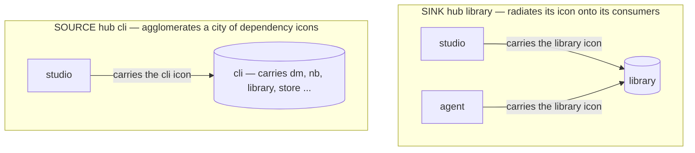

# ADR-0102: Shared islands promote their edges to per-island icon stamps (you carry the icon of what you depend on)

## Status

accepted — **owner-directed model (2026-06-25)**. The decision was reached in a design conversation:
the question was whether the `cli` hub should get the shared-island treatment `library` has, and how to
do it without hiding the `studio → cli` coupling. The owner directed this model — *each island carries
its own icon; a shared island promotes its edges to per-island icon stamps; you carry the icon of what
you depend on, so placement is the direction*. The **structural model is owner-directed and accepted**;
the **appearance** (the per-island icon art, the "city" a source hub forms, the stamp glyphs) is
operator-attested under [ADR-0070](0070-frontend-as-an-inner-loop-role-the-two-stage-proof-for-visua.md)'s
two-stage proof — geometry/behaviour red-green, the look surfaced for the owner's nod (the model does
not wait on it).

**Replaces [ADR-0088](0088-building-class-stories-surface-in-a-permanent-shared-islands.md)'s generic,
consumer-only bookshelf stamp** with per-island icon stamps in both directions (you carry the icon of
what you depend on), promoting a building's edges to those stamps rather than dropping them. ADR-0088's
off-map panel, the legend relocation (§4), and the BuildingLegend removal (§5) stand, as does
[ADR-0076](0076-forest-tree-docked-line-connections-river-trail-roads-retire.md)'s manual
`render: building` tag.

*(Currency note — amended by [ADR-0228](0228-forest-map-defaults-to-pathways-only-shared-island-hubs-retu.md)
(2026-07-22): the per-island icon stamps, the source-hub "city", and the per-nameplate identity-key glyph
are now **DEFAULT-OFF**, kept behind the `?buildings=on` escape; the studio map now defaults to
**pathways-only**, with the shared-island hubs back on the map and their dependencies drawn as ordinary
ADR-0169 trails rather than promoted to stamps. This ADR still describes the `?buildings=on` world — its
machinery is kept, not deleted. Corrected in place per
[ADR-0139](0139-the-accepted-adr-set-carries-no-stale-prose-correct-in-place.md).)*

*(History, in git: this ADR began the same session as a "flag/warn the antipattern edge" proposal. That
frame over-judged the coupling — a warning asserts an edge is wrong before a human has read it — and was
replaced by this simpler, neutral model during the owner conversation. This is the decided form.)*

## Context

**The shared-island treatment lifts a hub off the map to de-noise it.** A story tagged `render: building`
(today only `library`) *(since built out to more stories, e.g. `cli` — see the Consequences note below)*
leaves the laid-out map and renders its full island in the permanent left "Shared
Islands" panel (ADR-0088). To remove its road clutter, ADR-0088 / ADR-0076 §2 replaced every road to it
with a generic **bookshelf stamp** on each consumer ("this island uses the shared X").

That generic-stamp model has two faults this ADR corrects.

**1. It drops information — which collides with the system's whole purpose.**
[ADR-0074](0074-enforce-the-organism-boundary-gate-the-cross-story-dependenc.md) §1 says density is
handled "by de-noising visually … **never by dropping edges**," and §2 *rejected* hiding the wiring hubs
("hiding the most-connected nodes hides the most architecturally important relationships"). A *generic*
bookshelf stamp loses **which** shared island and the **direction** — it is a lossy near-drop.
[ADR-0100](0100-bring-consuming-surfaces-apps-and-the-public-website-subrepo.md) then surfaced the
**`studio → cli`** edge (the studio dev server lazy-imports `@storytree/cli/build` + `/secrets`,
`apps/studio/server/devApi.ts:105`) — a consuming surface reaching into the CLI composition root. A
generic stamp on `studio` is indistinguishable from "studio uses the shared library," hiding exactly the
coupling the boundary system exists to expose.

**2. `cli` is a SOURCE hub — the mirror of `library`.** `library` is a **sink**: `depends_on: []`,
depended-on by nearly every story; its many *inbound* edges are uniformly benign. `cli` is a **source**:
it depends on nearly every organism (declared provider-side on the spokes as `consumed_by: [cli]`) and is
depended-on by almost nothing — in the forest it is already an edgeless node, and `fullConnectionSet(cli)
.consumedBy` = **`{studio}` alone**. The old consumer-stamp model, applied to `cli`, would stamp only
`studio`, flattening 100% of cli's signal into one benign-looking badge.

**The resolution (owner-directed): per-island icons, and promote — don't drop.** Give every island its
own icon. A shared island **promotes** each incident edge to a per-island icon **stamp** — the edge is
*kept* as a low-salience badge, not deleted (honoring ADR-0074 §1). The direction rule does the rest:
**an island carries the icon of what it depends on**, so placement *is* the direction.

## Decision

### 1. Every island carries its own icon.
A per-story identity glyph. Authored/manual like the `render: building` tag (ADR-0076 — the map never
silently reclassifies); the exact art is owner-attested at build (ADR-0070).

### 2. A shared island promotes its incident edges to per-island icon stamps (promote, not drop).
When a story is `render: building`, every edge incident to it is **promoted** from a road to a stamp:
the **depended** island's icon is placed on the **depender** island. The edge is preserved as a
low-salience badge, never deleted — honoring ADR-0074 §1 ("de-noise visually, never drop edges"). This
replaces ADR-0088 / ADR-0076 §2's generic bookshelf stamp.

### 3. Direction is placement; the stamp needs no directional decoration.
*You carry the icon of what you depend on.* So the asymmetry does the work:
- a **sink** hub (`library`, depended-on by many) **radiates** — its icon spreads onto its many
  consumers; its own island stays clean;
- a **source** hub (`cli`, depends on many) **agglomerates** — it collects the icons of everything it
  depends on into a dense **"city."**

The picture tells you the hub's type at a glance — a real feature, not a side effect. Cycles are
forbidden ([ADR-0058](0058-cross-story-dependency-direction-the-no-cycle-rule-and-the-b.md)), so there are
no mutual stamps to disambiguate.

### 4. This surfaces couplings neutrally — no flag, no classification.
Because every edge promotes the same way, `studio → cli` renders as **studio carrying cli's distinct
icon** — and cli's icon is *rare* (studio is its only consumer), so it stands out. The coupling is plainly
visible; whether it is *wrong* is a human read, not a render-time verdict (observability-first: the system
surfaces, the operator judges). No "warning," no "antipattern" tag, **no per-edge classification rule** —
the per-island icon plus rarity does the surfacing. ADR-0074's deferred "per-edge flagged-smell matrix"
stays deferred; this model makes it unnecessary for shared-island rendering.

### 5. Scope: a hybrid — stamps for shared islands, roads for the rest.
Only `render: building` islands promote their edges to stamps; every other edge stays a **road**. This
keeps eye-traceable topology where it matters (the normal island-to-island graph) and de-noises only the
hubs (where roads tangle anyway). "Stamps for every edge / retire roads" is a deliberately **separate
future call**, not decided here. *(Since
[ADR-0169](0169-pathways-are-procedural-reveal-on-focus-trails-cost-field-ro.md) those roads render as
procedural cost-field trails — always drawn, with a growth animation on island arrival (the
reveal-on-focus default was retired 2026-07-07, ADR-0169 §3); the hybrid scope here stands. Noted
per [ADR-0139](0139-the-accepted-adr-set-carries-no-stale-prose-correct-in-place.md).)*

## Consequences

- **`cli` can become a shared island safely.** Its edges promote: it collects a city of its
  dependencies' icons, and `studio` carries cli's lone icon — the `studio → cli` coupling is *more*
  visible, not hidden. **Flip `cli` to `render: building` only with this model built** (per-island icons +
  the both-directions promote), never the bare flag alone.
- **The flag/warning/classification apparatus is retired** — unnecessary under uniform promotion. (This is
  what the earlier draft of this ADR proposed; it is superseded by the model above.)
- **ADR-0074 §1 is honored, not bent.** Promote-to-stamp keeps the edge (a low-salience rendering); it is
  not the edge-*dropping* §1 forbids. The earlier shared-island model (generic stamp + edges vanish) was
  the latent §1 violation this corrects.
- **One honest trade.** A stamp carries identity + direction but is **not eye-traceable** like a road (you
  can't follow cli → drive-machinery → … by tracing a line; you hop island to island). Accepted for hubs
  (roads tangle there); normal edges keep roads, so the traceable graph survives where it matters.
- **The "city" is the source-hub signal**, and its legibility (a coherent skyline vs clutter) is an
  **appearance** call, owner-attested at build (ADR-0070) — treat the *density itself* as the primary
  signal, the individual icons as secondary.
- **Replaces ADR-0088's generic consumer-only bookshelf stamp** with per-island stamps in both
  directions, and promotes (keeps as stamps) a building's edges rather than dropping them. ADR-0088's
  panel, legend move (§4), and BuildingLegend removal (§5) stand; ADR-0076's manual `render: building`
  tag stands.
- **Not built here (the build, behind a flag, one frontend unit):** every-island icons, the
  promote-on-`render:building` edge transform (both directions), the depender-carries-depended placement,
  the source-hub city, and the `cli` `render: building` flip — sequenced with the two-stage visual proof
  (geometry red-green + owner-attested appearance, ADR-0070).
  **Correction (2026-07-06 — ADR-0139 pass):** since built — `apps/studio/src/lib/buildingLayout.ts`
  implements the icon-stamp model, and `stories/cli/story.md` now also carries `render: building`.

## References

- [ADR-0074](0074-enforce-the-organism-boundary-gate-the-cross-story-dependenc.md) §1 ("de-noise visually,
  never drop edges" — the principle this honors) / §2 (visibility-over-exemption),
  [ADR-0088](0088-building-class-stories-surface-in-a-permanent-shared-islands.md) (Shared Islands panel —
  its generic-stamp model is replaced here; panel/legend/removal stand),
  [ADR-0076](0076-forest-tree-docked-line-connections-river-trail-roads-retire.md) §2 (the original
  distributed stamp + the manual-tag-never-derived precedent — the tag stands),
  [ADR-0100](0100-bring-consuming-surfaces-apps-and-the-public-website-subrepo.md) (brought the
  `studio → cli` edge into the graph),
  [ADR-0058](0058-cross-story-dependency-direction-the-no-cycle-rule-and-the-b.md) (cross-story dependency
  direction — sink vs source, and no cycles),
  [ADR-0062](0062-the-forest-world-is-the-observability-layer-rendered-one-art.md) (one-element-per-signal
  — an icon stamp is a render placement, not a new signal),
  [ADR-0070](0070-frontend-as-an-inner-loop-role-the-two-stage-proof-for-visua.md) (two-stage visual proof
  — the appearance is owner-attested).
- Library principles: `signal-and-noise` (cut noise, keep signal — promotion keeps the signal),
  `observability-first` (surface it; the operator judges, the system does not).
- Code: `apps/studio/src/lib/buildingLayout.ts` (`bookshelfConsumers` → a both-directions per-island
  promote), `apps/studio/src/lib/connectionSet.ts` (`fullConnectionSet` already yields both directions),
  `apps/studio/src/components/TreeView.tsx` (`buildWorld` edge partition + stamp render),
  `apps/studio/server/devApi.ts:105` (the `studio → cli` import), `stories/cli/story.md` /
  `stories/studio/story.md` (the source-hub + the build/secrets seam).
- The originating owner conversation (2026-06-25): the shared-island direction, the source/sink asymmetry,
  the "promote not drop" reconciliation, the per-island-icon + city model, and the hybrid scope.
