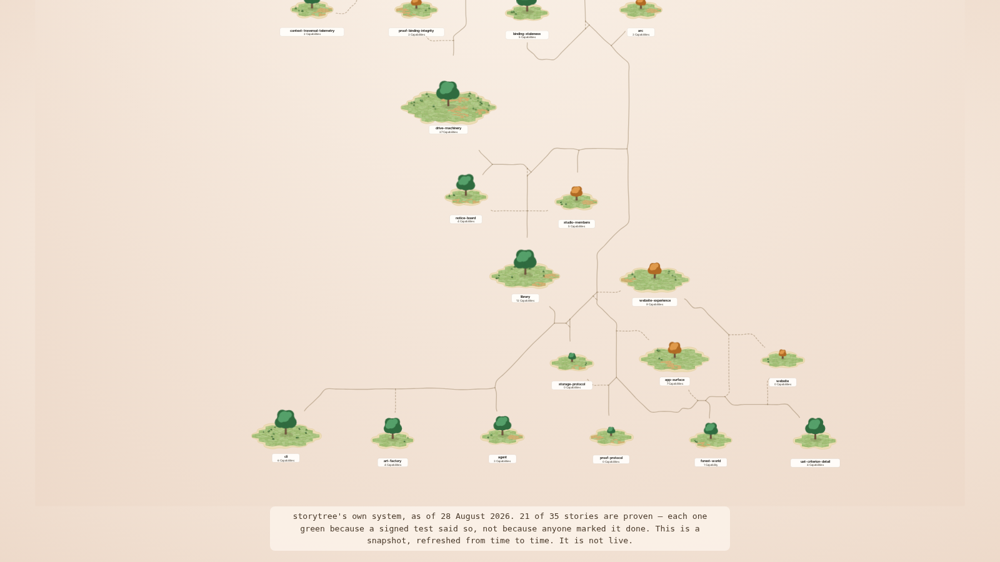

# GROW — the visitor lands on the real forest, 2026-08-28

The record for `website-refresh-arc-arrival`: what chapter 2 opens on now, and what it opened on
before.

## The picture



Captured at 1600x900 from the **built site** (`npm run build` → `npx serve dist`), driven through the
real seam: the page's own dynamically-imported `inflection` chunk, calling `mountForestLand` on
`#storm-land-canvas` exactly as `act1-storm`'s transform does. The storm's own chrome is hidden in
the capture because the synthetic mount skips the transform that would have hidden it; nothing else
is staged.

## What changed

| | before | after |
| --- | --- | --- |
| the forest | a scripted three-story demo laid out at build time | storytree's real 35-story corpus, stamped |
| the framing | pulled back to `full-forest` at the walk's last beat | the designed resting view (ADR-0471) |
| who drives | a terminal-agent narrator, one reply chip per step | the visitor — drag to pan, scroll to zoom |
| client JS | the walk + the guide + `zod` | **~24 KB total**, two chunks, no `zod`, no `three` |

Delivered at 1600x900: **scale 0.459 px/world unit, median island 90 px**, showing 93% of the
forest's width and 49% of its height. The fitted view the walk used to terminate at delivers a
**44 px** island on the same frame.

The island lands at 90 px rather than the composition's ~100 px because the snapshot stamp is docked
across the bottom and the frame reserves room for it — an island behind the stamp is not on screen,
so the composition is measured against the frame minus its chrome. Same reasoning, and the same
mechanism, as the studio map's `paddingBottom` for its terminal dock.

## How it is built

The map is **serialised at build time** by `index.astro`'s frontmatter (`forestArrivalSvg`) into
`#storm-land-canvas`, from the same `src/data/forest-snapshot.json` that `/forest/` renders. The
client module `forest-arrival.ts` only sets the `viewBox` and wires two gestures. Consequences worth
knowing:

- **The framing is not the website's decision.** It comes from `restingFrame` in the shared render
  core — the same rule the studio app opens on, synced by `pnpm sync:web-engine`. The app and the
  site showing one forest at two compositions would make the site's picture a marketing choice
  rather than a reading of the system.
- **The served markup is the whole world.** The `viewBox` in the HTML is `0 0 3238 4005`; the crop is
  applied by script. If the script never runs, the visitor gets the entire forest as a static
  picture — a worse composition, never a blank screen. The crop is an enhancement, not a
  prerequisite.
- **The stamp is in the markup, not painted by script**, for the same reason: an undated map is the
  one way the snapshot backfires, and `signals-must-be-real` is the site's own principle.

## ⚠ A live hazard this landing did NOT fix, written down rather than left to be discovered

`check:web-experience-closure` (ADR-0336) forbids any specifier with `forest-world-r3f` as a path
segment anywhere in the entry page's static import closure. `index.astro` now statically imports
`forest-snapshot-map`, which reaches `act2-walkthrough` for its disc geometry, which imports
`../lib/forest-world-r3f/act2-director`. **That chain is real and the rung passes anyway**, because
its `STATIC_IMPORT_RE` excludes newlines and therefore cannot see multi-line
`import { … } from '…'` statements — which is how that import happens to be written, and which is
the dominant import style in this repo.

So the rung is green for a reason that has nothing to do with the property it is asserting, and
**reflowing an unrelated import in `act2-walkthrough.ts` onto one line would red the gate while
naming this page.** Two things are separately true and should not be confused:

- **The property that matters HOLDS, measured.** Astro frontmatter runs at build time. The built
  client payload for the page is ~24 KB across two chunks, with no `zod`, no `act2-director` and no
  `three` in either. Nothing about this ships WebGL to a browser.
- **The guard on it is blind here.** That is a defect in the check, not in the wiring.

The dependency predates this change — `/forest/` has imported the same chain since the snapshot
landed. What is new is that it is now in the ENTRY page's closure. Breaking it properly means
lifting `buildDisc`/`escXml` out of `act2-walkthrough` into their own module, which is a sizeable
edit to a file `website-refresh-arc-pitch-overlays` is about to retire anyway — so it was
deliberately left, and is recorded here and in `index.astro`'s own frontmatter comment.

## Reproducing

```
cd web && npm run build && npx serve dist -l 4321
```
Then open `http://localhost:4321/`, take chapter 1's transform, and drag. The `viewBox` on
`svg.forest-arrival-svg` is the framing; `0 0 3238 4005` means the client module has not run.

## What this increment deliberately did NOT do

- **It did not retire the narrator.** `act2-orchestrator` and `act2-walkthrough` are no longer
  mounted, but both are left in the tree. The sequencer is a good declarative state machine and only
  its VOICE is rejected; deciding what survives is TELL's job
  (`website-refresh-arc-pitch-overlays`), and deleting them here would make that decision by
  accident.
- **It did not change `/forest/`.** That page is a poster in a scrolling document with no viewport
  and no pan, and a crop is only honest where the rest is reachable. Its argument is the whole system
  at once.
- **Chapter 2 is currently the forest and nothing else.** That is the increment's stated intent —
  the forest on screen, honest and pannable, before any overlay work begins and independently of
  whether it lands — but it does mean the site says less than it did until TELL arrives.
