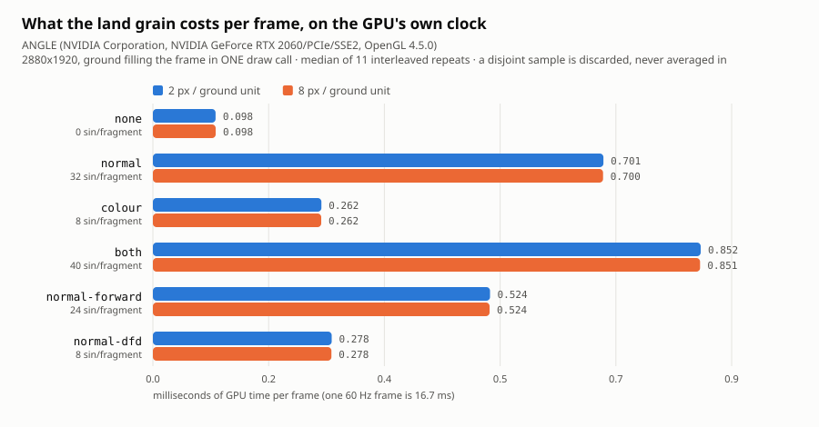

# The grain octave costs 4.5% of a frame — and `gl.finish()` was never measuring the GPU. 2026-08-28

Increment `cost-the-grain-octave-on-the-gpu-clock` on `adopt-the-land-into-the-shipped-map-arc`,
answering end-state item 2's frame-cost half.

**THE ANSWER, first.** On an RTX 2060, with the ground filling a 2880x1920 frame in **one draw
call**, the grain octave's full treatment (`both` halves) costs **+0.75 ms per frame — 4.5% of a
60 Hz frame, 8.7x the ungrained control**. The palette-closed `normal` half alone costs
**+0.60 ms (3.6%)**. Every arm RESOLVED — none of them is hiding under a noise floor — and the
two zooms agree to within 0.0011 ms. **The grain is affordable.** It is also not free, and it is
now the first component of this land treatment with a number on it.

**AND A SECOND RESULT, which invalidates numbers already committed elsewhere.** The standing
suspicion that `gl.finish()` does not block until the GPU retires the work is **ESTABLISHED**, on
12 of 12 configurations, by margins of **29x to 255x**. The wall-clock route this project has used
for every frame figure it has ever published reports **0.0033 ms/frame** for work the GPU's own
clock times at 0.098–0.85 ms. See §4 and §5 — the fill-rate arithmetic alone is conclusive.

| | |
|---|---|
| **measurement integrity** | **SOUND** — GPU clock available and undisturbed; **132/132 samples kept, 0 disjoint** |
| **frame budget** | **PASS** at both zooms — the dearest configuration spends 5.1% of a 60 Hz frame |
| **`gl.finish()` hypothesis** | **ESTABLISHED** — 12/12 configurations, ratio 29.3x–255.2x |
| **renderer** | `ANGLE (NVIDIA Corporation, NVIDIA GeForce RTX 2060/PCIe/SSE2, OpenGL 4.5.0)` |
| **vendor** | `Google Inc. (NVIDIA Corporation)` |
| **`EXT_disjoint_timer_query_webgl2`** | available |

Raw: [`frame-cost.json`](frame-cost.json) · picture: [`frame-cost.svg`](frame-cost.svg)



---

## 1. The table

Median of **11 interleaved repeats**, 30 renders per timed batch, 2880x1920, ground covering
**100.0%** of the frame in **1 draw call / 2 triangles**. Every cost is stated against the `none`
arm **measured in the same run** — never against a committed figure.

### 2 px / ground unit — the overview

| variant | sin/fragment | GPU ms/frame | spread | % of a 60 Hz frame | cost vs `none` | resolved? |
|---|---:|---:|---:|---:|---|---|
| `none` (control) | 0 | 0.098 | 0.015 | 0.59% | — | baseline |
| `colour` half | 8 | 0.262 | 0.032 | 1.57% | **+0.164 ms** · 2.69x | RESOLVED |
| `normal` half | 32 | 0.701 | 0.088 | 4.20% | **+0.603 ms** · 7.18x | RESOLVED |
| `both` halves | 40 | 0.852 | 0.155 | 5.11% | **+0.754 ms** · 8.73x | RESOLVED |
| `normal-forward` † | 24 | 0.524 | 0.096 | 3.15% | **+0.427 ms** · 5.38x | RESOLVED |
| `normal-dfd` † | 8 | 0.278 | 0.051 | 1.67% | **+0.181 ms** · 2.85x | RESOLVED |

### 8 px / ground unit — the zoom the owner singled out

| variant | sin/fragment | GPU ms/frame | spread | % of a 60 Hz frame | cost vs `none` | resolved? |
|---|---:|---:|---:|---:|---|---|
| `none` (control) | 0 | 0.098 | 0.017 | 0.59% | — | baseline |
| `colour` half | 8 | 0.262 | 0.036 | 1.57% | **+0.164 ms** · 2.68x | RESOLVED |
| `normal` half | 32 | 0.700 | 0.099 | 4.20% | **+0.602 ms** · 7.17x | RESOLVED |
| `both` halves | 40 | 0.851 | 0.109 | 5.10% | **+0.753 ms** · 8.72x | RESOLVED |
| `normal-forward` † | 24 | 0.524 | 0.066 | 3.14% | **+0.426 ms** · 5.36x | RESOLVED |
| `normal-dfd` † | 8 | 0.278 | 0.034 | 1.66% | **+0.180 ms** · 2.84x | RESOLVED |

† the two untried reductions on the normal half — §6. `normal-dfd` is **not**
appearance-equivalent and is costed, not proposed.

**THE ZOOM MAKES NO DIFFERENCE, AND THAT IS A FINDING RATHER THAN A NULL.** The largest
difference between the two tables is **0.0011 ms**, roughly two orders of magnitude below either row's
spread. It is what the mechanism predicts: the grain is sampled in **world** coordinates
(`vWorld.xz`), so at a fixed buffer size both zooms shade the same fragments and only the field's
sampling density changes. So there is no zoom-dependent cliff to design around — **the grain's
cost is per-fragment and per-frame, and the only lever on it is how much of the frame the land
covers.**

**WHAT A SHIPPED MAP WOULD PAY.** These figures are for ground covering **100%** of the frame,
which is the maximum-sensitivity configuration and not the delivered one. The land covers roughly
**two thirds** of a real frame, so the delivered cost scales to about **0.50 ms** for `both` and
**0.40 ms** for `normal` — a linear scaling of a per-fragment cost, which is the right shape here
and is stated as an estimate rather than measured.

## 2. Why a new instrument was needed at all

`harness/hardware-floor.*` already measures frame time. It **cannot cost a shader**, and it does
not say so — it returns a plausible number. Measured 2026-08-27, varying one thing per run:

| configuration | draw calls | median |
|---|---:|---:|
| 171 plants, 2880x1920 | 172 | 0.76 ms |
| 171 plants, **5760x3840** (4x the fragments) | 172 | 0.62 ms |
| **0 plants**, 2880x1920 | **1** | **0.02 ms** |

Quadrupling the FRAGMENTS moved it 0%; removing the PLANTS dropped it 97%. That scene draws one
call per plant, so submission dominates and any fragment-stage change is invisible underneath it.
Its grain A/B reported "below the noise floor" — indistinguishable from the `grain` option never
reaching the material.

**This scene is the opposite shape**: one ground quad, one draw call, two triangles, filling the
frame. The ground's fragment stage is the only substantial term, which is what makes an A/B on it
mean anything.

## 3. The measurement, and what it refuses

`harness/frame-cost.ts` (pure, 29 tests) · `harness/frame-cost-scene.ts` (the scene, 13 tests) ·
`harness/frame-cost.html` · `harness/frame-cost-measure.mjs` (thin driver).

It reuses `frame-budget.ts`'s three-verdict vocabulary rather than re-inventing it — **PASS /
FAIL / UNVERIFIED, where UNVERIFIED is a verdict about the MEASUREMENT and outranks a fail** — and
adds the four refusals a GPU clock needs:

- **A DISJOINT SAMPLE IS DISCARDED, NEVER AVERAGED IN.** `GPU_DISJOINT_EXT` is the driver saying
  the elapsed figure is *garbage*, not merely noisy. The **whole** sample goes, wall half
  included: the two routes are compared against each other, so keeping the undisturbed half of a
  disturbed sample would bias exactly the comparison at issue. *(This run discarded none —
  132/132 kept.)*
- **TOO FEW SURVIVORS IS UNVERIFIED, AND THE BAR IS ARITHMETIC RATHER THAN A TOLERANCE.** `spread`
  is zero below two samples, so a row down to one accepted reading would report a **zero noise
  floor** and classify every delta RESOLVED — the instrument would get more confident as the
  measurement got worse. Three is the first count at which a range is a statement about the run.
  A row whose survivors are a **minority** of its attempts is also UNVERIFIED: what is left is the
  subset the GPU's own interruptions spared, which is not a random subsample. *The test of an
  honest bar is where a number picked to PASS would have sat — at 1, accept whatever came back.*
- **A SOFTWARE RASTERISER OR AN ABSENT EXTENSION REFUSES THE RUN.** Every browser figure this
  project published before 2026-08-27 came off SwiftShader and no report said so. For a timing
  those numbers are not merely unattributed, they are meaningless. `DISPLAY=:0` must be in the
  environment **even headless** — without it the GPU flags fall back to SwiftShader silently, as
  does `--use-gl=egl`.
- **THE ARMS MUST NOT BE SECRETLY THE SAME SCENE.** `frame-cost-scene.test.ts` proves every
  variant compiles a fragment source different from the control **and pairwise different from
  every other variant**, that each calls the half it names and only that half, that the geometry
  and ramp length are identical, and that the projection does not move. An A/B whose arms
  collapse always reports "no measurable difference" with the calm authority of a real
  measurement.

Two more non-vacuity checks run at measurement time and REFUSE rather than warn: the scene must
submit **exactly one draw call**, and the ground must cover **100% of the frame** — read back off
an actually-cleared buffer, so the check does not depend on colour management still doing what it
was asked. A frame 60% covered would report 60% of the cost with nothing able to say so.

**Repeats are INTERLEAVED round-robin**, asserted by the driver, never grouped. A GPU drifts over
a run, so grouping aliases the drift onto the variable and whichever arm went last always looks
dearest. The first version of the older A/B took one sample per arm and published `both halves`
as **21% FASTER while doing strictly more work.**

## 4. The numbers check out against two independent arithmetics

**Against the shader's own `sin` count.** One grain field evaluation is 2 octaves x 4 corners = 8
`sin` calls. Dividing each arm's measured delta by its `sin` count:

| variant | sin/fragment | delta ms | ms per sin/fragment |
|---|---:|---:|---:|
| `colour` | 8 | 0.164 | 0.0206 |
| `normal-forward` | 24 | 0.427 | 0.0178 |
| `normal` | 32 | 0.603 | 0.0188 |
| `both` | 40 | 0.754 | 0.0189 |

Four arms spanning a 5x range in workload land within **±8%** of a single per-`sin` cost.
(`normal-dfd` is left out of this table on purpose — at 0.0226 it is the one arm whose cost is
not only `sin` calls, because the screen-space derivatives carry their own.) The
measured deltas track fragment ALU work almost exactly, which is what a fragment-bound instrument
should produce and what the draw-call-bound one could not.

**Against the card's fill rate.** 2880x1920 is 5,529,600 fragments per frame. The control's GPU
clock of 0.098 ms implies **56.7 Gfragment/s** — about 70% of an RTX 2060's theoretical 80.6
Gpixel/s ROP peak, i.e. plausible for a trivial shader. The **wall clock**'s 0.0033 ms for the
same frame implies **1,659 Gfragment/s**, roughly **21x the card's theoretical maximum.** That is
not a fast measurement, it is not a measurement.

## 5. `gl.finish()` — the hypothesis is ESTABLISHED

The same batch, on the same scene, at the same moment, timed both ways:

| configuration | GPU clock ms | wall clock around `gl.finish()` ms | ratio |
|---|---:|---:|---:|
| `none` @ 2px | 0.098 | 0.0033 | **29.3x** |
| `colour` @ 2px | 0.262 | 0.0033 | **78.6x** |
| `normal` @ 2px | 0.701 | 0.0033 | **210.2x** |
| `both` @ 2px | 0.852 | 0.0067 | **127.8x** |
| `none` @ 8px | 0.098 | 0.0033 | **29.3x** |
| `colour` @ 8px | 0.262 | 0.0033 | **78.5x** |
| `normal` @ 8px | 0.700 | 0.0033 | **210.0x** |
| `both` @ 8px | 0.851 | 0.0033 | **255.2x** |

12 of 12 configurations ESTABLISHED — the bar being an **order of magnitude**, which is the bar
the hypothesis was stated at rather than one chosen here, and the agreement band being read off
each configuration's own in-run spread rather than committed.

**`gl.finish()` returns before the GPU has retired the work.** Every figure this project has taken
through that route is timing CPU submission. Note the tell: the wall-clock median is **0.0033 ms
for every arm**, including the one doing 40 `sin` calls per fragment over 5.5M fragments — the
route is blind to a 8.7x change in GPU work.

**AND HERE IS THE COST OF THAT, RUN AS A VERDICT RATHER THAN ALLEGED.** The report scores the
*identical accepted samples* through both routes. The GPU clock resolves **all five** non-control
arms at both zooms. The wall clock resolves **none** — every arm comes back `BELOW_NOISE` with an
identical 0.0033 ms median, and prints a green PASS while saying it cannot state what anything
costs. Same run, same samples, same arithmetic; only the clock differs.

**WHAT THIS INVALIDATES.** Any frame figure derived from the `gl.finish()` batch route — including
`hardware-floor.mjs`'s committed "28x headroom at the island" and "one frame at ~6,044 plants" —
is a submission-time figure and should not be quoted as GPU cost. Correcting those is not this
increment's scope; naming them is.

## 6. The two untried reductions, now costed

Both were named as open in the grain-crossing record. Both are built here as narrow, asserted
surgery on the generated gradient function — the material every other panel compiles is untouched.

- **Forward difference** (3 field evaluations instead of 4): **0.524 ms vs 0.700 ms**, saving
  **0.176 ms** — a **25.2%** cut of the normal half, against a predicted 25%. The sample point
  shifts by half a step, so the delivered bump is offset rather than changed in kind.
- **Screen-space derivatives** `dFdx`/`dFdy` (1 evaluation): **0.278 ms**, saving **0.422 ms** —
  a **60.3%** cut. ⚠ **NOT APPEARANCE-EQUIVALENT.** The authored gradient steps a quarter
  wavelength and measures the slope of the *feature*; `dFdx` measures it across one screen pixel,
  so the delivered bump changes with the zoom. It is costed to answer "what would the cheap route
  buy", not proposed. It also lands at 0.278 ms against `colour`'s 0.262 ms for the same 8 `sin`
  calls, which is the arithmetic agreeing with itself again.

**Neither is needed on this evidence.** `both` at 5.1% of a frame is affordable; the reductions
are a lever held in reserve for when the other five components of the treatment are added.

## 7. What is NOT claimed

- **This is ONE renderer's timing.** An RTX 2060 through ANGLE-on-OpenGL. The grain's *picture* is
  already known to be renderer-specific (24.5% of grained pixels land on a different ladder rung
  between SwiftShader and this card); its *cost* will vary at least as much on an integrated part.
  The instrument travels; the numbers do not.
- **This is the GRAIN, not the land treatment.** The other five components are unbuilt in the
  live renderer. Nothing here bounds their cost.
- **This is BARE GROUND.** No plants, no props, no relief, no shadow, no terracing — deliberately,
  because that is what isolates the fragment stage. It is not a whole-map frame time, and the
  draw-call cost of a real map is exactly what this scene removes.
- **The 2/3-of-frame delivered estimate in §1 is an estimate**, a linear scaling of a
  per-fragment cost, not a measurement of a shipped frame.
- **The box was not idle.** A sibling session held its own worktree on this machine during the
  run. Interleaving is what makes that survivable, and the spreads (0.015–0.155 ms) are what it
  cost; every reported delta clears its own spread by 4x or more.

## 8. Reproducing it

```
pnpm --filter @storytree/forest-world-r3f exec vite harness --port 5217 --strictPort
DISPLAY=:0 ST_FRAME_URL=http://localhost:5217/frame-cost.html \
  ST_FRAME_REPEATS=11 ST_FRAME_BATCH=30 ST_FRAME_REDUCTIONS=1 \
  pnpm --filter @storytree/forest-world-r3f measure-frame
```

Knobs: `ST_FRAME_ZOOMS` (default `2,8`) · `ST_FRAME_WIDTH` / `ST_FRAME_HEIGHT` (default the
ADR-0380 D2 buffer) · `ST_FRAME_OUT`. The driver **refuses** port 5184 (every worktree shares it),
verifies the served page's own `<title>` before trusting a reading, and exits non-zero on
UNVERIFIED.

⚠ Unlike `capture.mjs` and `hardware-floor.mjs`, this driver writes **only** into its own
`ST_FRAME_OUT` directory and rewrites no committed evidence anywhere else. `git status` after a
run regardless.

**IT REPRODUCES.** The whole sweep was run twice, minutes apart, on the same box with the same
sibling session working beside it. Every one of the twelve medians came back within **0.0011 ms**
of the committed figure — two orders of magnitude inside its own spread — with the same SOUND
integrity, the same twelve RESOLVED verdicts, the same ESTABLISHED cross-check and zero disjoint
samples in either run. That matters because the older A/B on this arc produced two readings of an
*identical* configuration differing by **43%**; a run that cannot be repeated is not a
measurement, and this one was checked rather than assumed.
