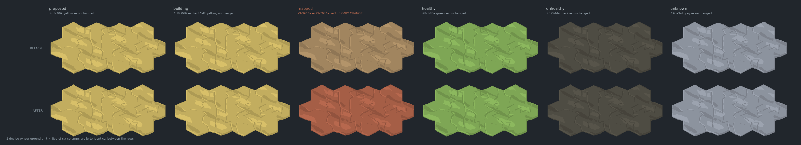

# A tilled clay in place of the tan — the land's last colour clash, closed

**2026-08-28 · increment `pull-the-four-land-colours-apart-in-hue` on
`adopt-the-land-into-the-shipped-map-arc` · ADR-0470**

**Taken on an NVIDIA GeForce RTX 2060**
(`ANGLE (NVIDIA Corporation, NVIDIA GeForce RTX 2060/PCIe/SSE2, OpenGL 4.5.0)`, hardware, not
SwiftShader — the driver refuses if `ST_CLAY_GPU=1` and the context comes up on a software
rasteriser).

> Read `chapter2-hue-frontier-2026-08-28/` first — it is the search that picked this colour and did
> not apply it. This directory is the application, and the re-measurement of everything it moved.

---

## 0. The headline

**The land no longer misreports at any lighting step.** `mapped`'s ground family stops being a warm
tan and becomes a tilled clay, and that is the whole change:

| | was | is |
|---|---|---|
| `--hex-top-0` | `#b3946a` | `#b7684e` |
| `--hex-top-1` | `#a68557` | `#a95539` |
| `--hex-top-2` | `#bda278` | `#c1795e` |
| `--hex-side` | `#85683f` | `#883d24` |



*(the same sheet at 8 px/unit is `clay-combined-8px.png` — a whole island per panel at delivered
size, nothing resampled, nothing cropped)*

Five of the six columns are **byte-identical between the two rows**, and the driver refuses the
whole run if they are not. That is what makes this a comparison of one thing rather than a picture
of two different scenes.

| | before | after |
|---|---|---|
| delivered pixels reading as the wrong colour | `yellow@0.78→brown`, `yellow@0.8→brown` | **none** |
| tightest colour pair, against its own bar | **yellow/brown 0.395x** | yellow/green 1.134x |
| pairs under their bar | 1 | **0** |
| the weakest link between two distinct colours | 8.27 | **23.72** |
| `SHADOW_RUNG` (derived, never typed) | 0.81 | **0.77** |

### ⚠ On the owner's own instrument, this change is currently INVISIBLE — and that is a fact about the corpus, not the change

The studio's live 2D map was captured before and after, at two zooms, same camera transform to the
digit (`studio/`). The two arms come back **colour-identical**. The reason is not a capture failure
and it was verified two ways (a DOM query over `.hex-territory` and the raw `/api/tree` payload):

> **No story in the live corpus has `mapped` status.** 46 stories: 35 `proposed`, 11 `retired`.
> Folded onto the map that paints 21 islands green and 14 amber, and **zero brown**. `mapped` is
> reserved for genuine inherited-brownfield provenance (ADR-0395 — only an AUTHORED `mapped` falls
> through to brown), and nothing today is authored that way.

So the four live-map screenshots prove the rule is *unreachable by today's corpus*, not what the
colour looks like in place. What DOES exercise it is the studio's own shipped
`?semanticGrowth=demo` witness stage, whose second frame is explicitly "the plot is claimed
(`mapped` ground)" — `studio/studio-2d-{before,after}-demo-land.png` is a real before/after of the
new colour on the shipped 2D renderer. A `mapped`-next-to-`proposed` adjacency does not exist in
the data and was not invented.

One further honest note: a small pulsing claim-wisp marker differs by an animation phase between
the two live-map arms (bounding-boxed, ~9x11 px and ~23x37 px). It is an infinite CSS loop that the
settle signal deliberately does not block on. Nothing else differs.

---

## 1. How many transcriptions of this palette are there? THREE, and they are not peers

The increment asked this explicitly, because a colour applied in one place and not the others is
worse than not applying it. The answer:

| # | where | what it is | moved here? |
|---|---|---|---|
| 1 | `apps/studio/src/index.css` `.hex-territory.st-<status>` | **canonical** — the authoring surface, and what the studio's 2D map actually renders | **yes** |
| 2 | `packages/forest-world-r3f/harness/palette-band.ts` `STATUS_TOKENS` | a declared transcription of (1); its own comment names (1) as its source of truth | **yes** |
| 3 | `packages/forest-world-r3f/src/ForestWorldCanvas.tsx` `STATUS_COLOUR` | a **third, independent SPIKE palette** that agrees with neither on any of its six values | **no — deliberately** |

**(3) is not a stale transcription that a sweep could fix**, and the reason is worth stating rather
than filed as a to-do. The same lookup colours the story tree's **crown** as well as the ground, and
the ground and crown token sets legitimately disagree for `building` (the app authors no
`--crown-building-*` pair, so a building crown falls through to `unknown`'s grey while its ground
wears `proposed`'s yellow). A uniform six-hex swap would therefore be right for the ground and
wrong for the crown. It is also still pre-ADR-0462 — it is the only one of the three that still
paints `building` a distinct blue-purple. Bringing it into the vocabulary is its own unit, and
editing that file obliges a `web` submodule landing. ADR-0470 D6.

**Two further tables exist and are NOT transcriptions.** `status-vocabulary.ts` holds
`LEGACY_STATUS_TOKENS` (pre-ADR-0462) and now `ADR0462_STATUS_TOKENS` (pre-clay). They are frozen
history: never reconciled, never updated, and a later palette change must not touch them. See §4.

**And two SIBLING palettes for the same status, which are not the land's** — the tree crown
(`--crown-mapped-lo/hi`) and the tree-card strip (`--st-mapped`). They did not move, and measured,
they did not need to: `--crown-mapped-lo` `#7d5f3b` sat **52.7** from the tan and sits **33.1** from
the clay, so the land and the crown of a `mapped` story read as one family for the first time. The
dirt-lane `--trail-bed` `#c2a677` went the other way — **16.7** from the tan, **49.9** from the clay
— which is also a gain, because a trail crossing `mapped` ground used to be close to the colour of
the ground it crossed. Both figures corrected in place in `index.css`, which had claimed the tan was
"kin to the dirt-lane family".

---

## 2. Proving the instrument can fail

Two instruments on this arc were found within the last week to be **structurally incapable of
failing** — one compared a hand-copied duplicate of its own subject, one timed the wrong thing. So
the separation floor built here is held to refusing something real before its pass is worth
anything.

`status-vocabulary.ts` gains `vocabularySeparation(tokens, vocab)` — one call, a pass/fail on two
conditions that do not imply each other (no pair under its own bar, no delivered pixel reading as
another colour). Run against **the palette that shipped the day before**, it refuses:

```
separation floor: BEFORE REFUSED · AFTER pass
  BEFORE  tightest yellow/brown 0.395x · under: yellow/brown · 2 foreign reads
  AFTER   tightest yellow/green 1.134x · under: none          · 0 foreign reads
```

That refusal is asserted as a test beside the pass (`status-vocabulary.test.ts`, *"⚠ THE SEPARATION
CHECK CAN FAIL"*), and `clay-measure.mjs` fails the whole run if the pre-change palette ever starts
passing. It is a **real** pre-change palette, not a synthetic bad case — which is the difference
between showing an instrument works and showing it can be made to say no.

⚠ **It ranks pairs by RATIO, never by distance.** `colourPairs` sorts by distance, so its first row
reads like "the worst pair" and is not: every pair is read against its own bar, and a large distance
under a large bar is tighter than a small distance under a small one. That error once produced 1,196
spurious clearing candidates. A test exhibits an actual inversion in today's table rather than
restating the rule.

---

## 3. The eighteen findings, re-measured

⚠ **The list was not enumerated anywhere.** PR #1685 counted "18 pinned findings across
`shadow-ladder.test.ts`, `status-vocabulary.test.ts` and `ground-cover`" without naming them, so
this table was derived the only honest way available: apply the change, run the suite, and read
every assertion and every docstring figure that moved. It came to **eighteen**, across four files
rather than three — `hue-frontier.test.ts` moved too. Whether it is the same eighteen cannot be
established and is not claimed.

**CONFIRMED** = the finding holds unchanged · **MOVED** = still true, different number ·
**INVALIDATED** = no longer true, corrected in place with the reason kept.

| # | finding | file | verdict |
|---|---|---|---|
| 1 | the shipped ladder is inadmissible before any shadow exists — `proposed@0.78`, `@0.8` read as `mapped` | `shadow-ladder.test.ts:139` | **INVALIDATED** — 2 → **0**. Title and body rewritten; the pre-clay arm is frozen so five → two → none stays measurable |
| 2 | `SHADOW_RUNG` = 0.81, derived on import | `shadow-ladder.test.ts:200` | **MOVED** — **0.77**. Nothing retuned; the rung is derived and the palette under it moved |
| 3 | the binding status is `proposed` | `shadow-ladder.test.ts:200` | **CONFIRMED** — still `proposed`; only the depth it can fall to changed |
| 4 | per-status ceilings spread 1.25x, so ONE ladder binds hard | `shadow-ladder.test.ts:234` | **MOVED** — 0.63 … 0.774, spread **1.23x**. Every ceiling moved down; the one-ladder argument is unchanged |
| 5 | the shadow costs exactly one palette entry per land token | `shadow-ladder.test.ts:283` | **INVALIDATED** — 56 tokens now buy **55** entries. See §5 |
| 6 | closure 224 lit / 280 shadowed | `shadow-ladder.test.ts:283` | **MOVED** — 224 lit (unchanged) / **279** shadowed |
| 7 | a shadow may darken rungs `[2, 3]` — relief's own dark faces sit below it | `shadow-ladder.test.ts:351` | **MOVED** — **`[0, 1, 2, 3]`**. The shadow rung is now below every authored level, so a shadow darkens anything it falls on. A real visual change; see §5 |
| 8 | membership and the reader model DISAGREE — `statusFamilyOf` is vacuous, the reader calls 2 pairs foreign | `shadow-ladder.test.ts:369` | **MOVED** — live disagreement is **0**; the demonstration is re-pointed at the frozen palette, where it still fires. The lesson outlives the collision |
| 9 | `robustlyInadmissible` — the verdicts no reference set can argue away — holds one entry | `shadow-ladder.test.ts:444` | **MOVED** — **empty**. Guarded by re-running the same call on the frozen palette, because an empty list is also what a broken instrument returns |
| 10 | **all six status pairs overlap in delivered luminance**, so hue is what separates them | `shadow-ladder.test.ts:489` | **INVALIDATED** — **three** overlap. `mapped` spans 97.4–124.8 against `healthy`'s floor of 125.7 and clears all three on luminance alone. ⚠ the margin is **0.9 luma** — a fact about today's tokens, not a property to build on |
| 11 | the naive grey `#808763` clears grey/black and fails elsewhere — 4 foreign reads | `status-vocabulary.test.ts:114` | **MOVED** — 4 (frozen arm) → **1** live (`green@0.78→grey`). Same lesson: check a candidate against the whole vocabulary, not the pair it was aimed at |
| 12 | ADR-0462 left exactly two cross-colour misreads | `status-vocabulary.test.ts:172` | **CONFIRMED** on the frozen arm; **live is 0**. Six → two → none |
| 13 | the worst pair of distinct colours is 8.27, `brown`/`yellow` | `status-vocabulary.test.ts:200` | **MOVED** — **23.72**, `green`/`yellow`. Brown left the bottom slot, which is the rule the colour was picked by |
| 14 | one pair sits under the lighting-step bar | `status-vocabulary.test.ts:200` | **MOVED** — **zero** |
| 15 | the frozen legacy table differs from live in exactly `building` and `unknown` | `status-vocabulary.test.ts:233` | **MOVED** — **three** now, `+ mapped`. The list is what makes the frozen table a record rather than a copy |
| 16 | the worst two DIFFERENT statuses sit 14.23 apart (`proposed`/`mapped`) | `ground-cover.test.ts:113` | **MOVED** — **24.58**, `healthy`/`unknown`. 3.33 → 14.23 → 24.58 |
| 17 | `yellowGrass` at 13.62 is safe against the map's own worst meaningful difference | `ground-cover.ts` `YELLOW_GRASS` | **MOVED** — the inversion deepens. The grass has not moved; the denominator has, twice, and 13.62 is now a little over **half** of 24.58. See §6 |
| 18 | the search's prediction: after the swap, tightest = `yellow/green` at 1.134x, zero foreign reads | `hue-frontier.test.ts` | **CONFIRMED** exactly, now asserted against the LIVE table rather than only against the sweep |

---

## 4. A second frozen palette, and why a SEARCH is evidence too

ADR-0462's closing finding was that **any evidence a metric is the metric must be pinned to the data
it was recorded against**, or the first change to that data destroys the evidence and leaves the
test green. That was about a port's provenance (`shadow-ladder.ts` reproducing three recorded
compositor configurations). It generalises here to a second kind of evidence.

**`hue-frontier.ts` swept outward from the tan.** Every figure it published — the 0.395 ratio it
started from, the 207 clearing candidates, the ratchet measured inert — is a statement about the
palette ADR-0462 shipped. Point that sweep at the live table once the clay lands and it starts from
the clay: the tests all pass, and the recorded search has silently become a different search.
`ADR0462_STATUS_TOKENS` is the freeze; `todaysBars()` and `sweepFamily()` take the table as an
argument so the ratchet's floor comes from the table being swept.

**The pin is asserted load-bearing.** A test requires the frozen and live tables to actually DIFFER,
and names the single family that does — otherwise every `ADR0462_STATUS_TOKENS` argument could be
deleted and the suite would go on passing, so the pin would be ceremony.

⚠ **A frozen palette must be measured on its OWN derived ladder.** The pre-clay palette derives
`SHADOW_RUNG` **0.81**; today's derives 0.77. Measuring the old palette across the new ladder
invents a rung nothing ever rendered and reports `proposed@0.77->mapped`, a foreign read that never
existed. The test derives each palette's rung rather than typing it — which reproduces ADR-0462's
recorded 0.81 as a by-product, and is how that mistake was caught here.

---

## 5. What the deeper shadow actually changed

`SHADOW_RUNG` has moved twice, both times without anything being retuned: 0.84 → 0.81 (ADR-0462) →
**0.77**. It is derived as the deepest ladder level at which every rendered status still reads as
itself, and it throws rather than falling back if none is admissible.

**One consequence changes KIND rather than degree.** The authored ladder is `[0.78, 0.80, 0.90,
1.00]`. At 0.81 the shadow rung sat *between* the dark rungs and the light ones, so a shadow could
only darken the two lit rungs — relief's own dark faces were already below it and a shadow crossing
one left it alone. At **0.77 the shadow rung is below every authored level**, so a shadow darkens
any pixel it falls on. That makes the shadow uniform where it used to be selective. It does not make
it dishonest — the rung is still the deepest at which every status reads as itself — but it is a
visual change, and it is priced at the owner's look verdict rather than here.

**The palette-cost identity broke, harmlessly, and the break is the finding.** The shadow used to
cost exactly one new colour per authored land token. At 0.77 it costs 55 for 56 tokens: `unknown`'s
middle ground variant `#9198a3` shadowed delivers `#70757e`, which is `unknown`'s **own unshadowed
flank**. A shadowed slate top matching an unlit slate wall costs the map's report nothing — both
pixels mean `unknown` — so the test names that collision explicitly and asserts the corrected
identity, rather than being relaxed to an inequality that would hide the next one.

---

## 6. The standard the scenery is judged by rose again

`worstStatusPair` — *how quietly the map already draws a MEANINGFUL difference*, the denominator
every scenery separation is read against — has now moved twice in the same direction:

| | worst two different statuses | `yellowGrass` to the nearest proof state |
|---|---|---|
| before ADR-0462 | **3.33** (`healthy`/`unknown`) | 13.62 |
| after ADR-0462 | **14.23** (`proposed`/`mapped`) | 13.62 |
| after the clay | **24.58** (`healthy`/`unknown`) | 13.62 |

Nothing about the cover moved. The grass was authored when the comparison read *"the map already
draws a meaningful difference 4.1x quieter than this scenery colour is from any status"*; it now
reads the other way round, and not marginally — a scenery cell differs from a proof state by a
little over HALF what two genuinely different states differ from each other.

This is **not a defect that has appeared**. It is the headroom argument losing force as the
vocabulary gets better, which is exactly the trade
`oq-how-does-the-map-report-a-capability-s-state-once-the-gro` exists to price. Corrected in place in
`ground-cover.ts`'s `YELLOW_GRASS` docstring, with a note to expect it to keep happening. Not acted
on: re-authoring the grass is not this increment's to do.

---

## 7. What is here

- `clay-combined-2px.png` / `clay-combined-8px.png` — the comparison sheets, whole islands at
  delivered size, six states across, before above and after below.
- `clay-pre-clay-mapped-{2,8}px.png` / `clay-live-mapped-{2,8}px.png` — the one family that moves,
  raw as measured.
- `clay-live-proposed-8px.png` — its neighbour, the yellow that was sliding onto it.
- `clay-measure.json` — every panel's digest, own-colour share, palette-closure verdict and
  measured pixel stats; the separation tables before and after; the renderer.
- `combine.py` — the sheet composer (composites the measured PNGs; never screenshots the page).
- `studio/` — the same change on the studio's live 2D map, which is the instrument the owner
  actually reads: four live-map captures (colour-identical, for the reason in §0), the
  `?semanticGrowth=demo` land-frame pair that does show it, `.settled.json` sidecars proving each
  shot was taken after motion settled, and `NOTES.md` with the full procedure and every caveat.

Reproduce:

```
pnpm --filter @storytree/forest-world-r3f exec vite harness --port 5202
DISPLAY=:0 ST_CLAY_GPU=1 ST_CLAY_URL=http://localhost:5202/clay.html \
  pnpm --filter @storytree/forest-world-r3f measure-clay
python3 docs/research/chapter2-land-clay-2026-08-28/combine.py .clay-measure
```

⚠ `vite.config.ts` pins `strictPort: 5184` for every worktree, so the driver refuses that port
unless `ST_CLAY_ALLOW_DEFAULT_PORT=1` — measuring a sibling worktree's tree produces a NUMBER
rather than a crash, which is worse than no measurement. `--use-gl=egl` and a missing `DISPLAY`
both fall back to SwiftShader silently; the driver refuses that too when `ST_CLAY_GPU=1`.
