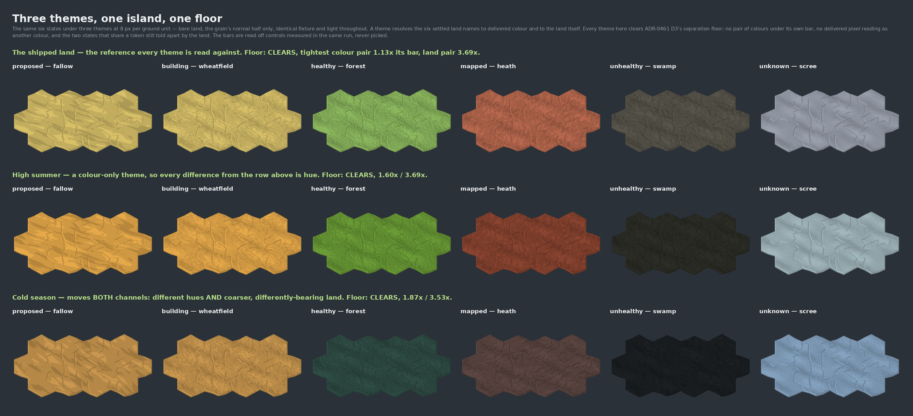
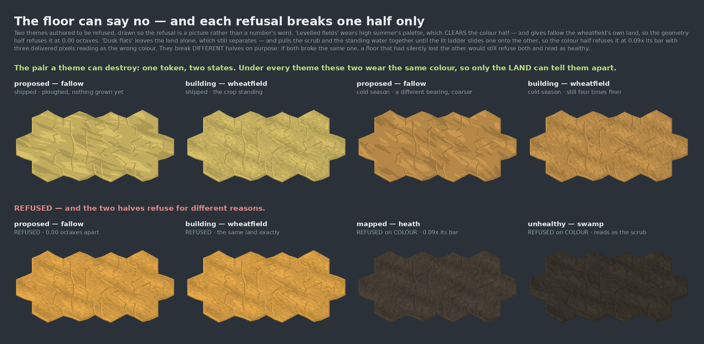

# A theme cannot ship without clearing the separation floor — 2026-08-28

**Increment:** `themes-clear-the-separation-floor` on `adopt-the-land-into-the-shipped-map-arc`.
**Decision:** ADR-0461 D3 — *"Themes are permitted, and every theme is held to the SAME separation
floor. A theme may move every hue on the map; it may not let one state read as another."*

---

## 0. What this landing is, in one paragraph

The map draws a capability's state as a named land — `forest`, `heath`, `fallow`, `wheatfield`,
`swamp`, `scree`. All six names are the owner's as of 2026-08-28. A **theme** is a set of
substitutions keyed on those six names: source says `forest`, the theme says what `forest` looks
like. This landing builds that resolution layer, and the **floor** that no theme may cross —
a theme may move every hue and may move the land itself, but it may not let one state read as
another. The floor is checked in two halves (pure and pixel), both bars are read off controls
measured in the same run, and it is proved able to REFUSE by two themes authored to fail, one per
half.

**The risk it removes, stated as what goes wrong without it.** Before ADR-0461 an art change could
only be wrong about APPEARANCE. After it, a theme can be wrong about MEANING across a whole palette
at once — every state on the map, in one edit — and nothing else in this repo would notice, because
every other instrument is pinned to the shipped tokens.

---

## 1. What a theme is, and what it is not

A theme resolves each of the six **terrain names** to a colour family and to the land itself
(`stretch`, `bearing`, `lattice`). Three things it deliberately cannot do:

- **It cannot change which state gets which land.** ADR-0461 D1 binds a state to a terrain; a theme
  only substitutes what that terrain looks like. A theme keyed on states could quietly re-map
  meaning while wearing an art change's clothes.
- **It cannot be partial.** A missing terrain is refused, not defaulted — a state falling through to
  the shipped land is a state drawn in another theme's clothes.
- **It cannot split ADR-0462's shared colour class.** `proposed` and `building` wear one token
  (five colours over six states). A theme giving them two makes SIX colour classes, and
  `status-vocabulary.ts` enumerates exactly the five `LAND_COLOURS` names — so a sixth is
  unreachable by the instrument. ⚠ **The refusal is not a judgment that splitting is wrong; it is
  that the floor cannot MEASURE it, and an unmeasurable theme must not pass a floor.** Lifting it
  means widening that module and re-deciding ADR-0462. This is the one place the layer is narrower
  than the owner's *"grant more flexibility to start off with"*, and it is narrow on purpose: it
  fences a case the instrument goes blind on, never a case that merely looks unusual.

---

## 2. The floor is two halves, because the two questions need two instruments

**PURE** — `harness/land-theme.ts`, provable under `bun test`, no browser:

- **Colour:** `status-vocabulary.ts`'s `vocabularySeparation`, called with the THEME's token table.
  That function already took the table as an argument precisely because this is the shape a
  per-theme floor needs. No second colour-distance function was written, and none should be.
- **Land:** every colour-blind pair a theme creates must be assigned distinct terrain geometry.
  ⚠⚠ **NECESSARY, NOT SUFFICIENT, and saying so is not a hedge.** These are the numbers that were
  *written down*, not what a reader *sees*. A theme could differentiate two lands by a figure that
  survives no rasteriser.

**PIXEL** — `harness/theme-measure.mjs`, a measure driver over the delivered frame:
`terrain-separation.ts`'s `pairVerdict` over rendered regions, per theme. `readTerrain` needs
delivered pixels, so this half cannot be a pure rung and does not pretend to be.

### The bars are read off controls, never picked

| half | the bar | the control |
|---|---|---|
| colour | one lighting step on the two families being compared | measured inside the same `vocabularySeparation` call |
| land (pure) | **0.7655 octaves**, from **`heath`/`swamp`** | the SHIPPED vocabulary's own weakest link between any two of its lands, computed in the same run |
| land (pixel) | the worse of the two lands' own within-island spread | measured on sub-regions of the same frame, under the same light |

⚠ **The house test of an honest bar: where would a number picked to PASS have sat?** The pair under
judgment (`fallow`/`wheatfield`) sits at **2.83 octaves**, so a number chosen to let it through
would sit just under 2.83. The bar is **0.77** and is set by a completely different pair that
colour already separates and that nobody was trying to make pass. A test asserts
`floor.from !== 'fallow/wheatfield'` — the bar may not be set by the pair it judges.

⚠ **Why an absolute pixel figure was not an option.** `grain-picture-is-renderer-specific` measured
24.5% of grained pixels landing on a different ladder rung between SwiftShader and an RTX 2060. A
committed pixel threshold is one machine's threshold and reds on every other.

⚠ **Where the shipped theme's own land verdict is weak, said plainly.** The bar is derived from the
shipped table, so for the SHIPPED theme the control and the subject are the same artifact and the
check is a self-comparison — the blindness
`self-comparison-invariance-suites-are-blind-by-construction` describes. It is meaningful for a
CANDIDATE theme, which is what it exists for, and the shipped table is pinned separately by a
committed digest so that moving it is a visible two-place edit.

---

## 3. ⚠⚠ PROVING THE FLOOR CAN FAIL

This factory has caught four instruments in two days that were structurally incapable of failing.
A floor that passes everything it is shown is indistinguishable from no floor, and the difference
is invisible in a green run. Three independent kinds of evidence are recorded here.

### 3a. Two themes authored to be refused, committed, and drawn

`REFUSED_THEMES` in `land-theme.ts`. They are never offered, and each breaks **exactly one half** —
because if both broke the same half, a floor that had silently lost the other would still refuse
both and read as healthy.

| theme | colour half | land half | verdict |
|---|---|---|---|
| `dusk-flats` — the scrub and the standing water pulled together until the lit ladder slides one onto the other | **REFUSED**, `brown/black` at **0.089×** its bar, **3 foreign colour reads** | passes (its land is untouched) | REFUSED |
| `levelled-fields` — high summer's palette, with `fallow` given `wheatfield`'s own land | passes cleanly (0 foreign reads) | **REFUSED**, `fallow/wheatfield` at **0.00 octaves** | REFUSED |

`dusk-flats` breaks the way a real theme would — not by giving two states one hex, which nobody
authors by accident, but by low contrast. That is ADR-0414 D4's failure exactly: two tints
separated mainly by brightness collide as soon as the shader's 0.78..1.00 ladder spans the gap.

### 3b. A palette this project actually shipped is refused

`ADR0462_STATUS_TOKENS` — the live palette on 2026-08-27, the day before the tilled clay replaced
`mapped`'s tan — is REFUSED by the colour half: `yellow/brown` at **0.395×** its bar with **2**
foreign reads. A floor whose only failing input was invented for it is much weaker evidence than
one that refuses something we drew.

### 3c. Hand-run mutations

⚠⚠ **THE AUTOMATIC RUNG COVERS NONE OF THIS, AND IT IS MEASURED ON THIS BRANCH RATHER THAN
INFERRED FROM THE LAST ONE.** `pnpm gate`'s `check:mutation-diff` skips `harness/**` — the harness
sits outside any workspace project's `src/`. This branch's own gate run printed:

```
[mutation-diff] base: `git merge-base origin/main HEAD` → 635a51003
[mutation-diff] SKIP — this branch changes no mutable source under a workspace project's src/
                — 2 changed .ts file(s) sit outside any project's src/
```

So every mutation below was applied by hand, run, watched go red, and reverted.

**8 mutations, 8 killed.** The loop is `/tmp/mutate-land-theme.py`'s shape: a reversible two-anchor
swap, `git checkout --` between each, and — ⚠ the part that matters — **the final assertion is the
FULL pass count (42/0), not "did anything change".** A loop that only diffed against the previous
run would report "no change, all good" and leave mutations in the tree. An anchor that does not
match is a hard exit 2, because a mutation that did not apply reads exactly like a check that
cannot fail.

| # | mutation | killed by |
|---|---|---|
| M1 | the bearing weight takes the STRONGER of the two lands, not the weaker | the bar digest + the verdict line (2 tests) |
| M2 | a bearing is a heading, not an axis — drop the fold to [0, 90°] | *a bearing is an AXIS, not a heading* |
| M3 | the geometry half compares the pairs colour ALREADY separates (`!==` → `===`) | **7 tests**, including both refusal fixtures and the vacuity arm |
| M4 | the class-integrity refusal is dropped | *a theme SPLITTING ADR-0462's shared colour is refused* |
| M5 | the bar becomes `0.1`, a number somebody picked | the bar digest + the verdict line (2 tests) |
| M6 | the theme verdict forgets the land half (`colour.pass && geometry.pass` → `colour.pass`) | *a theme that collapses two LANDS is REFUSED* |
| M7 | the colour half is asked about the SHIPPED palette instead of the theme's | *a theme that collapses two colours is REFUSED* |
| M8 | a partial theme silently falls back to the shipped land | *a PARTIAL theme is refused* |

M7 is the one worth naming: it is the "check the wrong subject" failure this arc has met before,
and without a theme authored to be refused on colour there would be nothing to kill it with — the
shipped palette clears the floor, so a floor that always asked about the shipped palette would be
green forever.

⚠ **A NEW FILE CANNOT BE REVERTED WITH `git checkout --`.** `land-theme.ts` was committed before
this loop ran. On an untracked file every revert fails silently and the mutations ACCUMULATE, which
reads as a broken suite rather than as un-reverted edits — the trap
`an-expectation-derived-from-its-subject-cannot-fail` records.

### 3d. The pixel driver refused its own first run

Not a rehearsal: `theme-measure.mjs`'s first run against this page **exited 1 with five refusals**.
The distinctness check was asking whether all five themes drew different pictures, and
`levelled-fields` is high summer's palette with ONE land changed — so five of its six states are
byte-identical to high summer *by construction*. That is the fixture doing its job (it isolates the
land half by holding colour fixed), and the rule applied to it was the instrument misreading the
fixture. It was narrowed to the OFFERED themes, and the right question of the fixture was added in
its place: **`levelled-fields` must differ from `high-summer` in exactly one state and no other** —
if it differed nowhere the theme never reached the renderer, and if it differed elsewhere its
refusal could be coming from something it does not declare. Both of those failures are silent
otherwise.

---

## 4. The themes

Three are offered. ⚠ **How many themes exist and whether a viewer can switch them is NOT decided
here** — ADR-0461 D5 leaves both open. These exist so the mechanism has something to be true of.

| theme | what it is | moves | tightest colour pair | tightest land pair |
|---|---|---|---|---|
| `shipped` | the land as it stands on the map today — the reference | — | `yellow/green` **1.13×** | `fallow/wheatfield` **3.69×** |
| `high-summer` | hot and bleached — olive green, sienna scrub, amber crop, cool pale stone | colour only | `green/grey` **1.60×** | 3.69× (unchanged) |
| `cold-season` | low sun and hard ground — dark pine, cold umber scrub, ochre stubble, pale ice stone | colour **and** land | `yellow/brown` **1.87×** | `fallow/wheatfield` **3.53×** |

⚠ **BOTH NEW THEMES ARE BETTER SEPARATED THAN THE SHIPPED PALETTE** (1.60× and 1.87× against its
1.13×). That is a fact about how tight the shipped palette is, not a claim that they look better.

### The floor is not what limits how different a theme can look

A sweep of global hue / saturation / lightness transforms over the shipped palette found **697**
that clear the colour half. So the constraint on a theme is taste, not the floor — which is the
same thing the owner's steer says from the other side: *"we can tighten it up if things get too
wild and I can no longer tell, but its a taste thing that needs a human eye."*

⚠ **AND SEPARATION RATIO IS NOT A PROXY FOR LOOKING LIKE LAND.** The highest-scoring transforms in
that sweep were saturation ×1.7 hue rotations — magenta forests, electric blue fields, scoring 3.1×
where the shipped palette scores 1.1×. Optimising the floor produces a Tron poster. Both themes
here were hand-authored inside a hue window and then *verified*, never tuned against the number.
An early draft of `high-summer` put `scree` at a bleached bone `#c9c3b4` and the floor REFUSED it —
`yellow/grey` at 0.62× with three foreign reads, the straw and the stone reading as each other.
That is the floor doing exactly its job during authoring.

---

## 5. The pixel half





`harness/theme-measure.mjs`, 60 panels (5 themes × 6 states × 2 zooms), **ANGLE / NVIDIA GeForce
RTX 2060, OpenGL 4.5.0**. Buffers read with `getImageData` off each canvas — never a screenshot, so
alpha survives and the water round the island is genuinely transparent.

**Palette closure, per theme: CLOSED on all five, 7,863,876 opaque pixels each.** Every delivered
pixel is an entry of the ramp of the theme it was drawn with. ⚠ Closure is asked **per theme, not
against `landPalette()`** — a theme's colours are foreign to the shipped palette by construction,
so auditing them against it would refuse every theme for being a theme. The claim that matters is
that a theme may not deliver a colour ITS OWN vocabulary does not authorise.

**The pair colour cannot help with**, at both zooms. Bars are each land's own within-island spread,
measured on sub-regions of the same frame:

| theme | 8 px/unit | 2 px/unit (the overview) |
|---|---|---|
| `shipped` | scale 1.433 / bar 0.879 → **SEPARATED, 1.6×** | 1.226 / 0.849 → **SEPARATED, 1.4×** |
| `high-summer` | 1.431 / 0.879 → **SEPARATED, 1.6×** | 1.228 / 0.849 → **SEPARATED, 1.4×** |
| `cold-season` | 1.221 / 0.649 → **SEPARATED, 1.9×** | 1.157 / 0.621 → **SEPARATED, 1.9×** |
| `dusk-flats` *(refused on colour)* | 1.422 / 0.877 → SEPARATED, 1.6× | 1.221 / 0.853 → SEPARATED, 1.4× |
| `levelled-fields` *(refused on land)* | **0.000 / 0.275 → NOT SEPARATED** | **0.000 / 0.218 → NOT SEPARATED** |

⚠⚠ **THE CROSS-CHECK CUTS BOTH WAYS, and that is what makes the driver an instrument rather than a
report.** An *offered* theme whose pair collapses on pixels refuses the run. And a theme the pure
half refused *for collapsing lands* that comes back SEPARATED on pixels **also** refuses — because
that means either the theme never reached the renderer or `readTerrain` cannot tell two identical
lands apart, and both of those are the instrument being broken rather than the theme being good.
`levelled-fields` came back NOT SEPARATED at both zooms; `dusk-flats`, whose land is untouched,
stayed separated. The pixels agree with the pure half about *which half* each theme breaks.

Two further non-vacuity checks the run makes:

- **The three offered themes draw six byte-distinct pictures each.** Three themes that rendered the
  same pixels would pass every check above and say nothing whatever about theming.
- **`levelled-fields` differs from `high-summer` in exactly one state and no other.** If it
  differed nowhere the theme never reached the renderer; if it differed elsewhere, its refusal
  could be coming from something it does not declare. Measured: *differs in `proposed`; identical
  in `healthy`, `mapped`, `building`, `unhealthy`, `unknown`.*

⚠ **One thing changed on the page AFTER this run, and it moved no pixel.** `capture-panels.test.ts`
requires a literal `data-st-panel` on every section opening tag — a source scan, because that is the
only thing that catches a section somebody forgot to label — so the page's sections were unrolled
from a mapped component into six authored ones. The canvases are produced by the same `IslandPanel`
calls with the same props; a headless re-load confirmed **60 tagged canvases with the same tags and
no page errors**. The panels above are the panels the page still draws.

⚠ **Cost, so the next session budgets for it:** ~50 s per 8 px panel, ~50 minutes for the run. The
cost is serialising a ~7 MB canvas buffer out of the page, not rendering it. And while the run
holds the page, **any edit to a file in the page's module graph triggers an HMR reload that blanks
the canvases the driver has not read yet** — so hand mutation-testing of `land-theme.ts` and this
run cannot overlap.

---

## 6. What this landing does NOT settle

- **How many themes exist, and whether a viewer can switch them.** ADR-0461 D5 leaves both open.
  The three here exist so the mechanism has something to be true of; they are not a product
  decision.
- **Adoption into the shipped map.** `packages/forest-world-r3f/src` is untouched. Adoption remains
  a separate, deliberate event (ADR-0380 D6 / ADR-0406 D2), and this is harness work.
- **Whether the map READS WELL under a theme.** The floor is a backstop against a theme that has
  stopped REPORTING, not a fence on how the map looks. The owner's eye remains the arbiter of the
  second, per his 2026-08-27 steer: *"its a taste thing that needs a human eye, so I rather grant
  more flexibility to start off with."* A session reading that as licence to skip the floor has
  inverted it.
