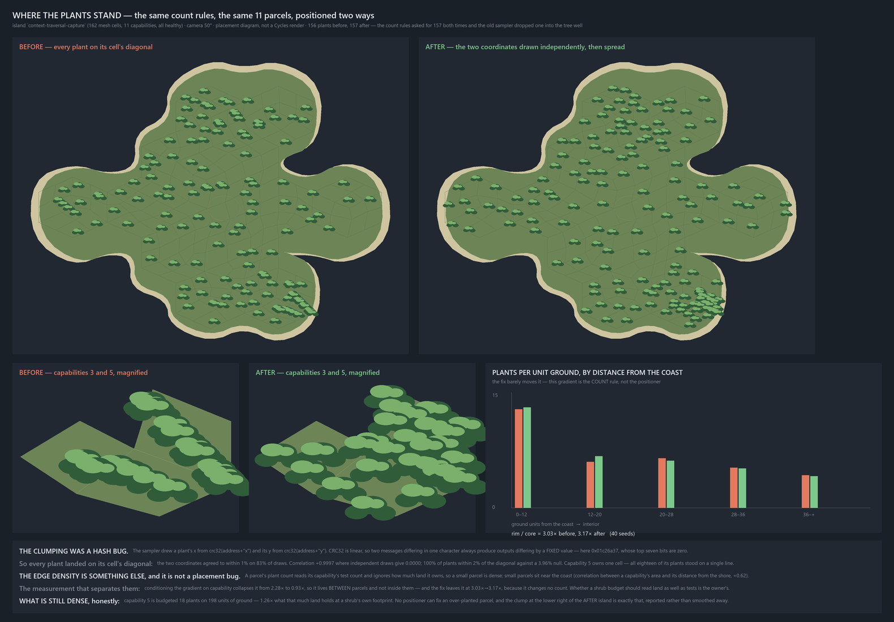

# The island is dense at its edges for one reason, and it looks clumpy for a completely different one

**Date:** 2026-08-17 · **Camera:** every number here is measured in GROUND units, before any
projection — the research track's 50° and the app's `LAND_CAMERA_ELEVATION_DEG = 20` both scale `y`
by a constant, which cannot create or remove a radial gradient · **Blender renders:** 0 ·
**Vendor calls:** 0 · **Cost:** $0 · **Islands:** the real-corpus `context-traversal-capture` (162
mesh cells, 11 capabilities, all healthy) and the `fork-spike-island` fixture (214 cells, six
statuses)

The owner asked *"can you explain why its so dense at the edges of the island, i want to make sure
the plants we end up with are dispersed properly"*. There are two answers, they have nothing to do
with each other, and separating them is most of the work:

| | what it is | who owns it |
|---|---|---|
| **the EDGE density** | a parcel's plant count reads its capability's TEST COUNT and never its AREA. Small parcels are dense; small parcels sit near the coast. | the count rules (ADR-0226 D2) — **the owner's, not this pass's** |
| **the CLUMPY look** | the sampler drew a plant's `x` and `y` from two CRC32s over addresses differing in one character, and CRC32 is linear, so the two draws returned nearly the same number. **Every plant on the island stood on its cell's bounding-box diagonal.** | a bug — **fixed here** |



## The two mechanisms the increment proposed are both FALSIFIED

Neither was close, and both were falsified on evidence rather than argument.

**Mechanism A — uniform-over-cells against coast-clipped smaller cells.** The arithmetic is right;
the premise is false. Mean cell area is FLAT across coast-distance quintiles on both islands:

| coast-distance quintile | q1 (rim) | q2 | q3 | q4 | q5 (core) |
|---|---:|---:|---:|---:|---:|
| real-corpus island, mean cell area | 157.2 | 148.9 | 149.8 | 148.7 | 155.4 |
| fixture island, mean cell area | 150.0 | 149.8 | 155.7 | 148.9 | 147.9 |

The mesh is not coast-clipped in area terms, so "one vote per cell" and "one vote per unit area"
are the same rule here. And the decisive test is the counterfactual that IS mechanism A's own fix:
hold every capability's realised count and redistribute it over that capability's cells strictly
proportional to area. **The rim/core ratio moves from 2.276× to 2.208× — A's fix removes 2.6% of
the thing it was proposed to explain.**

**Mechanism B — sliver cells collapsing onto their centroid.** Real machinery, never fires. Over
**120 seeds × 2 islands = 30,351 meadow placements: `centroidFallbacks` = 0, coincident points = 0.**
A draw lands inside its cell 57.0% of the time (measured, both islands), so twelve of them all
missing is rare, and summing each cell's own miss probability gives an expectation of **2.2
fallbacks on the real-corpus island and 1.7 on the fixture — 3.9 in total, against 0 observed.**
Zero is close to what the geometry predicts, so this is a mechanism correctly ruled out, not one
caught misbehaving; it should not be quoted as strong evidence of anything beyond "B is not it".

> An earlier draft of this file computed the expectation from the WORST cell in each quintile and
> reported "~12 expected against 0 observed", which is a worst case wearing an expectation's name
> and claims far more than the measurement holds. Corrected here and in `measure.py`.

## What the edge density actually is — and the signed test that proves it

The gradient is real on the real-corpus island: **9.06 → 5.28 → 6.68 → 5.12 → 3.98** placements per
1000 ground units, rim quintile to core quintile, over 120 seeds — a **2.28× rim/core ratio**. It is
not monotonic (q3 rises above q2), which is what you should expect from a mechanism that is not
about distance at all: the gradient is a by-product of WHICH capabilities happen to own small
parcels, so it tracks the coast only as strongly as parcel size does.

The discriminating prediction is a CONDITIONING test, because the two candidate homes for a
gradient make opposite predictions about it. Mechanism A acts *within* a capability's own cell set,
so its gradient survives conditioning on capability. An area-blind BUDGET acts only *between*
capabilities, so its gradient vanishes. Split each capability's own cells at that capability's own
median coast distance and compare the two halves:

| | real-corpus island | fixture island |
|---|---:|---:|
| rim/core density ratio, unconditioned | **2.28×** | 1.22× |
| the same ratio, **conditioned on capability** | **0.93×** | 0.90× |
| corr(log capability owned-area, its density) | **−0.93** | −0.47 |
| corr(capability owned-area, its mean coast distance) | +0.62 | +0.43 |
| density spread across capabilities | **29.5×** | 4.4× |

**The gradient is entirely between parcels.** `grass = round(2 + tests × 1.9)` has no area term, so
a capability's density is `count / area` with the numerator blind to the denominator: capability 5
owns one 198-unit cell and is budgeted 18 plants (density 91.1), capability 0 owns 39 cells and
5535 units and is budgeted 17 (density 3.07). Small parcels are near the coast, so an area-blind
budget PROJECTS onto a coast gradient without anything in the code ever mentioning the coast.

**This pass does not fix that and must not.** Whether a plant budget should read land as well as
tests is ADR-0226 D2's territory and is entangled with the owner's open question about whether
shrubs inherit grass's semantic role. What this pass does is make the density *nameable*:
`dispersion.capacity()` reports how many plants a parcel holds at a shrub's own footprint, and
**capability 5 is over capacity at 1.26×** — asked for more plants than its ground has room for.
That is a sentence the owner can answer; "it looks dense" is not.

## The third mechanism, which is the one that made it look bad

`scatter._sample_in_cell` (`chapter2-grass-reads-as-signal-2026-08-16/scatter.py:69-73`):

```python
x = min(xs) + det(addr, "x", t) * (max(xs) - min(xs))
y = min(ys) + det(addr, "y", t) * (max(ys) - min(ys))
```

`det` is CRC32 over the joined address. **CRC32 is affine over GF(2): for two equal-length messages,
`crc32(A) ^ crc32(B)` depends only on `A ^ B` and not on the message content.** Here the two
messages differ in one character — `"x"` versus `"y"`, which differ in a single bit — and the
resulting delta is the constant **`0x01c26a37`**, verified identical across every address tested.
Its top seven bits are zero, so the two 32-bit draws are numerically almost equal.

Measured consequence, on both delivered islands:

| | before | after | null |
|---|---:|---:|---:|
| corr(u, v) within the cell's bounding box | **+0.9997** | −0.014 / −0.055 | 0.0000 |
| placements within 2% of the bbox diagonal | **100.0%** | 4.0% / 4.4% | 3.96% |
| `\|u − v\| < 0.01` | 83% of draws | 1.9% | 1.0% |
| Clark–Evans nearest-neighbour index (per capability) | 0.97 / 1.17 | **1.93 / 1.91** | 1.00 |
| closest pair on the island | **0.04 / 0.32** units | 1.46 / 3.61 units | — |
| plants with a neighbour under 4 units | 50.6% / 24.9% | 18.2% / 2.2% | — |

A correlation of +0.9997 against a null of exactly zero is the signed asymmetry this diagnosis
rests on. It needs no threshold argued from taste, no baseline run and no edge correction — two
independent draws are uncorrelated whatever the cells look like. The most legible single fact:
**capability 5 owns one cell, and all eighteen of its plants stood on one straight line.**

### The fix, and the two traps in it

`disperse.py` changes three things and no counts:

1. **both coordinates come out of ONE hash, avalanche-finalised** (`_uv`). Murmur3's `fmix32` is
   non-linear, so no fixed input edit maps to a fixed output difference. Sixteen bits per
   coordinate resolves a 25-unit cell to 0.0004 units. Measured: `corr = +0.008`, marginals
   0.4998/0.4956 against 0.5, 16×16 uniformity χ² = 240.7 on 255 dof.
2. **cell choice weighted by AREA** rather than one vote per cell. Worth 2.6% on these meshes;
   corrected because the rule is wrong, not because the number is large.
3. **best-candidate (Mitchell) blue noise**, ten candidates per placement, spacing memory scoped to
   the capability.

> **TRAP 1 — moving the axis token to the front of the address does NOT work.** It is the obvious
> fix and it scores `corr = −0.72` (an anti-diagonal). CRC32's affine property does not care WHERE
> the characters differ, only that the difference is fixed. `verify_refusal.py` P4 runs it and
> requires it to trip the floor.

> **TRAP 2 — a keep-out is a hole a spreader races towards.** The tree well is an 11-unit disc no
> plant may occupy, so it is permanently the emptiest ground in any parcel containing it — and
> "furthest from everything already standing" is precisely a rule for finding empty ground. Scored
> naively the well ATTRACTED candidates, which were then culled: the delivered meadow fell 156 → 150
> while the rules authored 157. A candidate inside the well is now not scored at all, and the
> delivered count is 157 — one MORE than the original, because the original silently dropped a plant
> that happened to land in the well. `verify_refusal.py` P5 reinstates the leak and requires rung 5
> to catch it.

**The fix does not move the edge gradient, which is the point:** 3.03× → 3.17× on the real-corpus
island over 40 seeds. On the fixture it moves 1.03× → 1.33×, and that residual is UNATTRIBUTED —
best-candidate biases placements toward parcel edges and some of those edges are coastal. It is
small in absolute terms on an island whose gradient is 1.03× to begin with, but it is not zero and
it is not explained.

## The dispersion floor — `verify.py`

Fourteen checks, two islands, twenty seeds each. Four are FIXES that failed before this pass; three
are FENCES that already held.

```
1. axis independence      |corr(u,v)| pooled <= 0.15        was 0.9997
2. no diagonal band       on-diagonal share <= 0.07          was 1.0000  (chance 0.0396)
3. dispersion index       Clark-Evans per capability >= 1.35 was 0.97 / 1.17
4. no touching plants     closest pair >= 1.0 ground units   was 0.04 / 0.32
5. counts unchanged       delivered == what the rules authored
6. no coincident points   the centroid fallback stays a floor, not a path
7. no rim gradient WITHIN a parcel   conditioned ratio in 0.70..1.40
```

**`verify_refusal.py` proves it is not vacuous:** five perturbations × two islands, all ten caught.
P1 is the shipped positioner unmodified — it trips rungs 1, 2, 3, 4 and 5. P2 and P3 ablate the two
halves of the fix separately, proving rung 1 measures the hash and rung 3 measures the spacing. P4
and P5 are the two traps above.

Two rungs POOL across seeds rather than taking the worst one, and not to make them easier: the
first draft asserted worst-of-twenty on rungs 1 and 7 and both went red on values indistinguishable
from their own null, because one seed places ~100 plants and the sampling width of a correlation is
then 0.10. Pooling gives one estimate from ~2,900 placements at a null width of 0.019 — a strictly
TIGHTER test at the same tolerance.

**Deliberately NOT floored:** the island-wide near-pair fraction, and the unconditioned rim
gradient. The first cannot reach zero while capability 5 is over capacity; the second is a
consequence of the count rules, and a floor that laundered it would be this pass quietly deciding
the owner's question. Rung 4 skips over-capacity parcels for the same reason and names them.

## Does the shipped app share this? No — it has a different gap

`app_drift.py` transcribes `scene.ts:1715 driftSpot` and measures it on the same island. Per the
fences this pass edits no app source; findings are written down with a file and a line.

* **The app CANNOT have the coordinate-pair collapse.** It draws from `streamRand`
  (`scene.ts:1656`), a mulberry32 stream whose successive draws are independent by construction,
  not from two CRC32s over near-identical addresses.
* **`driftSpot` applies no containment test of any kind** — `anchor + (cos a, sin a·0.6)·√u·spread`,
  with nothing checking the result is on the parcel, the cell, or the island. **10.9% of placements
  land outside the parcel whose status tinted them** (median 21 ground units from the coast); 0.03%
  land off the island entirely. `scene.ts:1715`.
* **Its concentration is 9.08×** — the whole budget goes into one or two drift beds averaging 247
  ground² inside parcels averaging 2238. That is DELIBERATE and owner-directed (2026-07-18, and the
  docstring says so). But **88.0% of its plants have a neighbour within 4 units and the median
  nearest-neighbour distance is 2.06**, against a shrub 9–14 units across. That decision was taken
  for long grass, where a massed bed reads as a meadow. For shrubs the same bed reads as a blob, and
  it is worth re-asking now that grass is being withdrawn — as an owner question, not a change.

## Files

| file | what it is |
|---|---|
| `dispersion.py` | the instrument: Clark–Evans, near-pair fraction, parcel capacity, coast-binned density, and the two within-cell statistics. No opinion about positioners. |
| `disperse.py` | the fixed positioner. Imports every count rule live from `scatter.py`; owns positions only. |
| `measure.py` | runs all four questions, writes `dispersion-report.json` (~4 min). |
| `verify.py` | the dispersion floor (~90 s). |
| `verify_refusal.py` | makes every rung fire (~2 min). |
| `app_drift.py` | the shipped app's positioner, transcribed and measured; writes `app-drift-report.json`. |
| `picture.py` | `plants-dispersed.png`. A placement DIAGRAM — no rendered pieces, no band keys, no palette snap. **Three copies of a ~700-line compositor already exist on this track; this is deliberately not a fourth and must not grow into one.** |

## Gaps, stated

* **Spacing is enforced within a capability, never across parcel boundaries — and the fix makes
  that boundary case WORSE, measurably.** `crossParcelNearPairs` (plants under 4 units apart whose
  two halves belong to different capabilities) goes **3 → 12 on the real-corpus island** and 2 → 2
  on the fixture. This is a direct consequence of the fix working: best-candidate pushes plants away
  from their own parcel's plants, which pushes them toward its boundary, where the spacing rule
  cannot see the neighbour on the other side. It is a real trade and the net is still strongly
  positive — island-wide near-pair fraction falls 50.6% → 18.2% — but 12 of 157 plants now have a
  too-close neighbour they did not have before, and that is the first thing to fix next. The
  obvious remedy, accumulating spacing island-wide, would make capability *i*'s positions depend on
  capabilities *0..i−1*, which is exactly the property `scatter.py`'s determinism rule exists to
  protect: a fork for the owner, not a change to slip in. A cheaper option that keeps the property
  is to let a capability's spacing memory be seeded with the plants of parcels it BORDERS, computed
  from the mesh rather than from placement order — unexplored here.
* **`scatter.py` itself is not edited.** The bug is in a committed research artifact whose renders
  are provenance-stamped, and two vendored copies exist
  (`chapter2-island-place-dressing-2026-08-16/scatter.py:70-71` is identical). Every composite this
  arc has delivered was drawn with the diagonal collapse in it. Repointing them is a separate
  landing.
* **Nothing here is rendered.** The floor measures ground positions. Whether better dispersion
  survives the compositor — occlusion, the 3 px median delivered size, the palette snap — is
  unmeasured, and the delivery track's 17.2% loss rate on the real corpus applies to these
  placements exactly as it did to the old ones.
* **The fixture island's 1.03× → 1.33× rim shift under the fix is unattributed** (see above).
* **The tree is not drawn in the picture** and no capability's occlusion by it is modelled.
