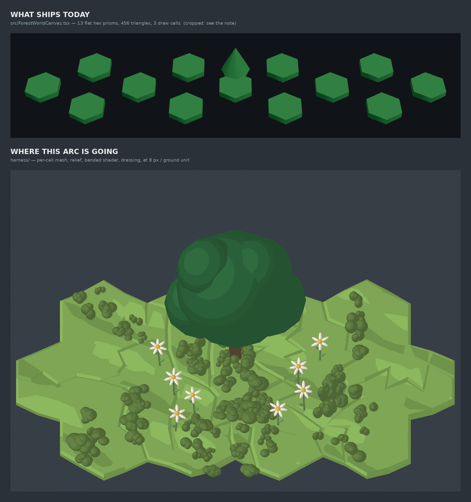

# What the shipped forest map draws today — the baseline

**Increment:** `adopt-the-land-into-the-shipped-map-arc-inc-01` on
`adopt-the-land-into-the-shipped-map-arc`.
**Taken:** 2026-08-28, on an **NVIDIA GeForce RTX 2060** (`ANGLE (NVIDIA Corporation, NVIDIA
GeForce RTX 2060/PCIe/SSE2, OpenGL 4.5.0)`, `EXT_disjoint_timer_query_webgl2` **available**).
**Instrument:** `harness/baseline.html` + `harness/baseline-measure.mjs`, which mount the REAL
`src/ForestWorldCanvas.tsx` and count the GL calls the driver received.

> Why this increment is first: the arc's end state asks what the new land **costs**, and a cost
> is a **difference**. Every picture this arc has ever shown came out of `harness/`. The thing
> that actually ships had never been photographed, never been counted, and — it turns out —
> had never been checked against the islands the product draws.

---

## 0. THE HEADLINE, AND IT RESIZES THE ARC

⚠⚠ **For an island of the shape the studio actually ships, `<ForestWorldCanvas>` draws NO LAND
AT ALL.** One story tree. **144 triangles. Two draw calls.** The ground is simply absent.

The mechanism, established by reading and then measured:

- The shipped mapper's ground case keys on a scene node of kind **`tile`**
  (`packages/forest-world-r3f/src/world-to-3d.ts:204-218`) — the **classic extruded-hex**
  island.
- The substrate the studio ships is the **relaxed mesh**
  (`packages/forest-world/src/scene.ts:658`: *"Mesh substrate cells; `null` ⇒ the classic
  extruded-hex ground"*), whose ground arrives as **`cell`** nodes.
- `worldTo3D` has no case for `cell`, so all **164** of them fall through to the default skip
  (`world-to-3d.ts:272-273`). Total census for the reference island:
  **1296 `skipped`, 1 `story-tree`, 0 `hex-ground`.**

✅ **AND IT IS NOT SIMPLY BROKEN — the control is what says so.** The same mapper, the same
call, the same thirteen tiles, with `relaxedCells: null`, draws **13 `hex-ground`**. So the
shipped canvas *works* and is *pointed at a representation the product no longer produces*.
Both halves are pinned in `harness/shipped-baseline.test.ts`; the second exists precisely
because the first, alone, is equally satisfied by a mapper that draws nothing ever.

**What this changes for the arc.** The arc's own framing already said adoption has two halves
and *"the first is the larger and duller one"* — promote the harness pipeline into the shipped
canvas at all. That framing is right and this baseline makes it sharper: the first half is not
"add relief and a shader to the shipped ground", because **there is no shipped ground to add
them to**. The shipped canvas would have to learn the relaxed-mesh cell representation before
any of the six treatment components has anywhere to land.

---

## 1. The picture



Same thirteen tiles, same GPU, same run. Above: `src/ForestWorldCanvas.tsx` on the classic
substrate — the only substrate it can draw ground for — thirteen flat, disconnected hex prisms
under a `meshStandardMaterial`, plus a cone. Below: the `harness/` treatment at 8 px per ground
unit.

⚠ **The top panel is CROPPED and the crop is part of the finding.** `frameWorld` backs the
camera off `max(260, spread * 2.6)` units (`ForestWorldCanvas.tsx:158-168`), so an island of
this size — which is the size the product draws — occupies a small fraction of an otherwise
empty frame. `shipped-classic-uncropped.png` is committed beside this sheet so the crop is
checkable rather than trusted.

---

## 2. The numbers, on the RTX 2060

| mount | canvas | draw calls / frame | triangles / frame | delivered px per ground unit |
|---|---|---|---|---|
| shipped, mesh substrate (overview) | 640×420 | 2 | 144 | 1.38 |
| shipped, mesh substrate (zoom) | 1280×840 | 2 | 144 | 2.76 |
| shipped, **classic** substrate (control) | 1900×1200 | 3 | **456** | 3.94 at target, **3.91–3.72 across** |

**456 = 13 × 24 (hex prisms) + 128 (trunk) + 16 (crown).** The authored count derived from the
shipped file's own primitive arguments and the count taken off the GL calls agree to **zero**.
They are computed by entirely different routes — one parses geometry arguments, the other wraps
`drawElements*` — so the agreement is evidence, and `baseline-measure.mjs` refuses a run in
which they diverge.

**Authored triangle counts, first ever recorded** (`harness/shipped-baseline.ts`, each pinned
against three.js itself in `shipped-baseline.test.ts` rather than derived from documentation):

| primitive | shipped call | triangles |
|---|---|---|
| hex ground prism | `cylinderGeometry(9, 9, 3, 6)` | **24** |
| story-tree trunk | `cylinderGeometry(1.2, 1.6, 8)` (32 radial by default) | **128** |
| story-tree crown | `coneGeometry(7, 14, 8)` | **16** |
| cave arch | `circleGeometry(hw, 24)` | **24** |
| wisp sprite | `sphereGeometry(2.2, 12, 12)` | **264** |

⚠ A cone is **not** a zero-radius cylinder by count: three drops the degenerate row at the tip,
so the crown is 16 and not 24. A non-vacuity assertion pins that, because it is exactly the
kind of off-by-a-row an authored count acquires and then reports with the calm authority of a
measurement.

**For scale — the harness island is 1,120 triangles** (164 cells × 4-point fan = 656, plus 180
parcel-bevel quads = 360, plus 52 rim quads = 104; derived in `survey-harness-and-delta.md` §5,
cross-checked against two independent source comments). So the treatment this arc wants is
roughly **2.5× the shipped control's geometry** and about **eight times what the shipped canvas
currently draws for a real island**. Neither figure is anywhere near a hardware constraint;
`harness/hardware-floor.*` is **draw-call bound**, not fragment bound, and that is the axis to
watch.

---

## 3. ⚠ THE SHIPPED CANVAS IS ON A THIRD, STALE PALETTE

`src/ForestWorldCanvas.tsx:30-37` carries its own `STATUS_COLOUR` map. It agrees with **neither**
`harness/palette-band.ts` **nor** `apps/studio/src/index.css` on **any** of the six statuses.
ADR-0462 landed the five-colours-over-six-states vocabulary the day before this baseline
(`e9af5550`) and touched `index.css` and `palette-band.ts` — **it did not touch the shipped
canvas**, which still draws `building` as a blue-purple `#7f8fd1` rather than sharing
`proposed`'s yellow.

| status | shipped canvas | the settled vocabulary (ADR-0462) |
|---|---|---|
| `healthy` | `#4f9d5d` | `#8cb85e` |
| `mapped` | `#5d8fa8` | `#b3946a` |
| `proposed` | `#c2b280` | `#d8c069` |
| `building` | `#7f8fd1` | `#d8c069` (shares `proposed`) |
| `unhealthy` | `#8a5a44` | `#57544a` |
| `unknown` | `#9a9a9a` | `#9ca3af` |

⚠ **This is recorded, not fixed.** The land's colour is a capability's status
(ADR-0392 D5 / ADR-0398 D7), so moving the shipped palette is a change to what the map
*reports*, and it belongs to the colour work rather than to a baseline. `SHIPPED_STATUS_COLOUR`
in `harness/shipped-baseline.ts` is a transcription and a test parses the shipped file and
fails if it drifts — a fourth uncheckable copy of this palette would be strictly worse than
none.

⚠ **`worldStatus()`'s `building → proposed` fold is NOT in this package at all.** It lives in
`apps/studio/src/lib/worldStatus.ts:39-44` and runs before `buildScene()` on the studio's own
path. Neither `scene.ts`, `world-to-3d.ts` nor `ForestWorldCanvas.tsx` folds anything. So a
consumer that does not perform the fold itself will reach the shipped canvas's `building`
colour — which is the one that has not moved.

---

## 4. ⚠ THE PERSPECTIVE CAMERA IS REAL, AND SO IS ITS DORMANCY

`ForestWorldCanvas.tsx:174` builds a **perspective** camera (`fov: 45`) under drei
`MapControls` — an orbit variant. ADR-0380 D6 fence 4 says the game stays 2.5D isometric with
no free camera, no orbit control and no perspective view.

Two facts, measured rather than assumed:

- ✅ **It is measurably perspective.** The control mount delivers **5.1% more px per ground
  unit at the near edge of the island than at the far edge** (3.91 vs 3.72). The harness is
  orthographic, so its px-per-ground-unit is one number by construction. This is what makes
  "px per ground unit" ill-defined on the shipped path: a single figure is the centre quoted as
  if it were the picture.
- ✅ **`<ForestWorldCanvas>` is mounted in exactly ONE place in this repo** — its own dev
  harness, `harness/main.tsx:151`, which is dev-only and synced nowhere. No mount in
  `apps/studio`, `apps/desktop`, or any built app.
- ⚠ **NOT ESTABLISHED for the public site.** The `web/` submodule is not checked out here
  (`git submodule status` shows it uninitialised), so whether any page there mounts it is
  unverified. `sync:web-engine` mirrors `packages/forest-world-r3f/src/*` only
  (`web-engine-sync.ts:65-72`) — so the file *is* published, whether or not it is mounted.

That is enough to size `the-shipped-canvas-meets-the-isometric-fence` but not to settle it: the
fence question is live in the sense that the code violates it and is published, and dormant in
the sense that nothing in this repo draws it. Settling it needs the submodule.

---

## 5. What `sync:web-engine` mirrors

`packages/forest-world-r3f/src/*` — every non-test `.ts`/`.tsx` — and nothing else
(`web-engine-sync.ts:65-72`). `harness/` is a sibling directory the sync never reads, which is
exactly why the experiment lives there (`harness/scope-fence.test.ts`, and ADR-0380 D6). CI's
`check:web-engine` blocks until the mirror matches, so **anything moved into `src/` is
published to a public repo in the same landing** — the reason adoption is a separate,
owner-gated event and not a refactor.

---

## 6. The six treatment components, against the live path

Full derivation with citations in `survey-harness-and-delta.md` §3. In brief:

| # | component | in `harness/` | in `src/` | mechanism the live path needs |
|---|---|---|---|---|
| 1 | perturbed coast polygon | partial | no | ✅ `smoothCoast()` **already exists** (`packages/forest-world/src/coast.ts:203-216`) with the noise outset and Chaikin rounding, and `forest-world-r3f` imports it from nowhere. Needs re-triangulation against the new boundary. ⚠ Not to be confused with the harness's own `Ctx.coast` (`island-dressing.ts:189-215`), which is plain Chaikin, unperturbed, and used only to place props |
| 2 | landform falling to the shore | no | no | `landHeight` is a pure `(x,z)` swell with no coast-distance term; needs one |
| 3 | worn path cut INTO the ground | no | no | nothing anywhere subtracts or displaces the land mesh along a route; both existing "paths" are additive |
| 4 | attribute-driven material | partial | no | slope already reaches the shader via the normal; shore-distance and path-wear reach nothing |
| 5 | **grain octave** | ✅ built | no | portable verbatim (`land-grain.ts` + the GLSL in `banded-material.ts`) — the one component already proven to cross |
| 6 | six-row stepped cliff skirt | no | no | the rim is ONE flat constant-depth quad per edge; six rows ≈ +624 triangles, needs an authored token |

⚠⚠ **COMPONENTS 3 AND 4 HAVE THE SAME ANSWER AND IT IS ALREADY DECIDED HERE.** This codebase
considered a **per-vertex attribute** for the shadow field and **rejected** it: the mean cell
pitch is ~16.5 ground units, coarser than the features being represented, so a vertex attribute
smears. It used a **ground-space TEXTURE sampled in the fragment stage** instead
(`harness/land-shadow.ts:9-16`, sampled at `harness/banded-material.ts:97-113`). Shore-distance,
path-wear and grain are the same shape of problem at the same scale. **Reuse that machinery as
the template; do not re-litigate the attribute route.**

**Confirmed absent from both renderers, by grep** (the greps are quoted in
`survey-harness-and-delta.md` §4): any lattice noise beyond `land-grain.ts`; any third vertex
attribute channel beyond `position`/`normal`; anything that displaces the mesh along a route;
and any `GLTFLoader` / `useGLTF` / `.glb` / `TextureLoader` / `KTX2Loader` / `DRACOLoader`
anywhere in the package, or `three-stdlib` / `meshoptimizer` / `draco3d` in any workspace
`package.json`. **`first-textured-asset-in-the-live-renderer` is a new capability, not a probe.**

---

## 7. What is NOT here, deliberately

- **Delivered payload in bytes.** NOT MEASURED. The shipped canvas draws only hand-authored
  procedural geometry and loads no asset at all, so today's answer is "the JS bundle and
  nothing else" — and the number that matters for end-state item 2 is the one the *textured
  asset* would add, which belongs to that increment.
- **A frame-cost number.** NOT MEASURED here. `EXT_disjoint_timer_query_webgl2` is **available
  on this box** and absent on the laptop, so the instrument end-state item 2 needs can be built
  — but the shipped scene at 2–3 draw calls has nothing to cost, and the harness's cost is
  known to be draw-call bound (`hardware-floor-is-draw-call-bound-not-fragment-bound`). Costing
  the grain still needs a fragment-bound A/B scene, which is its own increment.
- **Any change to `packages/forest-world-r3f/src`.** Adoption stays a separate event
  (ADR-0380 D6 / ADR-0406 D2). Nothing in this increment reaches the synced tree; the new
  modules are all under `harness/`, and `scope-fence.test.ts` holds that.

---

## 8. Files

| file | what it is |
|---|---|
| `survey-shipped-path.md` | the shipped path end to end, the three palettes, the mount answer, the sync |
| `survey-harness-and-delta.md` | the harness path, the delta table, the six-component mechanisms, the greps |
| `shipped-vs-harness-2026-08-28.png` | the comparison sheet |
| `shipped-classic-uncropped.png` | the same shipped panel uncropped, so the crop is checkable |
| `baseline.json` | the raw run: renderer, census, per-mount readings |
| `combine.py` | composites the sheet from the measured panels |

Reproduce:

```
pnpm --filter @storytree/forest-world-r3f exec vite harness --port 5231 --strictPort
DISPLAY=:0 ST_BASELINE_GPU=1 ST_BASELINE_URL=http://localhost:5231/baseline.html \
  pnpm --filter @storytree/forest-world-r3f measure-baseline
python3 docs/research/chapter2-shipped-baseline-2026-08-28/combine.py \
  .baseline-measure docs/research/chapter2-shipped-baseline-2026-08-28/
```

⚠ **Pass a free port.** `harness/vite.config.ts` pins `strictPort: 5184` for every worktree, so
the default is a port a sibling worktree may own, and a wrong-tree measurement produces a
*number* rather than a missing file. The driver refuses `:5184` outright.

⚠ **`ST_BASELINE_GPU=1` is not optional for a hardware claim.** On this box `--use-gl=egl` falls
back to SwiftShader **silently**, and so does omitting `DISPLAY` even headless. The flag makes
the run refuse rather than report a plausible software number as a GPU one.
