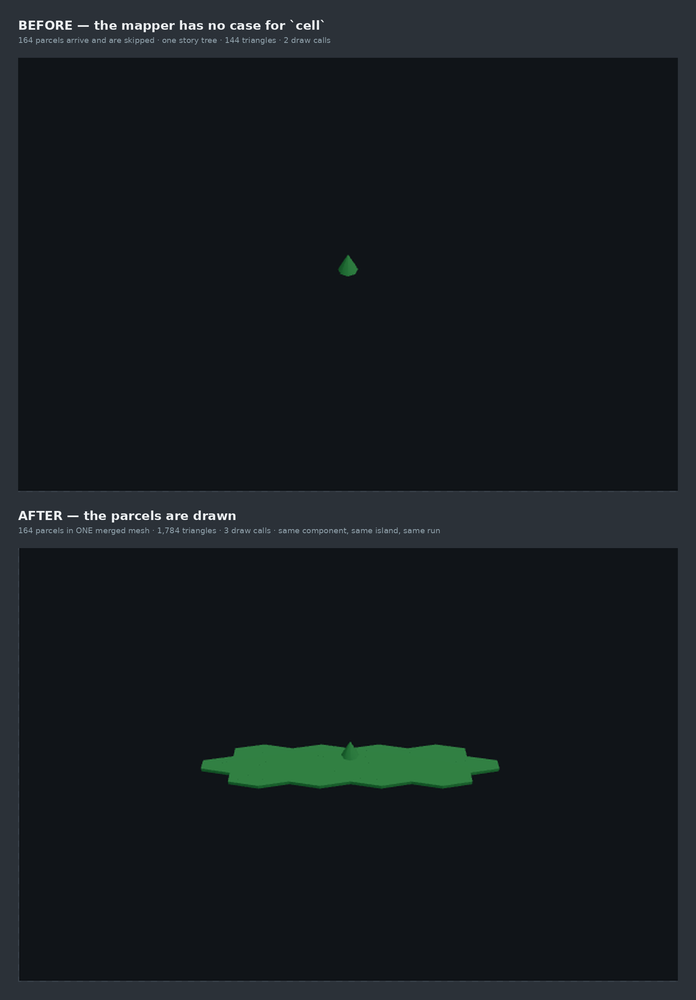
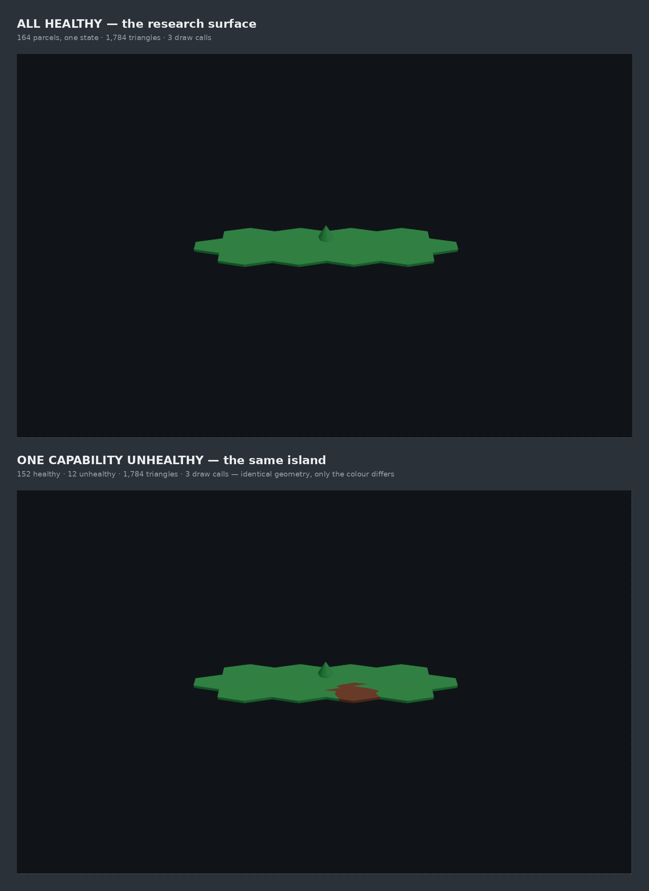

# The shipped forest map draws its ground again

**Increment:** `the-shipped-map-draws-its-ground-again` on `adopt-the-land-into-the-shipped-map-arc`.
**Taken:** 2026-08-28, on an **NVIDIA GeForce RTX 2060**
(`ANGLE (NVIDIA Corporation, NVIDIA GeForce RTX 2060/PCIe/SSE2, OpenGL 4.5.0)`,
`EXT_disjoint_timer_query_webgl2` **available**).
**Instrument:** `harness/baseline.html` + `harness/baseline-measure.mjs` — the same pair
`chapter2-shipped-baseline-2026-08-28` used, extended with a before/after row and a
status-reporting row. It mounts the REAL `src/ForestWorldCanvas.tsx` and counts the GL calls the
driver received.

> **Read `chapter2-shipped-baseline-2026-08-28/` first.** It is the measurement that found this
> defect and it is the source of every BEFORE number quoted here. This directory is the fix.

---

## 0. The headline

⚠ **Yesterday the shipped 3D canvas drew NO GROUND AT ALL for the substrate the studio ships.**
One story tree, 144 triangles, two draw calls. **It now draws the island** — 164 parcels, 1,640
ground triangles, in **one extra draw call**.



Same component, same island, same GPU, same run. The only thing that differs is whether the
mapper has a case for the `cell` parcels the product emits.

⚠ **The camera differs between the panels, and that is part of the finding rather than a
confound.** `frameWorld` derives the framing from the drawables it is handed
(`ForestWorldCanvas.tsx:158-168`), so with one story tree and nothing else there is no extent to
frame — it falls back on its 260-unit floor and the island-that-is-not-there occupies a corner.
Restoring the ground restores the framing with it. The tree is at the same world position in both.

---

## 1. What was wrong, in one paragraph

`@storytree/forest-world` emits ground in one of two shapes (`scene.ts:658`). The **classic**
extruded-hex island arrives as `tile` groups; the **relaxed mesh** the studio actually ships
arrives as `cell` / `cell-wheat` paths, one per parcel. `worldTo3D` had a case for the first only,
so all 164 parcels fell through to the default skip and the canvas drew the tree over empty space.

It was never broken — it was pointed at a representation the product no longer produces, which is
what the classic-substrate control said then and still says now.

## 2. The fix, and the three things it had to get right

**One new descriptor family, `cell-ground`**, and one new pure module,
`src/cell-ground-geometry.ts`, that turns a parcel ring into geometry. Both sit on the pure side
of the package's provability firewall (no React, no three), so every claim below is a `node:test`
rather than something only a browser can observe.

### (a) The ground has to REPORT, not just draw

⚠ **This is the one way this work could have done real harm** (ADR-0392 D5 / ADR-0398 D7: the
land's colour is a capability's proof state, and a land that reads beautifully while misreporting
it is a regression).

**A plain relaxed `cell` carries no status of its own.** The core stamps it on the
`<g kind="ground" status=…>` one level up (`scene.ts:3252` vs `:3254`); only the parcels-present
shape stamps per-cell status (`scene.ts:1718`, per capability rather than per territory). A mapper
that read the cell alone would have drawn **every parcel on the shipped map as `unknown`** — a map
that has stopped reporting, not one that merely looks wrong. So the walk threads the enclosing
group's status down, and the cell's own value wins where it has one.

The all-healthy fixture cannot show this: 164 parcels in one colour is equally consistent with a
ground that ignores status entirely. So one capability is given a foreign state.



| | parcels | triangles | draw calls |
|---|---|---|---|
| all healthy | 164 healthy | 1,784 | 3 |
| one capability unhealthy | **152 healthy · 12 unhealthy** | 1,784 | 3 |

**Identical geometry; only the colour differs.** Both halves are refused by
`baseline-measure.mjs`: more than one state must appear (else the ground ignores status), and the
two panels must draw the same geometry (else something other than colour varies with status and
the row is confounded). That is ADR-0462's premise refusal in the shape this arc has settled on.

### (b) 164 parcels must not cost 164 draw calls

Parcels are arbitrary polygons, so they cannot share a geometry and `<Instances>` is unavailable.
The naive shape is one mesh each — **164 extra draw calls to draw ground the classic substrate
drew in one**, which is a regression on the metric `hardware-floor.*` actually sweeps, dressed as
a fix. They are merged into one buffer instead, with per-parcel status surviving as a vertex
colour attribute. `baseline-measure.mjs` **refuses a run costing more than one extra draw call**,
so the claim is checked in the browser rather than asserted here.

### (c) A parcel wound the wrong way is invisible

⚠ **A top face wound the wrong way vanishes from above under backface culling** — which, on the
only surface that draws this, is indistinguishable from the bug the whole increment fixes. The
relaxed mesh's rings come out of a Voronoi relaxation clipped to the island's hex-union boundary:
**neither handedness nor convexity is guaranteed.**

⚠⚠ **A CENTROID FAN IS NOT SAFE, and the first implementation used one.** A fan is correct only
when the polygon is star-shaped about the point fanned from. On an L-shaped parcel the centroid
lands in the notch — *outside the parcel* — and the fan emits inverted triangles. **Ear clipping**
makes no convexity assumption and is what shipped. A `non-convex L` fixture whose centroid is
provably outside it is kept in `cell-ground-geometry.test.ts` so nobody simplifies this back.

The same fixture caught a second mistake: the wall's outward direction was first tested against
the parcel centroid, which is wrong on exactly those parcels for exactly the same reason. Outward
is now read off the ring's own winding (`(-dz, 0, dx)`), which is a local fact about the edge.

⚠ **Normals are derived from the emitted winding, never authored beside it.** `pushTriangle`
computes each face's normal from the three vertices it is writing, so a positions/normals
disagreement is unrepresentable. What the tests check is the vertex ORDER, which is the thing that
can actually be got wrong.

---

## 3. The numbers, on the RTX 2060

| mount | canvas | draw calls / frame | triangles / frame | px per ground unit at target |
|---|---|---|---|---|
| **BEFORE** — no `cell` case | 640×420 | **2** | **144** | 1.38 |
| **AFTER** — parcels drawn | 640×420 | **3** | **1,784** | 1.24 (1.23–1.15 across) |
| AFTER, zoom | 1280×840 | 3 | 1,784 | 2.48 (2.47–2.31 across) |
| classic-substrate control | 1900×1200 | 3 | 456 | 3.94 (3.91–3.72 across) |

**Authored 1,784. Measured 1,784. Delta 0.** The two are computed by entirely different routes —
one from the shipped file's own primitive arguments, the other by wrapping `drawElements*` — and
`baseline-measure.mjs` now **refuses** a run in which they disagree at all, where before it merely
printed the delta.

**The composition:** 128 (trunk) + 16 (crown) + **1,640 (ground)**. The ground is
`164 parcels × cellGroundTriangles(4)`, and every parcel is a quadrilateral — see §5.

**The BEFORE panel is verified, not asserted.** It is today's mapper with `cell-ground` filtered
out, which reproduces the old drawable set exactly (every parcel used to come back as a skip, and
a skip is not drawn). The driver refuses the run unless that panel lands on the **144 triangles
over 2 draw calls** PR #1679 measured on this same GPU *before the fix existed*. A reconstruction
that agrees with a number taken beforehand is evidence; one that only agrees with itself is
decoration.

This is also why there is **no draw-the-old-way flag in `src/`**: a switch added to a shipped file
to serve its own evidence page is the shape of instrument this arc has twice been burned by.

**The perspective spread is unchanged at 5.1%** — the shipped canvas still delivers 5.1% more
px/unit at the near edge of the island than the far one, exactly as PR #1679 measured. Nothing here
touched the camera; `the-shipped-canvas-meets-the-isometric-fence` is still open.

---

## 4. What this is NOT

⚠ **This is a representation fix, not adoption.** The restored ground is the PLACEHOLDER ground at
exactly the fidelity the classic substrate always had: a flat prism per parcel wearing the folded
status colour. **No relief, no grain, no coast smoothing, no stepped skirt, no terrain, no
attribute material.** Running the experiment and adopting its result stay separate events
(ADR-0380 D6 / ADR-0406 D2), and the ADR-0418 D4 replacement check is adoption's precondition.

What it changes for the arc is that **there is now somewhere for the treatment to land.** The
arc's own framing said adoption's first half is "the larger and duller one — promote the harness
pipeline into the shipped canvas at all". The first step of that half is done.

⚠ **The stale palette is untouched and is NOT a straight correction.** `ForestWorldCanvas.tsx`
still carries its own six-colour spike map, which ADR-0462's five-over-six vocabulary never
reached. Investigated this session and deliberately left: the same lookup colours the story-tree
CROWN as well as the ground, and `palette-band.ts`'s own `STATUS_TOKENS` (ground) and `TREE_TOKENS`
(crown) **disagree for `building`** — the crown falls to `unknown`'s grey rather than `proposed`'s
amber (`palette-band.ts:136-149`), because the app has no `.story-tree.st-building` rule. So a
uniform six-hex swap would be wrong for the crown. See §6.

---

## 4b. What the mutation rung forced, and what it found

`pnpm check:mutation-diff` mutates only the lines a branch changed and requires that branch's own
tests to kill them. On the first run of this work it reported **78 surviving mutants**. Getting to
zero was most of the increment's test effort, and it was not busywork — it changed the code three
times and found two real defects that the passing tests could not see.

**It found an aliasing bug.** `normalisedRing` returned `pts.slice().reverse()`. Drop the
`.slice()` and the RETURN VALUE is identical while the caller's array is reversed underneath it —
and `cellGroundGeometry` reuses the descriptor's `points` for the walls after triangulating, so
the aliasing would have been live. Nothing about the output could see it.

**It found that the loop's termination was discovered rather than guaranteed.** The ear-clipping
loop was a `while` with a `clipped` flag and a `break`. Six separate mutations of its body —
dropping the `splice`, pinning the flag, emptying the block — turn it into an INFINITE LOOP, and
the sweep reported all six as **timeouts**: real detections, but detections no test can be
credited with, because nothing failed; the suite simply hung. Counting the passes up front (the
bound is the ring itself, iterated for its length alone) converts every one of them into an
ordinary wrong answer that area conservation catches. ⚠ **That is the general lesson: a guard
whose only failure mode is a hang is held by a stopwatch rather than by a test.**

**It deleted three pieces of dead code**, each of which had looked like prudence: an
`n² + 4` iteration guard that could never fire, an `if (rings.length === 0) return emptyGeometry()`
early return the general path already answered exactly, and a `.slice()` defending against a
mutation that never happens. An unkillable mutant is what unreachable code looks like from
outside.

**Two mutants are marked `EQUIVALENT` in the source rather than tested**, both
`noUncheckedIndexedAccess` guards in the fallback fan whose false branch does not exist —
`rest[0]` where `rest.length >= 3` is already established, and `rest[i + 2]` where `i` indexes an
array of length `rest.length - 2`. Reaching either would mean weakening the types to manufacture
a branch.

**And it forced the two fixtures that carry the real risk.** The square, the L and the comb all
survive removing the ear test's convexity guard. A five-point star does not — three of its eight
pieces come out inverted. A concave ring with a vertex exactly on one of its own edges is what
catches relaxing `>= 0` to `> 0`. Both were found by SEARCH, not intuition, after the guard was
reported unkilled; both are named fixtures now so the shapes that discriminate cannot quietly
leave.

---

## 5. Two facts worth not re-deriving

**Every parcel of the shipped substrate is a QUADRILATERAL.** `buildRelaxedCells` produces
four-vertex parcels uniformly — 164 of them, all rings of 4. This is the same figure the harness
records from the other side ("164 cells × 4-pt fan"), reached independently here. It is a property
of today's generator and not a guarantee, so the triangle total is still summed per ring.

⚠ **A claim this increment first tried to make is FALSE, and it is recorded rather than dropped.**
A test was written asserting that a count-times-MEAN estimate of the parcel triangles would differ
from the per-ring sum. It does not: `cellGroundTriangles` is **affine** in the ring length
(`3n - 2`), so count × mean is exactly equal and an implementation that averaged would pass. The
real hazard is narrower — a ring length *assumed* to be 4, which is what today's generator
uniformly produces and what a reader sizing this geometry would most naturally hardcode. That is
what the test pins now.

---

## 6. What this increment leaves open, with numbers

**1,312 of the 1,640 ground triangles are INTERIOR WALLS that nothing can see.** Every parcel gets
a full skirt (2 triangles per ring edge), and the parcels tile the island with no gaps, so all but
the ~52 rim edges are buried inside solid ground. Emitting walls only on edges not shared with
another parcel would cut the ground from **1,640 to roughly 430 triangles — about 3.8× — with no
visible difference at all.**

It was **not** done here, deliberately: it needs an adjacency map keyed on shared vertices, and a
wall wrongly dropped at a T-junction is a hole in the island visible at a low camera angle. The
present shape has no adjacency assumption to be wrong about, and 1,784 triangles is nowhere near
any constraint (ADR-0415 D1 — the arc's own baseline puts the treatment's ~2.5× the classic
control well inside the hardware floor). **It is recorded here because this geometry is about to
have relief and a grain shader added to it**, and a 3.8× saving on the family the arc is about to
make expensive is worth knowing before rather than after.

**Still open on this arc, unchanged by this increment:** the isometric fence
(`the-shipped-canvas-meets-the-isometric-fence`), the third stale palette (§4), the per-frame cost
instrument (end-state item 2 — no frame-time threshold exists), and the six treatment components
themselves.

---

## 7. Reproducing this

```bash
pnpm --filter @storytree/forest-world-r3f exec vite harness --port 5241 --strictPort
DISPLAY=:0 ST_BASELINE_GPU=1 ST_BASELINE_URL=http://localhost:5241/baseline.html \
  ST_BASELINE_OUT=/tmp/baseline-out \
  pnpm --filter @storytree/forest-world-r3f measure-baseline
python3 docs/research/chapter2-shipped-ground-2026-08-28/combine.py /tmp/baseline-out \
  docs/research/chapter2-shipped-ground-2026-08-28
```

⚠ **Pick a free port and prove the tree before trusting a pixel.** `vite.config.ts` pins
`strictPort: 5184` for every worktree, so the default may be a SIBLING worktree's server — and a
wrong-tree measurement produces a NUMBER rather than a missing file, which is worse than a crash.
The driver refuses 5184 outright. This run was proved by curling
`src/cell-ground-geometry.ts`, a file that exists only on this branch.

⚠ **`--use-gl=angle --use-angle=gl` plus `DISPLAY` reaches the real GPU.** `--use-gl=egl` falls
back to SwiftShader silently, and so does omitting `DISPLAY` even headless. `ST_BASELINE_GPU=1`
refuses a run whose context came up software rather than reporting a plausible number from it.

Raw report: `baseline.json`. Uncropped panels: `shipped-before-uncropped.png`,
`shipped-after-uncropped.png`.
