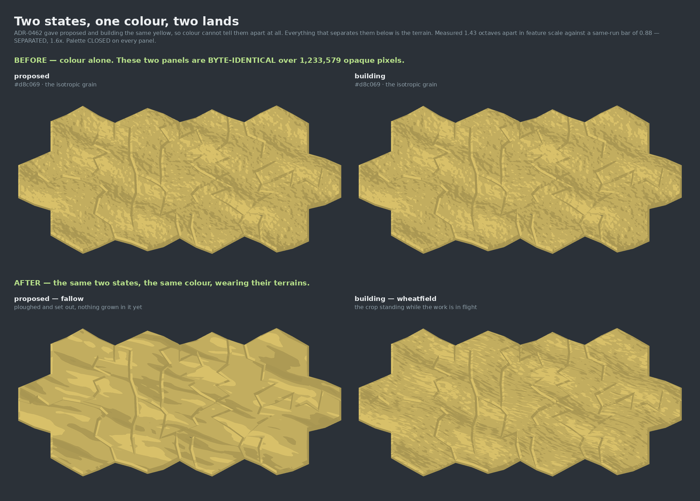
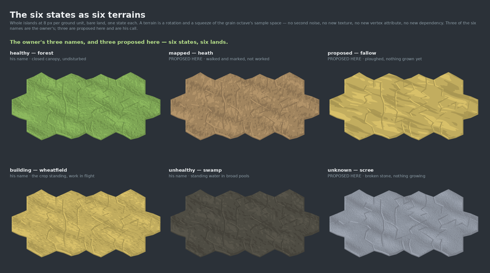

# The states as terrains — the first build of ADR-0461 D1

**Increment:** `name-the-four-states-as-terrains` on `adopt-the-land-into-the-shipped-map-arc`.
**Taken:** 2026-08-28 on an **NVIDIA GeForce RTX 2060** (`ANGLE (NVIDIA Corporation, NVIDIA
GeForce RTX 2060/PCIe/SSE2, OpenGL 4.5.0)`), `EXT_disjoint_timer_query_webgl2` available.
**Instrument:** `harness/terrain.html` + `harness/terrain-measure.mjs`, reading `getImageData`
off each canvas — never a screenshot.

---

## 0. THE ONE SENTENCE

**Two states that wear the identical colour are now two unmistakably different lands, and the
separation is measured on delivered pixels against a bar read off a control in the same run.**



---

## 1. Why this pair, and why it is the whole point

ADR-0461 D1 decides that a capability's state is carried by a **named terrain** rather than by a
tint — colour stays one channel of the signal and stops being the only one. ADR-0462, landed the
day before, settled the colour vocabulary at **five colours over six states**: `proposed` and
`building` share one yellow.

So those two states are the case where **colour has nothing left to say**, and ADR-0461 D4 says
so in terms: *"once `proposed` and `building` share a hue, colour alone cannot tell those two
states apart at all… terrain is not an enrichment there, it is the only carrier."*

✅ **THE PREMISE IS NOT ASSERTED, IT IS MEASURED.** With the terrain off, the two panels are
**BYTE-IDENTICAL over 1,233,579 opaque pixels**. Same token, same field, same light, same
island. That is the strongest available statement that colour cannot separate them — and it is
what makes every difference in the AFTER row attributable to the terrain and to nothing else.
`terrain-measure.mjs` **refuses the whole run** if those two panels ever differ, because a
difference there would mean something else varies with the status and every figure below would
be confounded.

**The two terrains, and why these two.** `fallow` is the field ploughed and set out with nothing
grown in it yet; `wheatfield` is the crop standing while the work is in flight. Same field, same
bearing (18°) — because it *is* the same field — and **4.7× apart in feature scale**. The
semantics are not decoration: `building` is already the only status carrying `spark: true` in
`heathConf()`, which is ADR-0461's own observation that the code carries state through more than
hue, partly and undeclared. This makes it declared.

---

## 2. The measurement

| channel | fallow vs wheatfield | same-run bar | verdict |
|---|---|---|---|
| **colour** | **0.00** — the same token, by decision | — | cannot separate, by construction |
| direction | 0.0451 | 0.0643 | no — they run the same way *on purpose* |
| **feature scale** | **1.433 octaves** | **0.879** | **SEPARATED, 1.6× its bar** |

At the **overview** (2 px/ground unit): 1.226 octaves against a bar of 0.849 — **SEPARATED,
1.4×**. The terrain survives being small, which is where a treatment that only works zoomed in
gets found out.

**✅ PALETTE CLOSED ON ALL 14 PANELS.** Every delivered pixel is an authored ramp entry. The
terrain costs the map's report exactly nothing — which it had to, because a treatment that
reported a colour no status owns would be the art asserting a state the work does not hold
(ADR-0392 D5 / ADR-0398 D7), the one way this arc can do real harm.

### ⚠⚠ THE BAR IS READ OFF A CONTROL IN THE SAME RUN, AND HERE THAT IS NOT MERELY HOUSE STYLE

Two terrains count as separated when the distance **between** them exceeds the spread **within**
each of them — measured across nine sub-regions of the same island, in the same frame, under the
same light. The same land is never separated from itself, and a test asserts that.

The reason it cannot be an absolute threshold: `grain-picture-is-renderer-specific` measured that
**24.5% of grained pixels land on a different ladder rung between SwiftShader and an RTX 2060**.
Any committed absolute figure over grained land would be one machine's figure and would red on
every other. A within-run ratio survives that, because both arms move together.

### ⚠⚠ A SYNTHETIC TEST CAUGHT A DEFECT THAT WOULD HAVE SUNK THE INCREMENT

The instrument's first design measured **orientation only** — how a land spends its gradient
across four directions. Against synthetic lands it reported two fields of rows at the *same
bearing* and **seven times apart in scale** as **0.0002 apart**.

That is exactly the `fallow`/`wheatfield` case. An orientation-only instrument would have
reported the pair the entire vocabulary rests on as **indistinguishable**, and it would have been
the *instrument* that was wrong — a false negative wearing the calm authority of a measurement.
The **fineness** channel (crossings of the land's own local mean per 100 px) is the fix, and both
channels are token-invariant by construction: scaling every pixel's level scales numerator and
denominator alike, and crossings are counted about each scan line's own mean.

The failing case is kept as a test so nobody deletes the second channel as redundant.

---

## 3. The vocabulary



| state | terrain | what it is | colour | feature (along × across) | how it was settled |
|---|---|---|---|---|---|
| `healthy` | **forest** | closed canopy over undisturbed ground | `#8cb85e` | 6.7 × 6.7 | **he named it** |
| `mapped` | **heath** | open scrub over surveyed ground — walked, marked, not worked | `#b3946a` | 14.2 × 8.4 | proposed here, **he accepted it** |
| `proposed` | **fallow** | ploughed and set out, nothing grown in it yet | `#d8c069` | 104.4 × 17.4 | proposed here, **he accepted it** |
| `building` | **wheatfield** | the crop standing while the work is in flight | `#d8c069` | 14.7 × 3.7 | **he named it** |
| `unhealthy` | **swamp** | standing water in broad pools | `#57544a` | 12.7 × 12.7 | **he named it** |
| `unknown` | **scree** | broken stone with nothing growing | `#9ca3af` | 2.8 × 2.8 | proposed here, **he accepted it** |

⚠ **THE COLOUR COLUMN IS THIS PASS'S PALETTE AND `mapped` HAS SINCE MOVED.** The tan `#b3946a`
was replaced by a tilled clay on 2026-08-28 (ADR-0470, PR #1687). This table is the record of the
run above and is not reconciled forward; the live table is `palette-band.ts`.

⚠⚠ **ALL SIX MAPPINGS ARE SETTLED — UPDATED 2026-08-28.** He named `forest`, `swamp` and
`wheatfield` on 2026-08-27, and on 2026-08-28 he was shown the sheet above and accepted the other
three verbatim: *"All three are fine."* ADR-0461 D5's *"which terrain maps to which state beyond
the three the owner named is not decided"* is therefore **discharged**, and
`oq-three-of-the-six-land-names-are-mine-not-yours-accept-the` is settled.

The rows carried `provenance: 'proposed-here'` until then, and the picture above printed
**PROPOSED HERE** under three of six panels. **That flagging was right** — it is what stopped a
guess quietly becoming a decision nobody made — and keeping it after the answer would have
inverted its own purpose, making a settled vocabulary read as unsettled. It came off in the
landing that built the theme layer (`themes-clear-the-separation-floor`), which is the first
landing after the settlement to touch the vocabulary. The **origin** distinction is kept in the
type (`owner-named` / `owner-accepted`) and in the table above, because "he named it" and "he
accepted it when asked" are different facts a later reader may need; what is gone is the claim
that anything here is still open. A test asserts the 3/3 split and that no row is unsettled.

⚠ **SIX TERRAINS, NOT FIVE, AND THE COUNT IS BY STATE.** ADR-0461 D4: *"an increment scoped off
the colour count will author one treatment too few and will not notice."* A test counts them.

⚠ **NAMED FOR WHAT THEY ARE, NEVER FOR HOW THEY LOOK** (ADR-0461 D2). `forest`, not
`forest-green`. A test greps every name for a hue word, because the terrain half of a name
survives a theme and the hue half goes stale the first time a theme moves it.

---

## 4. What a terrain IS, mechanically

**A rotation and a non-uniform squeeze of the grain octave's sample space.** That is all.

- no second noise field
- no new texture
- no new vertex attribute channel
- no new dependency
- ~30 lines of generated GLSL

It builds on the **one component of the approved treatment already measured to cross into WebGL**
(PR #1665: +183% pixel-scale contrast on bare land, palette closed). ⚠ `land-grain.ts` records
that the Cycles grain was anisotropic *by accident* — generated coordinates normalise per axis —
and that ours was deliberately authored isotropic at a round 2.5. **This makes that axis a
declared, per-state carrier rather than an artefact.**

✅ **THE TERRAIN IS LOOKED UP FROM THE STATUS, NEVER PASSED IN.** `IslandView`'s prop is a
**switch**, not a choice. A panel cannot ask for a terrain that disagrees with the state it is
drawing, because a per-panel override would be a way to draw a lie. It also means a **mixed**
island gets the right ground character per parcel for free.

✅ **ABSENT ⇒ BYTE-IDENTICAL.** A material with no terrain compiles the source it always did, and
a terrain asked for on an *ungrained* material emits nothing at all — inert, not an error. Both
are asserted on the generated source.

---

## 5. What else the run found

**13 of the 14 colour-separated pairs are ALSO separated as land.** That is an enrichment rather
than a necessity — those pairs were already told apart by hue — and saying so is the honest
claim. The exception is worth recording: **`fallow` vs `swamp` is colour-only** (direction
0.0350 against a 0.0643 bar, scale 0.70 against 0.88). Both are coarse, both are undirected
enough at this scale. They are 14+ apart in colour so nothing is at risk today, but if a theme
ever brought those two hues together, that pair is where it would bite first.

**Anisotropy, measured:** `wheatfield` 2.59, `fallow` 2.14, and the three undirected lands
1.73–1.75 — so the directed terrains really do read as directed and the undirected ones do not.

---

## 6. What this does NOT do

- **It does not adopt anything.** Nothing here reaches `packages/forest-world-r3f/src`; adoption
  stays a separate event (ADR-0380 D6 / ADR-0406 D2) and `scope-fence.test.ts` holds it.
- **It does not settle the theme layer or the per-theme floor.** That is
  `themes-clear-the-separation-floor` (ADR-0461 D3). What this supplies is the instrument that
  guard will need: `terrain-separation.ts` already produces a per-pair verdict with a same-run
  bar, and a per-theme floor is that verdict run over a theme's own tokens.
- **It does not use vegetation as a carrier.** `heathConf()` already varies plants per status and
  is a real second channel, deliberately held out so this page measures ONE thing. Every panel is
  bare land. Folding vegetation into the vocabulary is the obvious next step and would only widen
  the margins reported here.
- **It does not settle the worn path** (`oq-may-the-shipped-map-s-land-carry-a-worn-path-and-what-doe`).

---

## 7. Files

| file | what it is |
|---|---|
| `terrain-pair-2026-08-28.png` | the comparison: two states, one colour, before and after |
| `terrain-vocabulary-2026-08-28.png` | all six terrains, whole islands at delivered size |
| `terrain-measure.json` | the raw run: renderer, per-panel signatures, every pair verdict |
| `combine.py` | composites the sheets from the MEASURED panels |

Reproduce:

```
pnpm --filter @storytree/forest-world-r3f exec vite harness --port 5241 --strictPort
DISPLAY=:0 ST_TERRAIN_GPU=1 ST_TERRAIN_URL=http://localhost:5241/terrain.html \
  pnpm --filter @storytree/forest-world-r3f measure-terrain
python3 docs/research/chapter2-terrain-vocabulary-2026-08-28/combine.py \
  .terrain-measure docs/research/chapter2-terrain-vocabulary-2026-08-28/
```

⚠ **Pass a free port** — `harness/vite.config.ts` pins `strictPort: 5184` for every worktree, so
the default is a port a sibling worktree may own, and a wrong-tree measurement produces a
*number* rather than a missing file. The driver refuses `:5184`, and it also **proves the tree**
by checking the served page's title before trusting a pixel.

⚠ **`ST_TERRAIN_GPU=1` is not optional for a hardware claim.** `--use-gl=egl` falls back to
SwiftShader silently on this box, and so does omitting `DISPLAY` even headless.
