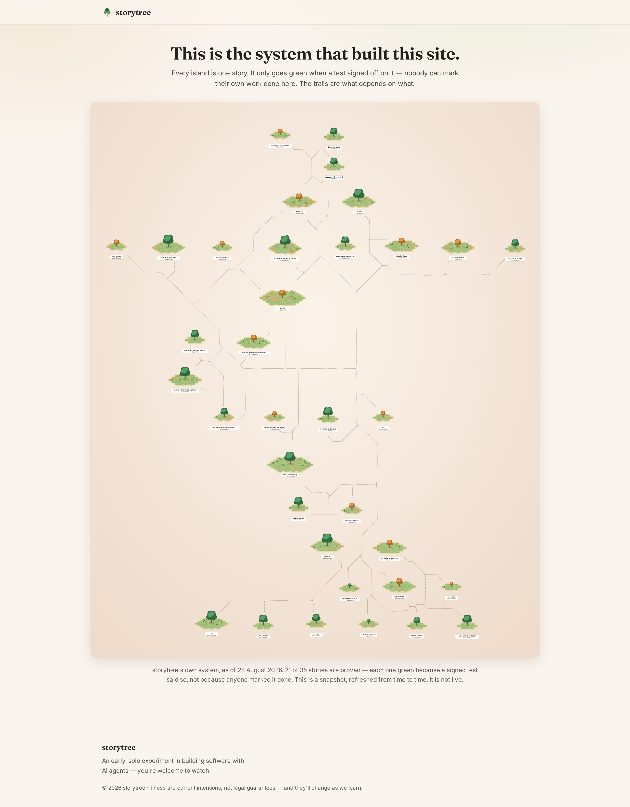

# The public site's forest is the real one — measured, 2026-08-28

The record for `website-refresh-arc-forest-snapshot` (ADR-0453 D5/D7): what the pipeline produced,
what the site now draws, and the evidence that every instrument built here can actually fail.

## The picture

**It is live: https://crisp-globe-bf6v.here.now/forest/** — captured from the deployed site below,
not from a local build.



`forest-page.png` is the same page from the local build, and `forest-map.png` the map alone.

Read it as the pitch reads it: **35 islands, one per story, 21 of them green — and green only
because a signed verdict says so.** The trails are `depends_on`; the foundation sits at the bottom
and the things that rest on it fan upward. Nothing on that map was authored to look that way.

## The numbers, from the live store

```
$ pnpm web:forest-snapshot --out web/src/data/forest-snapshot.json
  as of        2026-08-28T07:44:22.433Z
  stories      35 (21 proven)
  capabilities 215
  source       studio /api/tree + presentStories (ADR-0453 D7)
```

- **35 live stories** — 11 `retired` pruned by the studio's own presentation fold, matching
  ADR-0453's 2026-08-26 measurement exactly.
- **21 proven of 35.** ADR-0453 recorded 20 on 2026-08-25 after the crown-green work; one more has
  landed since. Every one of those 21 is `status: healthy` ONLY because `provenStatus` folded a
  signed pass into it — the authored field on all 35 is still uniformly `proposed`.
- **215 capabilities**, of which 138 read healthy, 70 proposed, 3 mapped and 4 unreadable.
- **71 KB** of JSON, inlined into the page at build time.

## Why the export could not just read `status`

This is ADR-0453 D7 and it is worth restating with the file in front of you. The authored `status`
of every one of the 35 live stories is `proposed`. An exporter that read that field would publish 35
identical grey islands: not a forest without red, a forest without information. The colour comes
from `rollupStoryGreen` folding signed verdicts, and that fold already exists in the studio's
`/api/tree` read — so the export calls it rather than re-deriving it. Concretely,
`apps/studio/server/apiRouter.ts` grew one exported function, `buildTreePayload`, holding exactly
what the route already did; the route is now a two-liner over it, and the exporter is its second
caller. Nothing about the read moved.

The consequence ADR-0453 named is now live: **the public site is a dependent of the studio's fold.**
A change to how the studio computes display status changes the public site at the next snapshot.

## Proof that the instruments can fail

Both suites were mutation-tested — each mutation applied, the suite run, the mutation reverted.

`apps/studio/server/forestSnapshot.test.ts` (9 tests):

| mutation | result |
| --- | --- |
| spread the whole `TreeStory` into the output (the leak) | 3 failed |
| read `payload.stories` instead of the studio's presentation fold | 3 failed |
| carry `payload.builds` (the wisp layer) through | 1 failed |
| make the publish guard always return "publishable" | 2 failed |
| *(restored)* | 9 passed |

`web/src/scripts/forest-snapshot-map.test.ts` (15 tests, plus the 3 existing camera tests):

| mutation | result |
| --- | --- |
| stamp prints a constant date instead of the snapshot's | 1 failed |
| an unknown status silently reads as `proposed` rather than `unknown` | 1 failed |
| `assertSnapshot` accepts anything | 4 failed |
| the layout ignores dependency rank (one flat row) | 1 failed |
| the frame drops its margins (islands off the edge) | 1 failed |
| *(restored)* | 18 passed |

The DAG property in that second suite carries its own teeth in the same test: the fixture is fed
again with every edge reversed, and the "a dependent sits above its dependency" assertion is
asserted to BREAK. Without that, a layout that put every island at the same y would pass it.

⚠ `bun test` transpiles and does not typecheck, so a mis-parameterised probe there runs to
completion and prints confident numbers. The web repo now has `npm run typecheck` and it is clean —
see below for what that first run found.

### And the shell-level refusals, run for real

The publish guard is not only unit-tested — the shipped command was run against two deliberately
broken states and **wrote no file in either**:

```
$ STORYTREE_STUDIO_STORE=json  pnpm web:forest-snapshot --out /tmp/should-not-exist.json
  refusing: STORYTREE_STUDIO_STORE is not `pg`. The published snapshot must be a reading of the
  LIVE store; the offline JSON backend carries a deliberately-frozen fixture corpus that is not
  this project.
  exit 1 — /tmp/should-not-exist.json: No such file or directory

$ STORYTREE_DB_USER=  pnpm web:forest-snapshot --out /tmp/should-not-exist2.json
  refused at startup by the blank-credential guard.
  exit 1 — /tmp/should-not-exist2.json: No such file or directory
```

The third refusal — a reachable store that answers with no proof — is the one that cannot be staged
locally without breaking the database, and is covered by `unpublishableReason`'s unit tests plus the
mutation above that disabled it.

## What the typechecker found the moment it existed

The web repo had **no typecheck at all**, and `astro build` uses esbuild, which transpiles without
checking. Adding `tsc --noEmit` surfaced seven standing errors, four of them one defect:

`SceneTerritoryInput.radius` was split into `groundRadius` and `screenRadius` in the parent engine
— a split whose own doc comment says it exists so that "that mismatch is a TYPE ERROR the next
time, not a quiet 11–66% shortfall". The engine was synced into the site; the site's four call
sites were not updated; `radius` is not a member of the interface, so esbuild dropped it silently
and **every island on the live public site has been reaching the scene with both radii undefined**.
Restoring both fields to the one declared value reproduces the pre-split behaviour exactly, which
is all the fix claims.

The other three: a `.map(hexCenter)` index-into-options trap in the dead `world.ts`, and the
camera test's missing `@types/node`.

## What is NOT here, deliberately

- **No wisps** (ADR-0453 D5). The exporter does not publish `builds`/`sessions`/`claims` and the
  renderer draws none. A wisp says a session is working right now; a nightly snapshot saying that
  would be a description of the system rather than a reading from it.
- **No check rung comparing the live corpus to the published file, and none may be added**
  (ADR-0302 D1/D4). Staleness is not a defect of this artifact; it is what the artifact is. That is
  why the page prints the date.
- **No hand-edits.** The file is written by `pnpm web:forest-snapshot` and by the nightly workflow,
  and by nothing else.
- **No public labels, renames or glossary** (ADR-0453 D3). The plates carry our own story ids —
  `drive-machinery`, `proof-binding-integrity` — because the illegibility is the mechanism: the
  visitor projects their own system onto the shape.

## The one thing that is not yet running

⚠ **An earlier decision had already argued the other way, and nobody had linked the two.** ADR-0299
governs exactly this territory — the public site's forest as a projection of the real corpus — and
carried **no edge to ADR-0453 at all** until the pre-merge library pass added one. Its D1 says
outright: *"Merge cadence is the event cadence: the forest updates every time work lands, which is
the beat worth watching."* It assumed the website's own CD would do the regenerating, which is not
buildable — the credentials are in the private repo — so the mechanism sentence is corrected in
place, and the CADENCE it argued for is now in the open question as the stronger case for on-merge.
This is what `storytree library related <id> --unlinked` exists for: every traversal here follows an
authored edge, and the decision that bore on this one had none.

The nightly job (`.github/workflows/forest-snapshot.yml`) is complete but **inert until the owner
adds a `WEB_PUSH_TOKEN` secret** — it publishes into a different repo, which the built-in
`GITHUB_TOKEN` cannot write to. The workflow refuses up front and by name rather than discovering
it at the push. The cadence and that secret are both in
`oq-how-often-should-the-public-forest-refresh-and-who-cuts-t`.
