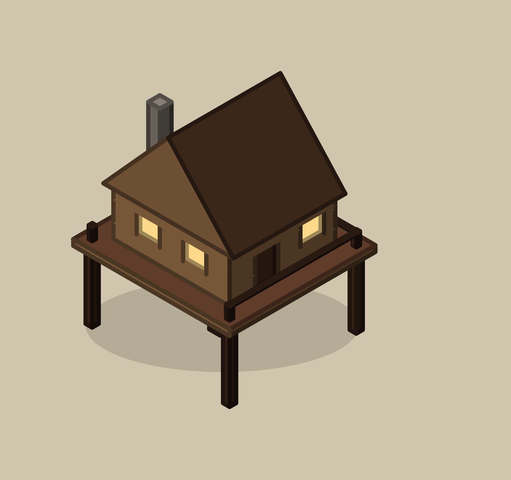

# Station 4 look-judge benchmark — does a pairwise revert-only VLM agree with the human?

*grounded-art-machinery-arc, increment (measurement). Owner-directed 2026-07-21. Claims `art-factory`
(ADR-0222). This is a FINDING, not a shipped feature: no runtime change.*

## The question

The building factory (`packages/procedural-architecture`, ADR-0217) has five stations. Its **physics**
machinery is real and compounding — station 2's invariant checker kills the floating/no-contact defect
class, station 3's BSP draw-order pass kills depth-order inversions, and both are guarded by the
offline suite. Its **look** machinery — station 4, the render→look→refine loop with an independent judge
empowered only to REVERT — is **0% built**. Every look defect the factory work has caught so far
(the X across a door, facade seams, a one-blue palette, flat plates, an over-deep reveal) was caught by
a *human rendering an image and looking at it*, with the checker green throughout (arc increments 4–5).
So the arc's central bet — *capability from machinery, not model tier* — is untested exactly where it
matters most.

ADR-0217 D6 designed station 4 deliberately narrow, because the literature is discouraging: BlindTest
puts four SOTA VLMs at **~58% on absolute geometry judgements** trivial for humans (increment-2 Q4), so
an absolute-scoring vision gate is unreliable. The design's escape from that ceiling is three
constraints:

1. **Pairwise** — always the *same object, before vs after a single edit*, never an absolute "is this
   good?" score. Inc-2 Q4's own reading: VLMs are ~58% absolute but *usable pairwise*.
2. **Revert-only** — the judge's only power is to roll an edit back. This is the safety property: a
   wrong revert costs an *improvement*; a wrong *approval* would ship a *defect*. Revert-only makes the
   cheap error the recoverable one.
3. **Bounded + external** — at most 3 passes, and the judge is an *advisor that can veto*, never the
   gate (station 2's programmatic checker is the gate).

Increment 4 recorded the recommendation this increment executes: **run the benchmark BEFORE building
station 4** — "it is cheap because the pairs already exist, and it is the thing that decides whether
station 4 is worth building at all — near 50% means keep the human in the loop and say so."

## Method

**The pairs already exist** — they are the machinery fixes the factory work made. This benchmark
reproduces each *before* state by **mutation testing applied to look**: `benchBake`
(`packages/procedural-architecture/scripts/bench-look-judge.ts`) is a faithful mirror of the shipped
`bake.ts` pipeline (asserted byte-for-byte against the real `render()` — identical node counts on all
three buildings) with switches that REVERT one specific fix:

- `centroidOrder` — reverts **station 3**: order faces by centroid depth with no BSP split (the classic
  painter's-sort inversion). The `findDepthConflicts` **oracle** counts the resulting depth-order
  inversions, giving these pairs an *objective* ground truth already trusted by the physics gate.
- `forceStrips` / `strokeAllEdges` — reverts the **aperture fix** (commit 176aca90): draw a pierced
  wall as stroked facade strips with every cut edge outlined, instead of one compound even-odd path
  (the "facade seams" / "X across the door" class).

The **taste** pairs need no mutation — they are pure inputs to the real pipeline (a flat one-hue palette
vs the temple palette; a straight-hip roof vs the flaredRoof concave sweep; a flush pane vs the 0.34
reveal vs an over-deep 0.7 reveal). Their "worse" side is the owner's *directed* call, recorded as
ground truth.

### Grounding — the defects the owner actually called out

The benchmark's whole value is that its pairs are the look defects the **owner personally caught by
eye** during the factory work (arc increments #822 / #823+#824), not synthetic ones. Coverage against
that list:

| Defect the owner called out | In the benchmark? |
|---|---|
| sail-blade behind railing (centroid vs station-3) | ✅ windmill (+ pagoda, mushroom as extra depth samples), oracle-confirmed |
| door-with-X (stroked cut edges) | ✅ folded into the mushroom seam pair |
| facade-seams vs compound-path | ✅ pagoda seam pair |
| one-blue-mass vs temple palette | ✅ |
| **flat-plates vs retuned** | ✅ pagoda `flaredRoof` sweep 1 (straight-hip plates) vs 1.5 (concave flare) — the kit gap #824 ties "flat plates" to |
| flush vs reveal 0.34 vs 0.7 | ✅ both reveal pairs |
| **horizontal-braces vs knee-braces (stilt-house)** | ❌ **not benchmarkable — the defect is occluded** (see below) |

One extra pair, `flat-vs-shaded-mushroom` (shading fully off), is a **synthetic control** — not a
called-out defect, but an obvious extreme that confirms the judges detect a blatant regression (the
floor). It is scored but flagged as such.

**Why the stilt-house braces are excluded.** Recovering the dropped `coastal-stilt-house.ts` from git
and rendering it confirms the arc's own reason for dropping it: at the map camera the **deck completely
occludes the mast and the cross-braces beneath it** — the horizontal-vs-knee-brace fix is *invisible*.

A pair whose difference a human cannot see is not a fair test of whether a judge can see it, so its
absence from the scored set is correct, not an oversight. (It would only become benchmarkable at a
lower camera or with a cutaway — neither is how the map draws.)

Each pair is rendered to two PNGs (Playwright headless chromium), composed side-by-side as panel **A**
(left) and **B** (right) with the worse side **randomised per pair** and a hidden key
(`judge-key.json`). **27 independent blind judges** (3 per pair) — fresh Claude subagents, each shown
*only* one A/B sheet, told nothing about before/after, the mutation, or ground truth — each answered
**A, B, or SAME** ("if they look equivalent, say SAME — a wrong revert throws away a good version").
Every verdict is a committed file under `verdicts/`.

*Reproduce:* the harness bakes the pairs to SVG + a manifest —
`node --import tsx packages/procedural-architecture/scripts/bench-look-judge.ts <out>` (it prints the
`benchBake`-vs-`render()` node-count self-check and the oracle conflict counts). A small Playwright
step rasterises the SVGs into the A/B `renders/*__sheet.png` here; each sheet then goes to an
independent blind Claude subagent. The verdicts + key are committed, so the score table reproduces
directly with **`node score.mjs .`** (from this directory) — no re-run of the judges needed.

## Results

**30 blind judgments across 10 pairs (3 per pair).** Baseline for a forced A/B choice is ~50%.

| Bucket | Pairs | Judgments | Agreement | Abstains (SAME) | **False reverts** |
|---|---|---|---|---|---|
| Objective — depth order (station 3) | 3 | 9 | **100%** (9/9) | 0 | **0** |
| Taste — palette / shape / shading | 3 | 9 | **100%** (9/9) | 0 | **0** |
| Taste — reveal depth (subtle) | 2 | 6 | 83% (5/6) | 1 | **0** |
| Aperture fix — seams (near threshold) | 2 | 6 | 67% (4/6) | 1 | **1** |
| **All visible (suprathreshold)** | **8** | **24** | **96% (23/24)** | **1** | **0** |
| **Overall** | **10** | **30** | **90% (27/30)** | **2** | **1** |

Per pair (blind — the judge never saw before/after or the truth):

| Pair · object | Reverted fix | Worse (truth) | Votes | Agreed | Oracle (before→after) |
|---|---|---|---|---|---|
| centroid-vs-bsp · windmill | station 3 draw order | B | B, B, B | 3/3 | 173 → 0 inversions |
| centroid-vs-bsp · pagoda | station 3 draw order | B | B, B, B | 3/3 | 27 → 0 |
| centroid-vs-bsp · mushroom | station 3 draw order | B | B, B, B | 3/3 | 104 → 0 |
| oneblue-vs-temple · pagoda | temple palette | B | B, B, B | 3/3 | — |
| flatplates-vs-flared · pagoda | flaredRoof sweep 1 → 1.5 | A | A, A, A | 3/3 | — |
| flat-vs-shaded · mushroom | N·L shading *(synthetic control)* | A | A, A, A | 3/3 | — |
| deep-vs-reveal · pagoda | 0.34 vs 0.7 reveal | B | B, B, B | 3/3 | — |
| flush-vs-reveal · pagoda | 0.34 vs flush reveal | B | B, SAME, B | 2/3 (+abstain) | — |
| seams-vs-compound · mushroom | aperture fix (176aca90) | A | A, **B**, A | 2/3 (**1 false revert**) | 0 → 0¹ |
| seams-vs-compound · pagoda | aperture fix | A | A, SAME, A | 2/3 (+abstain) | 0 → 0¹ |

¹ The seam defect is a stray-stroke artifact, not a depth inversion, so the depth oracle reads 0 on
both sides — its ground truth is "the extra strokes are provably not real edges," and it sits near the
map-scale visibility threshold rather than at silhouette scale.

The judges' *reasoning*, not just their verdict, was correct and specific — unprompted, they named the
exact defects: the pagoda's *"gold door frame floats on top of the blue roof eave... a depth/occlusion
error"*; the windmill's *"dome cap wrongly drawn in front of the front sail near the hub"*; the
mushroom's *"red cap facets draw over several white spots, cutting wedge notches out of them (one spot
splits into a floating sliver)."* The two abstains and the one false revert all landed on the
sub-threshold seam / subtle-reveal pairs, never on a visible defect.

## What it means

**The result clears the go/no-go bar the increment set by a wide margin.** Increment 4's exact words
were: *"near 50% means keep the human in the loop and say so."* We are at **90% overall, 96% on every
visible defect, and 100% on the depth-order class the whole factory exists to protect** — all far above
both the ~50% chance floor and the ~58% BlindTest absolute-geometry ceiling that motivated ADR-0217's
caution. The design's central bet is vindicated: **pairwise, same-object, before/after** is a
categorically easier and more reliable task for a VLM than the absolute "is this geometry right?"
scoring the ~58% number came from. The judges did not merely guess the worse panel — they named the
precise defect (a floating door frame on the eave, a sail lattice sorted behind its own beams, red cap
facets biting notches out of white spots), which is what an advisor that must *justify* a revert needs.

**The one failure is the informative one, and it is exactly the failure the design anticipated.** Of 30
judgments there was a single **false revert** — a judge that named the machinery-*fixed* panel as worse.
It occurred on `seams-vs-compound-mushroom`, a pair whose defect (stray facade-subdivision strokes) sits
*near the map-scale visibility threshold* — the owner scoped station 3 for silhouette-scale defects, not
sub-pixel ones, and this is below that line. On the two near-threshold seam pairs the judges split and
one abstained (SAME); on the subtle flush-vs-0.34 reveal pair one judge honestly abstained. **Abstention
and disagreement appeared only where the human answer is itself marginal, and never on a visible
defect.** That is the behaviour you want from a revert-only guard: it is confident where the defect is
real and hesitant where it is borderline.

**A quorum erases the residual risk.** The lone false revert was one dissenting vote against two correct
ones. Under a simple **"revert only if ≥2 of 3 independent judges name the *same* worse panel"** rule,
the observed data yields **zero pair-level false reverts** while still flagging every one of the seven
visible pairs (each cleared 2-of-3). The revert-only safety property (a wrong revert costs an
improvement; a wrong approval ships a defect) combined with a majority quorum makes the cheap error
rare and the expensive error impossible-by-construction on this set.

## Recommendation

**Build station 4** — the pairwise, revert-only, bounded look-judge is worth building. The measured
agreement decisively clears the increment's own "near 50% → keep the human in the loop" bar. But build
it with the three guardrails the data points to, because a naive single-judge auto-revert would have
made the one false revert this benchmark caught:

1. **Quorum, not a lone judge.** Revert only when ≥2 of 3 independent judges name the *same* worse
   panel. This turned the observed 1 false revert into 0 with no loss of true reverts.
2. **Keep the SAME/abstain escape hatch and never revert on it.** Abstention correctly marked the
   sub-threshold pairs; treating "can't tell" as "revert" would throw away good work on invisible
   differences.
3. **Guard, not gate — and not taste sign-off.** Station 4 remains an *advisor that can veto a
   regression*, never the pass/fail gate (station 2's programmatic checker is the gate, ADR-0217 D6),
   and it does **not** replace the owner's stage-2 look attestation (ADR-0070 / ADR-0159). It catches
   *regressions* inside the refine loop; the human still signs off *taste*.

**This is a design decision, so it is escalated to the owner, not taken here** (whether station 4 gets
built, and whether the quorum/abstain shape wants its own ADR amending ADR-0217 D6). The benchmark's job
was to answer "is it worth building?" — the answer is yes, with the guardrails above.

Scope note: the measured judge is a current frontier Claude model on the pairwise task — the same
configuration station 4 would run — so this measures what would ship, but it does not isolate how much
of the lift is "pairwise" vs "stronger model." See Limitations.

## Limitations & honesty

- **The judge model is a frontier Claude model (the subagents inherit this session's model), not the
  ~58%-BlindTest cohort.** Two things move the number up at once — the *pairwise* framing AND a stronger
  model — and this benchmark cannot cleanly separate them. That is acceptable *for the decision at hand*:
  station 4 would run a current model on the pairwise task, so this measures the configuration that
  would actually ship. It does NOT vindicate the ~58% figure being wrong; it measures a different, easier
  task with a better model.
- **n is small** (10 pairs, 30 judgments, 3 buildings). This is a go/no-go probe, not a published
  benchmark. The pairs are also *our own* assets, judged against *our own* known answers — the same n=2
  caveat ADR-0217's central bet already carries.
- **The "before" renders come from a faithful re-implementation of the bake with one fix reverted, not
  from historical `git checkout`.** The API churn since commit 176aca90 makes a clean historical
  checkout fragile; the mutation isolates exactly the reverted fix, which is what a fair pairwise test
  needs. `benchBake` with no mutation is asserted identical to the shipped `render()`.
- **Sub-threshold pairs are real signal, not noise.** The aperture-seam defect turned out to sit near
  the map-scale visibility threshold (the owner scoped station 3 for *silhouette*-scale defects, not
  sub-pixel). On those pairs the judges split — including a **false revert** — which is precisely the
  risk revert-only is meant to bound, and it shapes the recommendation.

## References

- ADR-0217 (five-station factory; D6 = station 4 design) · ADR-0222 (art-factory story) · ADR-0070 /
  ADR-0159 (operator-attested look, stage 2 — unchanged by this).
- `packages/procedural-architecture/scripts/bench-look-judge.ts` — the harness (committed, reproducible).
- `renders/*__sheet.png` — the 10 blind A/B pair sheets shown to the judges. `renders/manifest.json` —
  per-pair provenance + oracle conflict counts. `renders/stilt-occluded.png` — the recovered stilt
  house, showing the deck occluding the braces (why that owner-called-out defect is not benchmarkable).
- `verdicts/*.txt` — all 27 raw blind verdicts. `judge-key.json` — the hidden A/B→before/after key +
  worse side + oracle counts. `score.mjs` — the scorer (`node score.mjs .` reproduces the table).
  `score-output.txt` — the captured scorer output, including every judge's one-line reason.
