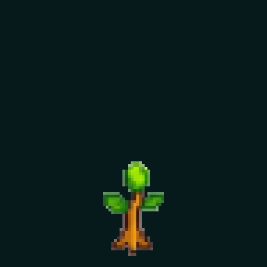

# Nano Banana tree-growth spike — 2026-07-30

## Question

Can one bounded Nano Banana generation match or beat the existing PixelLab tree-growth sprite sheet
as author-time visual research for Storytree Chapter 2?

## Result

**Verdict: useful and better staged, but it does not beat PixelLab overall.**

Nano Banana produced a genuinely fresh, coherent nine-stage sheet in one completed call. Its strongest
result is choreography: the trunk rises before the large branches, branch growth is easy to read, five
canopy buds are clearly separated at the handoff into foliage, and the crown then fills toward a
recognisable mature tree. That is a stronger topology/choreography reference than the PixelLab
interpolation.

It loses on three important axes:

- the raw generation vertically re-centres the tree as it grows, causing **21 px of bottom-root drift**
  after equal-cell downsampling to 96×96; PixelLab's raw sequence drifts **6 px** vertically;
- its projection is closer to an attractive front-facing game tree than Storytree's requested 2.5D
  low-top-down view; and
- its finish is cleaner but more generic and materially less rich than PixelLab's bark, roots, canopy
  texture, teal depth and restrained luminous accents.

The packaged preview applies explicit integer translations to place every bottom root at `y=91`.
That correction is useful for judging the art in motion, but it is a transformation, not evidence that
Nano Banana obeyed the fixed-root prompt. The unmodified model output and an unaligned transparent
sheet are retained beside it.

Per ADR-0264,
neither this sheet nor the [PixelLab sheet](../pixellab-tree-growth-spike-2026-07-30/tree-growth-spritesheet.png)
may become Chapter 2's semantic state model. This spike is author-time art direction only. The most
useful Nano Banana residue is branch timing, readable negative space, and separable canopy slots for a
later deterministic topology rig.

## Side-by-side assessment

| criterion | Nano Banana (`gemini-3-pro-image`) | PixelLab baseline | winner |
|---|---|---|---|
| Fresh nine-stage concept | One coherent 3×3 generation | Two endpoints plus animation interpolation | Nano Banana |
| Trunk → branch → canopy order | Very explicit; frame 5 exposes five separate buds | Readable, but foliage arrives earlier and interpolation invents the in-betweens | Nano Banana |
| Stable topology | Broad structure reads consistently, but forks and cluster boundaries still mutate | Broad structure reads consistently, but topology is invented between endpoints | Neither |
| Raw horizontal root range at 96 px | 2.1 px | 2.6 px (`46.0`–`48.6`) | Nano Banana, narrowly |
| Raw vertical root range at 96 px | **21 px** (`bottom y=66`–`87`) | **6 px** (`bottom y=84`–`90`) | PixelLab |
| 2.5D low-top-down read | Weak-to-moderate; mostly front-facing | Stronger trunk/root volume and depth | PixelLab |
| Pixel-art finish | Crisp, readable, conventional | Richer, more organic, more Storytree-like | PixelLab |
| Five capability-like canopy slots | Clearest at the bud stage; later clusters merge and can read as more than five lobes | Five clusters remain fairly legible in the mature crown | Mixed |
| Disallowed motion/scene elements | No flying leaves, ground tile, text, border or camera change | Also clean | Tie |
| Overall | Better choreography reference, weaker finished art and raw alignment | Better art-direction reference | **PixelLab** |

## Model, tool and provenance

- Model: **Nano Banana Pro**, repository model id `gemini-3-pro-image`.
- SDK: `@google/genai` `2.13.0`.
- Route: the repository-documented Gemini API backend, with ambient ADC used to access Secret Manager
  secret `gemini-api-key` in project `storytree-498613`. No credential was printed or persisted.
- Probe: `models.list` returned 50 models on its first page and included `gemini-3-pro-image`.
- Completed generation calls: **1**.
- Inputs: text only; no PixelLab or Storytree image was supplied to the model.
- Config: `1:1`, `1K`, response modality `IMAGE`.
- Returned format: opaque 1024×1024 JPEG, despite the transparent-sheet target.
- Completed call time: 26.5 seconds.
- Raw SHA-256:
  `B675BBA261F0BB38607C17FD9B2213A427B37B0AA787FDBE664F5AAD510C0B7A`.
- Full machine-readable record: [`generation-metadata.json`](generation-metadata.json).

An initial foreground launch was terminated by the execution harness after about five seconds and
returned no asset. It may have reached the vendor before termination, so the vendor-side billed-call
count could be one higher than the single completed call proven by local metadata. The successful
background launch used the same prompt and configuration.

## Prompt

> Create ONE coherent 3 by 3 sprite sheet showing exactly nine chronological growth stages of the SAME
> fantasy story tree. This is fresh original game art, not a copy of any existing asset.
>
> LAYOUT
>
> - A square 3x3 grid, read left-to-right then top-to-bottom.
> - Nine equal invisible cells on one perfectly flat pure white (#FFFFFF) background.
> - No grid lines, borders, labels, numbers, text, checkerboard, ground, island, soil tile, cast shadow,
>   or decorations outside the tree.
> - Keep generous blank white gutters so adjacent stages never touch.
> - In every cell, the tree's root socket is fixed at exactly the same lower-centre position. The root
>   tips and trunk base must not move at all between cells. No camera change, no whole-tree translation,
>   no rotation, and no centre-scale pop.
>
> NINE STAGES
>
> 1. tiny rooted sapling with a short ochre stem, two small leaves, and one restrained lime bud;
> 2. the same root and stem, trunk rising upward;
> 3. trunk taller, first major branch extending from an already-visible fork;
> 4. more major branches extending parent-first from visible trunk forks, still sparse foliage;
> 5. exactly five clearly separated canopy cluster buds appearing only at supported branch tips;
> 6. those same five clusters partly filling, with branch structure still legible;
> 7. those same five clusters fuller and denser;
> 8. nearly mature crown, same five-cluster topology;
> 9. mature asymmetrical story tree, same root, trunk, branches, and five canopy clusters.
>
> ART DIRECTION
>
> - crisp handcrafted pixel art with deliberately blocky pixels and no painterly blur;
> - Storytree-like calm 2.5D low-top-down view: trunk and roots seen slightly from above, not a side-view
>   platformer tree and not a fully top-down icon;
> - warm ochre/copper bark with deep umber creases;
> - deep forest-green and teal canopy shadows;
> - restrained lime proof-bloom accents only, never neon-dominant;
> - readable asymmetrical silhouette, selective dark outlines, compact game-sprite shading;
> - one consistent warm upper-left light across all nine cells;
> - canopy clusters remain visibly separable so a later deterministic runtime rig could reveal one
>   stable cluster per capability.
>
> Hard negatives: no flying leaves, no falling particles, no magical swirls, no duplicate trees inside
> a cell, no unrelated poses, no moving roots, no changing viewpoint, no image-frame border.

## Transformations

The raw response is [`nano-banana-original.jpg`](nano-banana-original.jpg). It is unchanged.
[`process-assets.py`](process-assets.py) performs deterministic packaging only:

1. split the 1024×1024 response into nine equal 3×3 cells in reading order;
2. remove only the near-white background connected to each cell edge with a corner-sampled flood fill
   (`max-channel tolerance = 42`);
3. box-downsample every complete cell to 96×96 with one common scale, then threshold alpha at `48` for
   crisp pixel edges;
4. save the resulting raw-position sheet as
   [`nano-banana-transparent-unaligned.png`](nano-banana-transparent-unaligned.png);
5. measure each frame's alpha bounds, bottom `y`, and mean `x` across the bottom three occupied rows;
6. translate each whole frame by integer pixels to target bottom root `(x=47, y=91)`;
7. save [`frame-01.png`](frame-01.png) through `frame-09.png`, assemble
   [`tree-growth-spritesheet.png`](tree-growth-spritesheet.png), and create the 384×384 nearest-neighbour
   dark-field [`tree-growth-preview.gif`](tree-growth-preview.gif).

No repainting, inpainting, compositing from other art, palette replacement, per-part warping, or
generative post-processing was used.

## Geometry evidence

Detailed per-frame evidence is in [`geometry-evidence.json`](geometry-evidence.json).

| frame | unaligned bounds | unaligned bottom y | unaligned root mean x | applied `(dx, dy)` | aligned bottom y | aligned root mean x |
|---:|---|---:|---:|---:|---:|---:|
| 0 | `(37, 33, 58, 66)` | 66 | 47.1 | `(0, 25)` | 91 | 47.1 |
| 1 | `(36, 23, 59, 70)` | 70 | 47.1 | `(0, 21)` | 91 | 47.1 |
| 2 | `(28, 11, 75, 71)` | 71 | 46.5 | `(0, 20)` | 91 | 46.5 |
| 3 | `(18, 7, 77, 82)` | 82 | 46.4 | `(1, 9)` | 91 | 47.4 |
| 4 | `(16, 7, 78, 82)` | 82 | 47.0 | `(0, 9)` | 91 | 47.0 |
| 5 | `(11, 4, 81, 82)` | 82 | 46.5 | `(0, 9)` | 91 | 46.5 |
| 6 | `(11, 6, 83, 86)` | 86 | 46.3 | `(1, 5)` | 91 | 47.3 |
| 7 | `(7, 5, 88, 86)` | 86 | 46.8 | `(0, 5)` | 91 | 46.8 |
| 8 | `(3, 2, 93, 87)` | 87 | 45.0 | `(2, 4)` | 91 | 47.0 |

- Raw horizontal range: **2.1 px**.
- Raw vertical range: **21 px**.
- Post-alignment horizontal bottom-root range: **0.9 px** (integer pixels cannot eliminate a
  shape-dependent fractional mean).
- Post-alignment vertical range: **0 px**.

## Limitations

- The model returned opaque JPEG, so transparency is derived, not native. The flood fill preserves
  enclosed light pixels but still inherits JPEG edge contamination.
- The raw root violates the most important animation constraint. The aligned preview is honest
  packaging for review, not model compliance.
- The model appears to size each stage for its cell, which creates the vertical drift and makes growth
  feel slightly like progressive reframing until corrected.
- Branch support is visually plausible, not addressable or deterministic. Fork positions and fine
  topology mutate between frames.
- Five canopy buds are clearest in frame 5. Later foliage lobes overlap and occasionally read as more
  than five clusters, so the sheet is not a reliable capability-count encoding.
- The tree reads more front-facing than low-top-down, and its roots lack PixelLab's richer 2.5D
  surface contact.
- The mature crown reaches the rightmost pixel after alignment. Nothing was clipped by the translation,
  but the 96×96 review frame has minimal right-side breathing room.
- Nano Banana is non-deterministic. Re-running [`generate.mjs`](generate.mjs) incurs another paid call
  and will not reproduce this image byte-for-byte.
- Most importantly, generated frames are expressly excluded as Chapter 2's runtime state model by
  ADR-0264 D4/D5.
