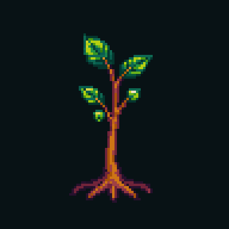

# PixelLab tree-growth spike — 2026-07-30

## Question

Can PixelLab generate fresh tree art and animate it growing in a way that is
useful for the Chapter 2 intro?

## Result

**Spike verdict: useful visual proof, not a production growth substrate.**

PixelLab produced an appealing nine-frame transparent pixel-art sequence with
a readable order:

1. rooted sapling;
2. trunk extension;
3. parent-like branch extension;
4. canopy clusters appearing and filling; and
5. the supplied mature tree.

The sequence is a good art-direction and choreography reference. It is not
ready to become Chapter 2's runtime state model:

- the raw root stays horizontally stable but drifts down by six pixels
  (`bottom y=84` to `bottom y=90`);
- the interpolation invents topology between the pinned endpoints rather than
  exposing deterministic, addressable trunk/branch/canopy parts;
- replay stability is a property of these baked frames, not of the product
  model; and
- ADR-0264 D5 explicitly rejects generated animation frames as the semantic
  state model.

The most promising use is as an author-time reference for the deterministic
SVG topology rig: palette, silhouette, branch pacing, canopy clustering and
the restrained lime proof-bloom accents. It should not replace that rig.

## Connection proof

The user-level Codex config at `C:\Users\mickh\.codex\config.toml` now contains
the `pixellab` MCP server entry. The exact configured `npx mcp-remote@latest`
stdio bridge was exercised independently:

- PixelLab MCP server: `0.2.0`;
- `mcp-remote`: `0.1.38`;
- initialize succeeded; and
- `tools/list` returned 65 tools.

The current Codex task was started before the config change, so its built-in
MCP registry does not hot-reload the new server. A new task or app restart is
needed before `pixellab` appears as a native tool there.

## Generation workflow

All accepted assets are fresh PixelLab output; no Storytree art was supplied.

1. Generate a 96×96 transparent mature tree with `create_image_pixflux`.
2. Generate a separate 96×96 transparent sapling with
   `create_image_pixflux`.
3. Pin both endpoints with `animate_image`, request eight interpolated frames,
   and describe the semantic order and fixed-root constraints.
4. Download the returned input-plus-eight frame sequence, then package the raw
   frames as a GIF and sprite sheet without repainting them.

PixelLab charged six trial generations total:

- mature endpoint: 1;
- two rejected start-frame experiments: 2;
- accepted sapling endpoint: 1; and
- animation: 2.

The trial balance after the spike was 34 of 40 generations remaining. A
Tier-1-only inpaint attempt failed before charging.

## Accepted prompts and job metadata

### Mature endpoint

- Job: `a00a98ac-552f-4f28-9db0-3e64bb725365`
- Seed: `20260730`
- File: [`end-mature-tree.png`](end-mature-tree.png)

Prompt:

> A single mature story tree game sprite for a calm 2.5D forest map: one sturdy
> asymmetrical trunk rooted at the exact lower centre, visible parent-first
> branching structure supporting five distinct rounded canopy clusters, warm
> ochre-brown bark, moss, deep forest-green and teal leaves with a few
> restrained lime proof-bloom accents. Hand-crafted storybook pixel art,
> readable silhouette, low top-down view, selective dark outline, medium
> detailed shading. Tree only with visible roots, no island, no ground tile, no
> text, no border, no detached shadow, ample transparent breathing room around
> the crown.

### Sapling endpoint

- Job: `80aa20b8-2573-4c34-9bf1-c2c1c9325098`
- Seed: `20260733`
- File: [`start-sprout.png`](start-sprout.png)

Prompt:

> A single tiny newly sprouted story tree, isolated game sprite. Exactly one
> short warm ochre stem grows from a small fixed root at x=48 y=88, with
> exactly two deep forest-green leaves and one lime bud. It is a very young
> sapling only, under 18 pixels tall, with no mature tree, no adult trunk, no
> branches and no canopy. Handcrafted storybook pixel art matching an enchanted
> forest, low top-down 2.5D view, selective dark outline, medium shading.
> Transparent background across the entire 96x96 canvas; no ground, island,
> soil tile, diamond, shadow, checkerboard, text or border. Large empty
> transparent space above and around it for upward growth.

### Animation

- Job: `642723a4-fb10-4b2a-9203-bf338cf8407e`
- Seed: `20260734`
- Requested generated frames: 8
- Returned frames: 9 (the preserved input plus eight generated frames)
- Files: [`tree-growth.gif`](tree-growth.gif),
  [`tree-growth-preview.gif`](tree-growth-preview.gif), and
  [`tree-growth-spritesheet.png`](tree-growth-spritesheet.png)

Action prompt:

> The rooted sapling grows in place into the mature tree. Keep the root socket
> absolutely fixed. First the trunk lengthens upward from the root; then major
> branches extend parent-first from visible forks; then the five canopy
> clusters bud and fill outward from their supporting branch tips. No whole-tree
> translation, no centre-scale pop, no flying leaves, no rotation and no camera
> movement.

## Raw geometry evidence

| frame | alpha bounds | bottom y | bottom-root mean x |
|---:|---|---:|---:|
| 0 | `(29, 14, 64, 85)` | 84 | 47.0 |
| 1 | `(28, 13, 66, 86)` | 85 | 47.4 |
| 2 | `(27, 13, 67, 86)` | 85 | 46.7 |
| 3 | `(23, 11, 70, 86)` | 85 | 48.3 |
| 4 | `(18, 11, 74, 87)` | 86 | 47.2 |
| 5 | `(16, 9, 78, 88)` | 87 | 48.1 |
| 6 | `(14, 6, 81, 88)` | 87 | 47.7 |
| 7 | `(14, 6, 81, 88)` | 87 | 48.6 |
| 8 | `(13, 5, 83, 91)` | 90 | 46.0 |

The stable horizontal root and ordered silhouette expansion are encouraging.
The vertical drift is the clearest reason not to treat the raw frames as the
implementation.

## Rejected start-frame experiments

- [`rejected-img2img-sprout.png`](rejected-img2img-sprout.png) retained the
  mature tree and added a sapling beside it.
- [`rejected-pixen-sprout.png`](rejected-pixen-sprout.png) added an opaque
  diamond ground plane despite the transparent/no-ground prompt.

Both failures are useful workflow signal: freeform endpoint generation was
more controllable here than transforming the mature endpoint or using PixeN.
