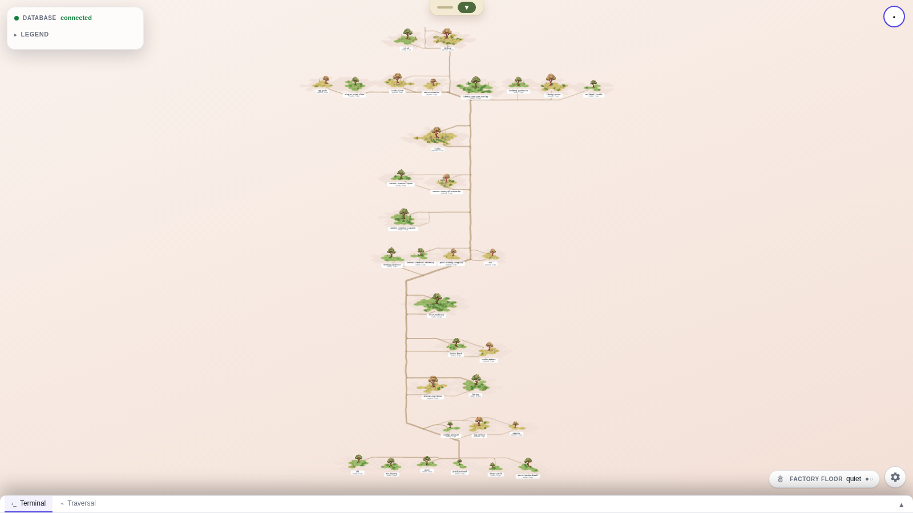
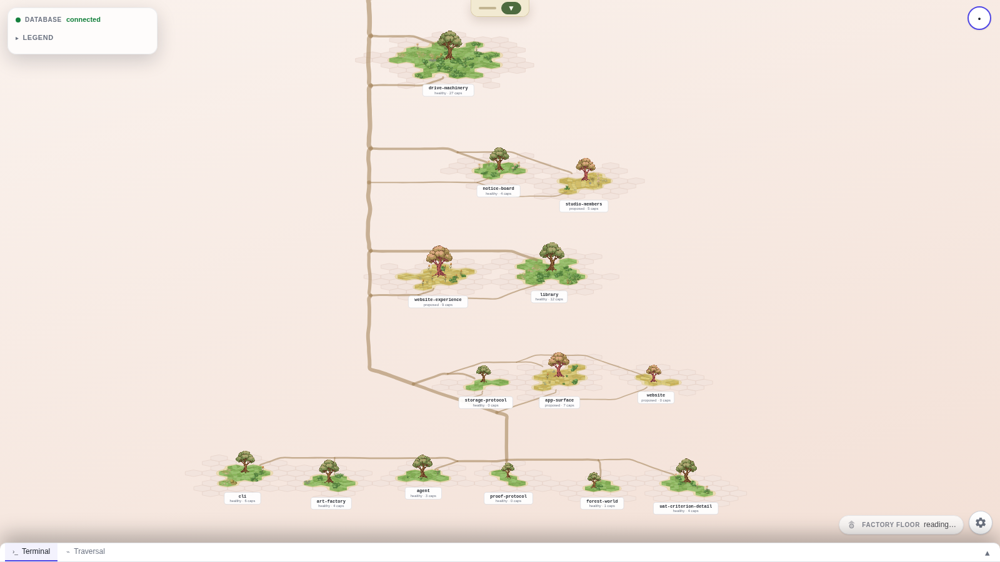

# The map opens on a frame someone chose — measured, 2026-08-28

The record for `website-refresh-arc-resting-view` and **ADR-0471**: what the fitted view actually
delivered, what the designed one delivers, and the evidence that the instrument which says so can
fail.

## The two pictures

Both captured from the **shipped studio map**, same build, same live corpus, same paint, 1600x900,
`deviceScaleFactor: 1`. The only difference between them is the `?restingView=fit` query param,
which restores the pre-ADR-0471 framing — so the comparison isolates the camera and nothing else.

### Before — the FITTED view (`?restingView=fit`)



### After — the DESIGNED view (the default)



## The numbers

Read off the map's own `<g class="world-camera">` transform and `getBoundingClientRect()` on the
rendered islands — the delivered framing, never a recomputation of it.

| | fitted (before) | designed (after) |
| --- | --- | --- |
| delivered scale | 0.259 px/world unit | **0.582** (2.25x) |
| median island on screen | **41.9 px** | **99.4 px** |
| drawn content | 513 x 906 px | 1217 x 2149 px |
| frame filled | **32%** | **76%** |
| islands in frame | 33 of 35 | 14 of 35 |

Reproduce: `pnpm studio:up`, then from `apps/studio`, `node scripts/capture-resting-view.mjs`.

### ⚠ The fitted framing MOVED between two runs an hour apart. The designed one did not.

Captured twice against the live store while sibling sessions were landing work:

| run | fitted scale | fitted island | designed scale | designed island |
| --- | --- | --- | --- | --- |
| first | 0.26088 | 44.5 px | 0.58241 | 99.4 px |
| second | 0.25924 | 41.9 px | 0.58241 | 99.4 px |

Nobody touched the camera between them. The corpus changed — a capability count moved, so an
island's radius moved, so the world's bounding box moved — and the fitted view silently re-derived
a 6% smaller island. The designed view is **byte-identical** across the two runs, because it is
pinned to island size rather than to bounds and does not depend on the world's extent at all
(unless the whole world fits inside it, which it does not).

That is `the-resting-view-is-designed-not-fitted`'s cost, observed rather than argued: "an undesigned
resting view cannot be regressed — a derived framing quietly re-derives, and each re-derivation looks
exactly as legitimate as the last." There was no composition to regress against; now there is.

## What the fitted view was, and why "it is correctly computed" was not a defence

The forest is a dependency DAG laid out bottom-up, so its own bounds are **portrait** — 3238 x 4005
world units on the live corpus — while every screen it is delivered on is landscape. Containing that
in a 1600x900 frame is arithmetically correct and leaves two thirds of the frame empty. At ~42 px an
island is a coloured dot: you cannot see that it is made of hex parcels, you cannot read its plate,
and two adjacent ones are told apart only by a brightness difference.

That is `legible-at-the-resting-view`'s named failure — "a scene sitting in a small central patch of
a large frame is a finding on its face, and the finding is a number, not a taste" — and
`the-resting-view-is-designed-not-fitted`'s named defence: "the framing is what the function returns
for this data" establishes that the view is correctly COMPUTED and says nothing about whether it is
the view the surface should open on.

A comment in `TreeView.tsx` had already made that defence in as many words, calling the side margins
"that shape's designed consequence of 'see it all' under 'contain', not fit residue". It is corrected
in place rather than deleted (ADR-0139), because it is an argument a later reader would otherwise
make again.

## What the designed view is, stated so it can be disagreed with

**The frame's shorter side spans nine median islands.** At a 900 px-tall frame that is a ~100 px
island — about four hex parcels across, which is the size at which an island stops being a dot and
visibly becomes MADE OF capabilities. Measured delivery: 99.4 px.

- **What it puts at the centre:** the foundation and the ranks resting directly on it. The frame is
  bottom-anchored, and the DAG puts the most foundational stories at the bottom, so the map opens on
  the ground the system is built on.
- **What it deliberately cuts off:** the canopy. 14 islands of 35 are in frame; the trails run off
  the top edge, which is the visible evidence that there is more.
- **What it invites:** panning up. Zoom and pan are untouched, and the zoom-out floor is derived
  from the FIT, not from the crop — so the whole forest stays exactly as reachable as it was.

⚠ **It is not `fit * 0.75`.** A flat multiplier is the undesigned view with a constant on it: a
forest of one island crops badly where a forest of eighty crops well. The owner's "stop 3/4 of the
way" survives as a FLOOR (`MAX_EXTENT_SHOWN`) that guarantees arriving never means arriving at
everything; on this corpus it does not bind, because the island-size rule is far tighter.

## Proof that the instrument can fail

`apps/studio/scripts/capture-resting-view.mjs` reads the delivered camera off the DOM rather than
off the module that computed it, so a change that computes a correct scale and fails to apply it is
a failure rather than a pass.

**It caught itself on its first run.** The corpus streams in and the resting camera is recomputed as
it does, so the fitted arm measured **9 islands** and reported `scale=0.4287` — 64% off its settled
`0.2609` — with nothing in the output saying the map was half loaded. It now waits for the island
count to stop moving and refuses below a floor:

```
$ RESTING_VIEW_MIN_ISLANDS=99 node scripts/capture-resting-view.mjs
Error: studio-fitted: only 35 islands settled (floor 99) — the map never finished loading,
so any framing measured here would be a number for a forest that is not on screen.
```

`packages/forest-world/src/resting-view.test.ts` was mutation-tested — each mutation applied, the
suite run, the mutation reverted from a byte copy, and the full pass count re-asserted at the end
(186/0), so an un-reverted mutation could not masquerade as a clean result:

| mutation | result |
| --- | --- |
| return the fitted scale always (delete the design) | 6 failed |
| drop the whole-world guard (crop even a one-island forest) | 1 failed |
| drop the extent floor (legibility rule alone) | 2 failed |
| mean instead of median island size | 4 failed |
| keep unusable island sizes (no filter) | 2 failed |
| frame the LONGER side instead of the shorter | 3 failed |
| invert the floor comparison | 6 failed |
| report `designed` unconditionally (the bound stops being evidence) | 1 failed |
| *(restored)* | **186 passed, 0 failed** |

And then held to the gate's own rung, which is stricter than a hand-written list because it does not
get to choose the mutations. `pnpm check:mutation-diff` mutates every changed line span:

```
[mutation-diff] 2 changed source file(s), 2 changed line span(s), 71 mutant(s) counted
[mutation-diff] PASS — every mutant in this branch's changed lines was killed by this branch's own tests
```

⚠ Its first run found **27 survivors**, and reading them changed the module. Three clusters were
not weak tests but DEAD BRANCHES — an even/odd median split whose two arms were indistinguishable on
any real input, and two `content > 0 ?` guards whose false arm returned exactly what the true arm
already computed. They were removed rather than tested around: an equivalent mutant is a branch that
cannot matter, and the honest fix is to delete it. The median is now the LOWER middle island — a size
some island really is, which is also what makes "the frame spans nine median islands" literally true.

⚠ The first attempt at that loop reverted with `git checkout --` against files staged with
`git add -N`, which truncated the module to **zero bytes** — the trap
`an-expectation-derived-from-its-subject-cannot-fail` documents. Reverts here are byte copies.

## What is NOT settled

**The number.** `RESTING_ISLAND_SPANS = 9` is a composition, and by ADR-0070 stage 2 an appearance
verdict is operator-granted and never self-signed. Everything above defends it against a stated
standard; whether it LOOKS right is the owner's call, and `?restingView=fit` exists so that call can
be made by flipping one running app rather than by comparing two screenshots.

**The narrow column.** Frame fill goes 34% → 76%, and the width that is still unused is the DAG's
own shape: rank rows are narrow, so the forest is a column whatever the camera does. That is a
layout question, not a camera one, and it is the next thing worth measuring if the composition still
reads as sparse.
