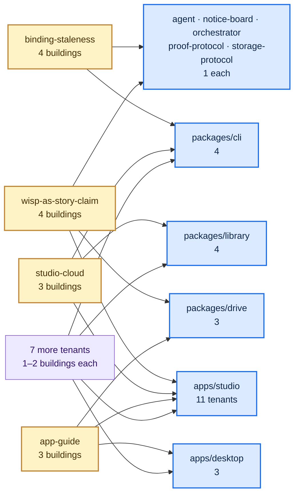

# The shape of the system, measured — 2026-09-08

**What this is.** A picture of where the code actually sits, drawn from the repository itself rather
than from anyone's memory. It exists because the next step — proposing new boundaries, one at a time
— should argue with a measurement, not an impression.

**What this is not.** It proposes nothing. No boundary is moved, no re-cut is suggested, no
migration is started. It is also **not a verdict on the July decision (ADR-0192)**: that decision
answered *"how do we stop the boundaries getting worse"*, and its refusal rule is still holding the
line. This asks a different question — *is the remedy it chose finishing?* — and the two answers are
independent.

Every number below names the command that produced it. Re-run any of them; if one disagrees with
this page, the command is right and this page is stale.

---

## The short version

1. **Twenty-one of the thirty-five live stories own a package or app of their own. Fourteen do
   not** — and ten of those fourteen have their code sitting inside somebody else's. That is the
   real shape, and it is smaller than the arc's opening figure of 29-of-47, which counted a
   different thing (§1, §6).

   **The lodgers are not spread evenly: `apps/studio` hosts eleven of the fifteen.** Fourteen of the
   twenty-four packages host nobody at all. And four of the tenants are scattered across three or
   four buildings each, so "give this story its own package" is a gathering job, not a move (§1).

2. **The grandfather register has not drained. It has churned.** Six stories left it since July —
   one rename and five retirements — and three joined it. **Not one story has left it by moving into
   its own package**, despite 205 landings — 18% of everything that reached `main` — touching that
   code. Meanwhile the same 57 days produced **eleven new packages**. The forward half of
   packages-forward is working; the backward half has not moved at all (§2).

   That also answers the question ADR-0192's annotation put to this survey — *is continuing to
   migrate under the rule doing harm?* **No, because no migration has happened.** There is no work
   standing at risk of being redone (§2).

3. **The declared dependency map is accurate wherever the machinery can check it — and it cannot
   check fourteen of the thirty-five stories.** All 56 real code dependencies between stories are
   declared; zero are undeclared. But a story that owns no package has its declarations checked
   *advisorily only*, by the code's own admission (§3).

4. **Boundaries have already cost real, written-down things — eleven cases, all self-documented.**
   The largest standing one is 6,253 lines of machinery whose only job is to prove that two API
   surfaces, required to be identical and forbidden to share code, still match. The most expensive
   one-off was a body of code that could not be proven *at all* until it was moved out. And one
   boundary shipped a defect to the live public site that nothing reported. Every cost was paid in
   extra work that still got done — which is why none of it shows up in any throughput number (§4).

5. **Sessions blocking each other is now a one-surface problem.** Of the 27 times a session was
   turned away from work in the first week of September, **23 were on the forest-render code** — one
   capability, 18 of them, on work its own holder wrote down as unrelated. The older, broader
   version of this (half the historical refusals) was diagnosed and fixed in August and has not
   recurred since the 8th. Grain is fine almost everywhere: the median claim fences 2 files (§5).

---

## 1. Where each story actually lives

Vocabulary, once: a **story** is a unit of work in the tree. A **building** is a workspace package
(`packages/<x>`) or an app (`apps/<x>`) — a directory with its own `package.json`. A story that owns
a building is a *landowner*; a story whose code sits inside somebody else's building is a *tenant*.
The **register** is July's frozen list of tenancies that were allowed to continue (ADR-0192).

Measured with `packages/cli/src/boundaries.ts` — the same judge `pnpm check:boundaries` uses — over
`repo-manifest.json`'s ownership map and every story's unit specs.

**35 live stories** (11 more are retired). **24 buildings** — 22 packages and 2 apps.

### A. Owns a building, lives nowhere else — 16 stories

| story | building(s) | capabilities |
| --- | --- | ---: |
| `agent` | packages/agent | 5 |
| `arc` | packages/arc | 3 |
| `art-factory` | packages/art-authoring, packages/procedural-architecture | 4 |
| `ci-cd` | packages/ci-cd | 6 |
| `cli` | packages/cli | 7 |
| `context-traversal-capture` | packages/context-traversal-capture | 11 |
| `context-traversal-spawn` | packages/context-traversal-spawn | 3 |
| `context-traversal-telemetry` | packages/context-traversal-telemetry | 2 |
| `context-traversal-transcript` | packages/context-traversal-transcript | 6 |
| `forest-world` | packages/forest-layout, packages/forest-world | 1 |
| `library` | packages/library | 15 |
| `proof-protocol` | packages/proof-protocol | 0 |
| `storage-protocol` | packages/storage-protocol | 0 |
| `studio` | apps/studio | 24 |
| `studio-members` | packages/studio-members | 5 |
| `uat-criterion-detail` | packages/uat-criterion | 4 |

### B. Owns a building **and** keeps rooms in someone else's — 5 stories

| story | own building(s) | also lives in | on the register |
| --- | --- | --- | --- |
| `app-surface` | packages/app-surface | apps/studio | yes |
| `desktop` | apps/desktop | apps/studio | yes |
| `drive-machinery` | packages/drive, packages/orchestrator | packages/library | yes |
| `notice-board` | packages/notice-board | packages/cli, packages/drive | yes |
| `website-experience` | packages/forest-world-r3f | packages/cli | yes |

### C. No building at all — lives entirely inside others — 10 stories

| story | lives in | on the register | capabilities |
| --- | --- | --- | ---: |
| `app-guide` | apps/desktop, apps/studio, packages/drive | yes | 4 |
| `binding-staleness` | packages/cli, packages/orchestrator, packages/proof-protocol, packages/storage-protocol | yes | 5 |
| `embedded-terminal` | apps/desktop, apps/studio | yes | 2 |
| `library-review` | apps/studio, packages/library | yes | 9 |
| `library-tech-tree-overlay` | apps/studio, packages/library | yes | 17 |
| `studio-cloud` | apps/studio, packages/cli, packages/library | yes | 8 |
| `terminal-repo-picker` | apps/desktop, apps/studio | yes | 3 |
| `terminal-tabs` | apps/studio | yes | 2 |
| `uat-detail-studio` | apps/studio | yes | 2 |
| `wisp-as-story-claim` | apps/studio, packages/agent, packages/drive, packages/notice-board | yes | 7 |

### D. No building, and no build target the hosting rule can see — 4 stories

`feedback-graduation`, `proof-binding-integrity`, `uat-attestation`, `website`.

These are not empty. They carry code — `feedback-graduation` owns six source files, `website` owns
one — but none of their units names a build target, and the hosting rule reads only build targets.
So the rule never fires on them. See §6 for what that hides.

### Seen from the other side: who is hosting whom

The same 15 tenancies, read as *which buildings have lodgers*. **Ten of the 24 buildings host
somebody. Fourteen host nobody. And one hosts eleven of the fifteen tenants.**

| building | tenants | who |
| --- | ---: | --- |
| `apps/studio` | **11** | `app-guide`, `app-surface`, `desktop`, `embedded-terminal`, `library-review`, `library-tech-tree-overlay`, `studio-cloud`, `terminal-repo-picker`, `terminal-tabs`, `uat-detail-studio`, `wisp-as-story-claim` |
| `packages/cli` | 4 | `binding-staleness`, `notice-board`, `studio-cloud`, `website-experience` |
| `packages/library` | 4 | `drive-machinery`, `library-review`, `library-tech-tree-overlay`, `studio-cloud` |
| `apps/desktop` | 3 | `app-guide`, `embedded-terminal`, `terminal-repo-picker` |
| `packages/drive` | 3 | `app-guide`, `notice-board`, `wisp-as-story-claim` |
| `packages/agent` | 1 | `wisp-as-story-claim` |
| `packages/notice-board` | 1 | `wisp-as-story-claim` |
| `packages/orchestrator` | 1 | `binding-staleness` |
| `packages/proof-protocol` | 1 | `binding-staleness` |
| `packages/storage-protocol` | 1 | `binding-staleness` |

Tenancy is not one-to-one. Four tenants are spread across three or more buildings at once —
`binding-staleness` across four, `wisp-as-story-claim` across four, `studio-cloud` across three,
`app-guide` across three. So "migrate this story into its own package" means gathering it from four
places, not moving one directory.



### The register and the tenants match exactly

**Every one of the 15 stories with a foreign build target is on the register. Every one of the 15
register entries has a foreign build target.** No tenant is off the register; no register entry is
stale. Under the rule's own definition, there is no gap.

```bash
pnpm check:boundaries
```

---

## 2. The register: what actually happened to it

The July decision froze a list of tenancies and expected it to drain as each story was next touched.
Here is every change to that list, read off `main`'s history in the order the changes landed.

| date | PR | what changed | size |
| --- | --- | --- | ---: |
| 2026-07-13 | #723 | **created** with 18 entries | 18 |
| 2026-07-15 | #737 | `terminal-chat` → `app-guide` — **a rename** | 18 |
| 2026-07-17 | #775 | `chat-subagent-spawn`, `headless-orchestrator`, `spawn-visibility` out — **all three retired** | 15 |
| 2026-07-18 | #804 | `uat-detail-studio` **added** | 16 |
| 2026-07-18 | #808 | `model-uat-pilot` **added** | 17 |
| 2026-07-24 | #892 | `app-surface` **added** | 18 |
| 2026-08-20 | #1437 | `model-uat-pilot` out — **retired** | 17 |
| 2026-08-21 | #1499 | `map-terminal-build` out — **retired** | 16 |
| 2026-08-23 | #1578 | `desktop-build-mount` out — **retired** | 15 |

Each departing story's own `status:` field was read at the commit that removed it — that is how
"retired" is established rather than assumed.

**Nothing has migrated.** Every departure was a retirement or a rename. The one story that gained a
building while on the register, `app-surface`, gained it in the *same* landing that added it to the
register — PR #892 created `packages/app-surface` and the register entry together. It was born a
landowner with a tenancy, not migrated into one.

**Ten of the fifteen register entries own no building at all today, and every one of those ten owned
none at the freeze either.** Of the other five, four already owned one in July — they were landowners
with a tenancy on the side, never fully-hosted stories waiting to move — and the fifth is
`app-surface`, which did not exist yet. So the set of stories the register is actually asking to
migrate has gone from ten to the same ten.

### The trigger has had plenty of chances

July's design was that a story migrates when it is next touched. So: how often has each register
story been touched since the freeze? Counting landings on `main` that changed that story's
foreign-hosted files, and landings that changed its spec:

| story | own building today | landings touching its foreign code | landings touching its spec |
| --- | --- | ---: | ---: |
| `app-surface` | packages/app-surface | 87 | 13 |
| `uat-detail-studio` | — | 85 | 3 |
| `library-tech-tree-overlay` | — | 61 | 17 |
| `app-guide` | — | 22 | 10 |
| `notice-board` | packages/notice-board | 20 | 10 |
| `binding-staleness` | — | 14 | 8 |
| `embedded-terminal` | — | 12 | 16 |
| `wisp-as-story-claim` | — | 12 | 21 |
| `terminal-tabs` | — | 11 | 15 |
| `drive-machinery` | packages/drive, packages/orchestrator | 8 | 21 |
| `website-experience` | packages/forest-world-r3f | 6 | 16 |
| `library-review` | — | 5 | 9 |
| `studio-cloud` | — | 4 | 17 |
| `terminal-repo-picker` | — | 4 | 11 |
| `desktop` | apps/desktop | 2 | 32 |

**205 distinct landings have touched a register story's hosted code since the freeze — 17.9% of the
1,143 landings on `main` in that window. None triggered a migration.**

(The per-story column above sums to 353 because a landing touching two register stories' files
appears in both rows. 205 is the deduplicated count, over the 58 declared build-target files the
whole register covers.)

### The question ADR-0192 was annotated to ask this survey

When the re-cut was opened on 2026-09-07, ADR-0192 was annotated in place. It left this survey one
explicit job:

> the survey there is required to report whether continuing to migrate under this rule is doing harm.

The worry behind it, stated in ADR-0542 D4, is that migrations performed now might turn out to have
moved a story onto a line that a later proposal redraws — work done twice.

**Answer: no harm has been done, because no migration has happened.** Zero stories have moved into
their own package under the rule since the register was frozen 57 days ago, so there is no migration
effort standing at risk of being redrawn. The knowingly-accepted cost has not been incurred.

Two moves in the window might look like counter-examples and are not. The arc extraction (ADR-0369,
2026-08-14) *satisfied* the packages-forward rule for new work rather than migrating a grandfathered
story; and `packages/forest-layout` (2026-09-07) was created under ADR-0537 to settle a boundary
cost, on the owner's direction, and its story already owned a package. Neither drained the register.

### The forward half is a different story

Eleven of the twenty-four buildings were created *after* the freeze:

`uat-criterion` (07-17) · `procedural-architecture` (07-18) · `art-authoring` (07-21) ·
`context-traversal-telemetry` (07-24) · `app-surface` (07-24) · `context-traversal-capture` (07-25) ·
`context-traversal-spawn` (07-26) · `context-traversal-transcript` (07-27) · `arc` (08-14) ·
`ci-cd` (08-31) · `forest-layout` (09-07)

New work does get its own package. That half of the rule is working, and visibly so.

```bash
# the register's history, as it landed
git log --first-parent --format='%ad %s' --date=short -- repo-manifest.json
# when each building was created
git log --first-parent --reverse --diff-filter=A -- packages/<x>/package.json
```

---

## 3. The declared dependency map beside the real one

Every story declares which other stories it depends on. Separately, every package declares which
other packages it depends on. The gate checks that the second is covered by the first.

Measured over the 35 live stories:

| | count |
| --- | ---: |
| declared story-to-story edges | 101 |
| real package-level dependencies, projected onto stories | 56 |
| real dependencies **not** declared | **0** |
| declared edges no package-level import backs | 45 |
| …of which explicitly marked as deliberate non-import edges | 36 |
| …of which unmarked | 9 |

**Zero undeclared couplings.** The blocking check does what it was built to do.

The 45 unbacked declarations are not all drift. 36 carry an explicit annotation saying the edge is
deliberate and not an import — a build artefact, an injected seam, a write target. Of the remaining
9, eight come out of package-owning stories:

`ci-cd → studio-cloud` · `ci-cd → notice-board` · `context-traversal-telemetry → drive-machinery` ·
`desktop → studio` · `desktop → app-guide` · `desktop → studio-cloud` · `website-experience → website` ·
`website-experience → cli`

### The hole, and it is the same hole as §1

37 of the 101 declared edges start at a story that owns no package. For those, the package-level
check has nothing to read. The code says so in as many words
(`packages/cli/src/boundaries.ts`, rule 4):

> Virtual endpoints stay advisory — the sourceFile-derived evidence is too weak to block on
> (ADR-0115), so they live in the drift report.

So **14 of 35 stories have their dependency declarations checked advisorily, never blockingly** —
and they are the same 14 that own no building. Hosting and unverifiability are one condition, not
two.

The advisory report currently flags four stories, and all four own no package of their own:

| story | declared, no code behind it | real import, not declared |
| --- | --- | --- |
| `app-guide` | — | `library` |
| `proof-binding-integrity` | `drive-machinery` | — |
| `studio-cloud` | `notice-board` | — |
| `uat-detail-studio` | `studio`, `uat-criterion-detail` | `app-surface`, `forest-world` |

```bash
pnpm check:boundaries   # prints the blocking verdict and both advisory reports
```

---

## 4. Where a boundary has already cost something — with the receipt

Only cases where the code or the decision record *says so in its own words*.

### 4.1 A duplicated piece of arithmetic, kept on purpose for eight weeks — now repaired

The studio needed a two-line coordinate projection that `packages/forest-world` already had. It kept
its own copy instead, and said why. That package is synced wholesale to the public website, so
touching it obliged an engine sync and a version bump on the website — for two lines of arithmetic.

The duplicate survived until 2026-09-07 and its gravestone is still in the file
(`apps/studio/src/components/TreeView.tsx:382`):

> `groundPolarOffset` DIED here, and its comment died with it. It was a deliberate LOCAL copy of
> arithmetic `packages/forest-world/src/scene.ts` already held, and that comment gave the reason in
> terms: reaching into that package owed an engine sync and a web pin bump for two lines. It was the
> evidence ADR-0537 rests on and was kept until this landing on purpose.

**The repair is the more informative half.** The fix was not "share the arithmetic across the
boundary". It was to create a *new package on the correct side of the boundary* —
`packages/forest-layout`, which now holds the map-packing logic that used to live in the studio. Its
own header records both the toll and the ruling (`packages/forest-layout/src/pack.ts:7`):

> ⚠ IT LIVED IN `apps/studio/src/components/TreeView.tsx` UNTIL THIS PACKAGE EXISTED, and moving it
> was a DECISION rather than a tidy-up (ADR-0537 D1, owner-directed: *"pay the cost now"*). Two
> forces had kept it surface-side. The first was a TOLL: `packages/forest-world/src` reaches the
> public website through a wholesale sync, so touching it owed an engine sync and a web pin
> bump — which is why the studio held a deliberate local copy of `groundPolarOffset` rather than
> reaching for the shared one. […] ADR-0537 ruled the toll may not draw the boundary.

Two things worth carrying forward from this one case: the boundary cost was **paid in duplication,
not in refusal** — the work still happened, it just happened twice; and the cost was **legible for
eight weeks** because whoever paid it wrote down why.

### 4.2 The same boundary, four more times — the public website

The toll in 4.1 is not a one-off. `packages/forest-world` is copied wholesale into a separate public
repository, and four separate records describe what that costs. They were filed independently, by
different sessions, over five weeks.

**It shipped a live defect to the public site.** From
`web-submodule-has-no-typechecker-so-a-synced-split-shipped-undefined`:

> `SceneTerritoryInput.radius` was split into `groundRadius`/`screenRadius` […] The split synced into
> `web/`; the site's four call sites never updated; esbuild dropped the excess property; **every
> island on the LIVE public site ran with both radii undefined. Nothing anywhere reported it.**

The sync proves the copy is *fresh*, never that the other side still compiles. A typechecker was
added to the web repo on 2026-08-28 and found six further standing errors; it is still not wired into
the gate or CI.

**It taxes every landing that crosses it.** From
`a-web-pin-bump-forces-the-whole-gate-four-of-24-steps-can-see-it`:

> FOUR of the 24 steps can observe a `web` gitlink at all […] **14 seconds of the 13 minutes.**

Every website landing owes the parent repo a pointer bump, and each bump pays a full gate. Seven such
landings happened on a single day.

**And the workaround has its own cost.** Two more records —
`an-off-main-web-pin-is-green-so-the-publish-backlog-regrows` and
`the-documented-sync-supersession-proof-checks-one-branch-of-n` — describe the natural response to
that tax: park the pointer on a side branch, which is green and doesn't publish. The backlog
"regrown to fourteen [branches] by 2026-09-01" after being declared drained.

A fifth record, ADR-0212, shows the toll shaping a decision rather than merely costing one: splitting
the core out was sequenced *specifically* so the cross-repo cost would not be paid twice.

### 4.3 A boundary that made work unprovable until it was moved

ADR-0369 (accepted 2026-08-14) is the decision log's own worked example, and its account is blunter
than anything a survey could add. The arc code lived inside two other stories' packages:

> The arc domain was therefore **unable to be proven red→green by storytree's own gate without first
> being extracted. It was frozen at `mapped` by its address.**

The extraction cost three helper modules moved down a layer, three re-export shims left behind, and
by the decision's own accounting "one more package in a monorepo that already had 22". A related
record, `parked-increment-mis-sized-by-an-unchecked-import-boundary`, measures what happens when this
shape is met unexpectedly: an increment that had inspected the code carefully and called the work
cheap turned into "**26 files, +2623/-1399**" once the import ban was discovered mid-build.

That decision also names, in passing, exactly the hole §6 measures independently:

> the only reason no landlord rule fired was that the ADR-0094 brownfield shape leaves `proof.real`
> empty — `readUnitSourceFiles` skips a unit with no `real:` arm, so rules 5 and 6 never looked.

### 4.4 Two duplications kept on purpose, right now

**A shared formatter, copied to break a cycle.**
`packages/agent/src/orientation-tools.ts:70`:

> Mirrors `formatEnvelope` in packages/drive/src/envelope.ts — duplicated here to avoid the
> drive→agent→drive import cycle.

**A list of identifiers, spelled twice.**
`packages/context-traversal-telemetry/src/traversal-harness-provenance.ts:122`:

> ⚠ THIS LIST IS A SECOND SPELLING OF THOSE IDS AND CANNOT IMPORT THE FIRST — this package is the
> root the capture organism depends on, so the edge only runs the other way.

Both are deliberate and both are defended: the second is held honest by a test in a third package
that can see both copies. They are the small, steady-state price of the dependency direction rules.

### 4.5 The largest standing cost: two API surfaces required to be identical and forbidden to share

The desktop app re-implements the studio's read API rather than importing it. That is a decision, not
an accident — `packages/cli/src/check-mirror-conformance.ts:12`:

> the desktop backend re-composes `apps/studio/server/apiRouter.ts`'s routes verbatim over its own
> seam and may never import the studio (ADR-0176's one-wired-backend rule). **The duplication is the
> DECISION; the drift it invites is the defect.**

What it costs, today:

- **6,253 lines** that exist only to prove two copies still agree: 3,881 in the comparison harness
  (`mirror-conformance.ts` + `check-mirror-conformance.ts`), 1,135 in ten studio-side probes, 1,237
  in ten desktop-side probes.
- A **gate step on every PR**, deliberately excluded from the affected-only narrowing, "or it only
  fences half the class".
- **The drift happened anyway, before the fence was built.** From
  `friction-unfenced-cross-surface-mirrors`: the two sides disagreed for weeks and it "was found by an
  owner reading pixels, not by the gate", costing "roughly an hour of session time to diagnose".

The response was to widen the fence rather than remove the duplication: the registry held **one**
route in July (`/api/docs`) and holds **ten** today.

### What the receipts have in common

Every one of these is a cost paid in *extra work that still got done* — a copy, a shim, a probe, a
second gate step, a full-gate tax, an extraction — rather than in work refused. That is worth stating
plainly because it means the cost is invisible in any measure of throughput, and shows up only where
somebody wrote down why they were doing something twice.

The one exception, and the most expensive, is 4.3: work that could not be proven at all until the
boundary moved.

---

## 5. Where one claim fences work that is not the same work

Sessions take an exclusive claim on the thing they are about to write, at capability grain. A second
session wanting the same capability is refused and queued, however unrelated its work.

The ledger keeps its own audit log. Over its whole life — 2026-06-27 to 2026-09-07, 4,715 events,
832 distinct claimed ids, 898 distinct sessions:

| transition | count |
| --- | ---: |
| claimed | 2,410 |
| released | 1,995 |
| **refused (conflict)** | **123** |
| queued | 63 |
| reclaimed | 59 |
| promoted | 32 |
| upgraded | 32 |

### Half the history is a problem that was already fixed

51 of the 123 refusals were on a **story** id. Work claims at that grain were retired in August, and
the effect is unmistakable:

| month | refusals on a story | refusals on a finer id | spread |
| --- | ---: | ---: | --- |
| 2026-07 | 47 | 1 | — |
| 2026-08 | 4 | 44 | 48 refusals over 42 different ids |
| 2026-09 (to the 7th) | **0** | 27 | **27 refusals over 6 ids** |

The last story-grain refusal was 2026-08-08. That contention is gone and cannot recur, so the
July numbers describe a system that no longer exists. **The live question is the 27 refusals in the
first seven days of September** — and they are not spread thin the way August's were.

### What remains is one surface

| claim id | Sept refusals | all-time | files that claim fences |
| --- | ---: | ---: | ---: |
| `r3f-world-spike` | 18 | 19 | 44 |
| `render-core` | 5 | 5 | 14 |
| `forest-spacing-derived-from-island-size` | 1 | 1 | — |
| `composition-bar-replaces-occupancy-bar` | 1 | 1 | — |
| `adr-0139-sweep-dead-knowledge-json-refs` | 1 | 1 | — |
| `unscored-guards-arc-ci-db-free-refuted` | 1 | 1 | — |

**23 of September's 27 refusals — 85% — are on the forest-render surface.** `r3f-world-spike` is
the capability covering `packages/forest-world-r3f`; `render-core` covers `packages/forest-world`.
And `r3f-world-spike` drew exactly **one** refusal in the whole of August against **eighteen** in
seven days of September, so this is a hot spot that arrived recently rather than a standing one.

Over its life, `r3f-world-spike` has seen **60 distinct sessions**, 74 claims, 19 refusals and 19
queues between 2026-07-01 and 2026-09-07 — the busiest id in the ledger by a wide margin (179
events; the next is `cli` at 110).

`packages/forest-world-r3f` holds 196 source files with three declared owners: `website-experience`
(151), `r3f-world-spike` (44) and `act2-beat-director` (1). The first of those is a *story*-grain
declaration, so it can no longer be claimed at work grade — which leaves `r3f-world-spike`'s 44 files
as the fence 60 sessions have been queueing against.

### The clearest single case

On 2026-09-01 one session held `r3f-world-spike` and stated in its own claim text that it knew the
work was separable:

> adopt-the-land-into-the-shipped-map-arc component 6: the asset kit's cliff on a six-row stepped
> skirt (owner settled its rock colour 2026-09-01). **Coexisting with reverent-burnell-18d497's
> inset-ring work on the same capability — different component, new pure module, minimal wiring
> seam.**

Four sessions were refused against that hold in the following 96 minutes — 01:39, 02:10, 03:15 and
03:15. The holder had already written down that the work was on a different component in a new
module. The fence could not read that.

### But the grain is fine almost everywhere

Across the 203 declared owners of source subtrees:

| | files fenced |
| --- | ---: |
| smallest | 1 |
| 25th percentile | 1 |
| **median** | **2** |
| 75th percentile | 4 |
| 90th percentile | 8 |
| largest (`website-experience`) | 151 |

90 of 203 owners fence exactly one file. Seven fence twenty or more. **The five largest hold 38% of
all owned files.**

A second, related coarseness: of the 574 ownership declarations, **186 are at story grain** rather
than capability grain. A story-grain declaration satisfies the map but names an owner nobody can
claim any more, so the file it covers is claimable only through its subtree key. In
`packages/forest-world-r3f` alone that covers 150 of 196 files.

```bash
pnpm storytree noticeboard history --days all --limit all --pg
pnpm storytree noticeboard history --refusals --days all --limit all --pg
pnpm storytree ownership
```

---

## 6. Numbers here that differ from the ones this arc opened with

The arc was chartered on 2026-09-06 with figures worth correcting, because two of them shaped how
the question was framed. All four were re-measured against the same tree the arc saw.

| the arc said | measured | why they differ |
| --- | --- | --- |
| 47 stories | **46** story directories (35 live, 11 retired) | Off by one, at charter time too. The live/retired split was not made at all. |
| 21 packages | **21** at charter; **22** today | Correct then. `forest-layout` landed 2026-09-07. |
| 279 capabilities | **266** capability specs (226 in live stories) | The retired stories' 40 capabilities were counted in. |
| 29 of 47 own no package | **25 of 46**, or **14 of 35 live** | See below — this one matters. |

**The 29 reproduces exactly under a name match.** 29 stories have no `packages/<story>` or
`apps/<story>` directory *of the same name*. But ownership is declared in `repo-manifest.json`, not
inferred from names, and four stories own a building under a different name:

- `art-factory` → `packages/art-authoring`, `packages/procedural-architecture`
- `drive-machinery` → `packages/drive`, `packages/orchestrator`
- `uat-criterion-detail` → `packages/uat-criterion`
- `website-experience` → `packages/forest-world-r3f`

So the landowner count is 21, not 17, and the tenant count is 25 including retired stories, 14 live.

### And the "15 on the register, 14 not" gap is not a gap

The increment behind this survey asked for an explanation of why 15 of the 29 are on the register
and 14 are not, suggesting either a stale register or hosting escaping the rule. Neither is what is
there. **The 29 and the 15 count different things and were subtracted from each other**:

- 29 (really 25, or 14 live) = *stories with no building of their own*
- 15 = *stories with code inside a foreign building*

Those populations overlap but neither contains the other. Ten stories are in both. Five stories own
a building **and** keep rooms elsewhere — on the register, but not in the "own no building" set. Four
stories own no building and have no build target for the rule to read — in the "own no building" set,
but correctly not on the register. 10 + 5 = 15 and 10 + 4 = 14; the "gap" is the arithmetic of two
different questions.

### The real, much smaller version of that finding

The hosting rule judges from one field: a unit's declared build target. The source-ownership map is a
second, independent, hand-authored record of which unit is responsible for which file, and it covers
946 of 974 non-test source files — far more. Asking *both* where each story's code sits turns up six
tenancies, of which **five are invisible to the hosting rule**:

| story | files | where they sit | on the register |
| --- | ---: | --- | --- |
| `feedback-graduation` | 5 | packages/cli | no |
| `desktop` | 3 | packages/cli | yes (its entry names only apps/studio) |
| `ci-cd` | 2 | packages/cli | no |
| `feedback-graduation` | 1 | packages/library | no |
| `website` | 1 | packages/cli | no |

Twelve files, four stories, three of them not on the register:

```
packages/cli/src/friction.ts                        feedback-graduation
packages/cli/src/friction-drain.ts                  feedback-graduation
packages/cli/src/friction-lifecycle.ts              feedback-graduation
packages/cli/src/check-friction-drain.ts            feedback-graduation
packages/cli/src/resteer.ts                         feedback-graduation
packages/library/src/resteer-report.ts              feedback-graduation
packages/cli/src/route-tables.ts                    desktop
packages/cli/src/route-surfaces.ts                  desktop
packages/cli/src/check-desktop-route-coverage.ts    desktop
packages/cli/src/mutation-diff.ts                   ci-cd
packages/cli/src/check-mutation-diff.ts             ci-cd
packages/cli/src/check-web-grounding.ts             website
```

Eleven of the twelve are in `packages/cli`. That is not an accident — they are all commands or gate
checks, and the CLI is where commands live. Whether that makes `packages/cli` a natural home or a
crowded one is exactly the kind of question this survey exists to hand over, and it is not answered
here.

---

## How this was measured

| §  | source | command |
| --- | --- | --- |
| 1, 3 | `packages/cli/src/boundaries.ts` (the gate's own judge), `repo-manifest.json`, every `stories/*/**.md` via `loadNodeSpec` | `pnpm check:boundaries` |
| 2 | `main`'s first-parent history of `repo-manifest.json`; each departing story's `status:` read at its removal commit | `git log --first-parent -- repo-manifest.json` |
| 4 | the source files' own comments; the `friction` tier and the decision log in the live store | `git grep`; `storytree library artifact <id> --pg` |
| 5 | `events.claim_event` (the ledger's audit log); `repo-manifest.json` `sourceOwnership` | `storytree noticeboard history --days all --pg`, `storytree ownership` |
| 6 | all of the above, plus a name-match re-derivation to reproduce the 29 | — |

Counts of stories, capabilities and packages exclude nothing silently: retired stories are counted
separately and named, and every figure states whether it covers the live set or all of them. Two
figures deliberately use different populations and say so — §1's tenancy counts read *declared build
targets*, §6's second table reads the *source-ownership map*.

**What §4 admits and what it excludes.** A case is included only where the code, the decision or the
friction record *says in its own words* that a boundary caused the extra work. Coupling that merely
looks wrong is excluded, and so is a comment describing duplication that a dependency direction
successfully *prevented* — several of those turned up and none is a paid cost. That inclusion rule
means §4 is a floor: it finds costs somebody wrote down, and is blind to every cost nobody did.
The sweep read every title and description in the friction tier and pulled the bodies of the
plausible ones, searched the decision log, and grepped `packages/` and `apps/`. (The tier held 699
records when the sweep ran and 702 a few hours later, which is a fair illustration of how fast this
corpus moves.) Every case quoted above was then re-read at its own source before being quoted here.
The sweep found **no** story-to-story boundary cost that was not also a package boundary cost.

**A caveat on §5's fence sizes.** `storytree ownership` covers 947 of 976 source files (97%), so a
"files fenced" figure is a floor, not a total. Four of September's six refused ids are increments or
one-off units rather than declared subtree owners, so they have no comparable fence size and are left
blank. Refusal counts are exact; fence sizes are not, and the two columns should not be divided into
each other.
