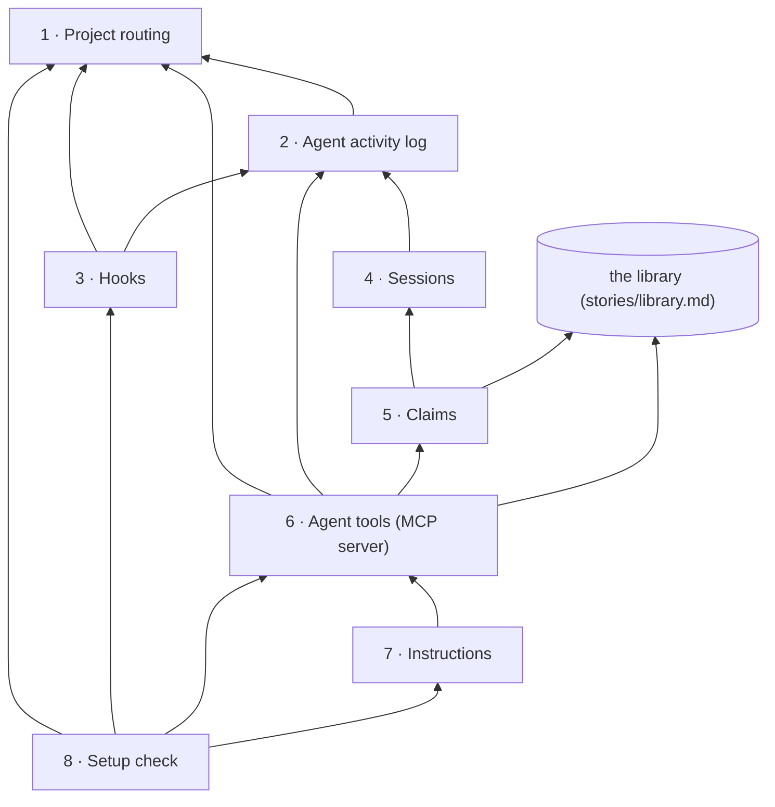

# Story: the agent link

**What it is.** The agent link lets the user's own Claude Code or Codex use storytree by itself,
through two layers that share one base. A passive layer of hooks records what every agent does,
so even an agent that ignores storytree shows up as unplanned activity. An active layer, an MCP
tool server, is what the agent chooses to call to plan, claim, report red, green and landed, and
take notes, taught by a short habits card. A setup check at every session start keeps it all set
up. Red-green is a convention the card teaches, not a loop storytree runs.

**Approved** by the owner on 2026-09-26. The tree below is ADR-0626 in storytree 0.2's decision
log (`storytree-ai/storytree02`), approved through the question `oq-0-3-agent-link-capability-tree`
(revision 5), with the corrections ADR-0627 made the same day (the rabbit-hole knowledge rules).
Names and scope come from those records; change them there first.

**Rule for building it: port behaviour, not code.** Storytree 0.2's hooks and harness settings
(`.claude/settings.json`, `.codex/`), its claim board (`packages/notice-board`,
`stories/notice-board`) and the MCP servers it runs for its own build workers are the behavioural
reference. Nothing is copied from them wholesale. It reaches the library only through the library's
public API (`stories/library.md`, capability 7).

**How each capability is proven.** Red→green, as for the library. Each capability's tests are
written and committed first, and seen failing (`red(<capability>): …`). Then the code that makes
them pass is committed (`green(<capability>): …`). The git history is the evidence that the red
came first.

**The owner's choices** (ADR-0626):
- **B1:** the link keeps its own agent activity log beside the library, not inside it. Sessions,
  activity, claims and note reads live there, not as library record types.
- **C1:** one holder per capability, and no queue.
- **E1:** Codex gets the same two layers as Claude Code, through user-level hooks and its one-time
  approval.
- **Onboarding is the setup check** (D5): the user installs only the tool server, and every session
  start checks the setup and fixes it on the spot. Every hook is proven to fire before real work
  starts, and the connection shows as verified only then (ADR-0625 D9's rule, which binds here).

Build order: 1 → 2 → 3 → 4 → 5 → 6 → 7 → 8.

---

## 1 · Project routing

The first time an agent session starts in a folder that isn't a storytree project, storytree asks
the user (through the agent) whether to set one up; if they say yes, this leaves a small marker in
the folder naming the project, and from then on it routes everything an agent does anywhere in that
folder to that project, whichever project the user happens to be looking at in the app. It never
picks a project by itself: a folder the user hasn't said yes to is ignored, and when storytree isn't
running it says so at once, so everything built on it quietly does nothing.

- **Depends on:** nothing in this story. It uses the library API's `connect` and `openProject`, and
  the note the running 0.3 app keeps of where its database is listening.
- **Leaves out (vs 0.2):** 0.2's four rules for working out who a session is from its worktree
  folder, the shared "lobby" checkout that could claim nothing, and repairing worktrees or
  installing packages at session start. 0.2 had one shared database and no idea of a project.
  Connecting through the library's Google Cloud option is left for later.
- **As built:** the marker is `.storytree.json` in the project's folder, holding
  `{ "project": "<name>" }`; a folder belongs to the nearest marker at or above it, and a git
  worktree without one is looked up in the folder it is a worktree of. Setting a folder up opens the
  project in the library first, so the library's own name rule judges the name. Where storytree is
  comes from the owner record `@storytree/local-postgres` keeps beside the app's data directory
  (`~/.storytree/0.3/pgdata.owner.json`, or under `STORYTREE_HOME`): a record whose process has
  ended is a crashed app's, and its address is never tried.

**Contracts** (each one a test):
1. Setting a folder up as project "site" leaves a marker in it naming "site", and asking from the
   folder, from a sub-folder of it, and from a git worktree of it all give "site".
2. A folder with no marker, in it or above it, gives "not a storytree project".
3. A project name the library would refuse is refused when setting a folder up, and nothing is
   written.
4. With the app's database stopped, asking where to send activity answers "storytree isn't
   running" in well under a second.
5. A leftover address from a crashed app counts as not running: it answers in well under a second
   and never hangs.

## 2 · Agent activity log

The agent link's own logbook of what agents do, one per project and kept beside the library rather
than inside it, with one line for each thing that happens: a session starts or ends, a file is
edited, a command runs, a note is read, work is claimed, released or landed. Lines are only ever
added, never changed, and can be read back in order as "everything since line N", including lines
that other processes wrote.

- **Depends on:** 1.
- **Leaves out (vs 0.2):** 0.2's claim-event, work-event and trace tables, its retired presence
  rows, and the machine-wide register of running jobs (`storytree own`). Lines can't be edited or
  deleted.
- **As built:** the log is its own database, `storytree-activity`, on the same Postgres server as
  the projects' libraries. The library lists only databases named `storytree_<name>` as projects,
  so the log is never one. One table holds every project's lines, and a project reads only its
  own; a project's writes take turns on a lock, so its lines commit in the order they are numbered.
  The kinds of line: a session started or ended, files edited, a command run, a storytree tool
  called, a note read, and a capability claimed, released or landed.

**Contracts:**
1. Two separate processes write lines for two sessions, and reading from the start returns every
   line once, in the order written.
2. Reading "since line N" returns only the lines after N, in order, each carrying the number to
   pass next time.
3. Lines written for project "site" never appear when reading project "app".
4. The log never shows up in the library's list of projects, and writing lines leaves the library's
   own records and change feed untouched.

## 3 · Hooks

Small commands that Claude Code and Codex run by themselves when a session starts, after every file
edit and shell command, and when it ends, each adding one line about that session to the agent
activity log, so an agent that never calls storytree still shows up. They run in the background and
always exit cleanly, so they can never slow down or break the agent, and when storytree isn't
running they do nothing.

- **Depends on:** 1 and 2.
- **Leaves out (vs 0.2):** 0.2's six session-start hooks (installing packages, repairing and pruning
  worktrees, remote setup, a claim reminder), its prompt-time definition lookups and its status line.
  0.2 never recorded edits or commands at all.
- **As built:** one command, `storytree-hook <harness>` (`claude-code` or `codex`), built into a
  single plain Node script with nothing beside it, and run with the hook's input on stdin. Claude
  Code's edits are its Write, Edit, MultiEdit and NotebookEdit tools and its commands are Bash;
  Codex's edits are `apply_patch`, whose patch text names the files (also when the patch runs
  through the shell), and its commands are Bash. It reaches the database only when the folder is a
  project on a running storytree, gives up after 2 s, and never runs past 5 s. Where nothing is to
  be written it exits in about 130 ms here.
- **The two probes, run 2026-09-26 before building:** Claude Code (2.1.212) starts the tool server
  with its session id in `CLAUDE_CODE_SESSION_ID`, the same id its hooks see, and a resumed session
  keeps it. Codex (0.155) sends `_meta.threadId` (and, from 0.155, `_meta.sessionId`) on every tool
  call, equal to its hooks' `session_id` in a top-level session. So the hooks do not need to record
  a pairing.

**Contracts:**
1. Real, recorded Claude Code hook inputs (a start, a file edit, a shell command, an end) are fed
   in, and four lines appear on that session, carrying the file path and the command.
2. The same holds for real, recorded Codex hook inputs, where the edited files are read out of its
   patch text.
3. With storytree stopped, with garbage input, or outside a storytree project, the command exits
   cleanly in under half a second and writes nothing.
4. It runs on Windows without a Unix shell, and it never prints anything the agent would see.

## 4 · Sessions

Reads the agent activity log as a list of agent sessions, one per Claude Code or Codex window, each
showing which of the two it is, which folder it works in, when it started and when it was last seen.
A session is live while its lines keep arriving, idle after a set quiet time (30 minutes to start
with), and ended once its end line arrives, so it never reads as live just because nobody said
otherwise.

- **Depends on:** 2, the agent activity log. Its lines come from the hooks (3) and the agent
  tools (6).
- **Leaves out (vs 0.2):** self-declared presence, which 0.2 retired as "not useful … advisory
  rather than deterministic" (ADR-0200); identity by worktree folder; machine names; and 0.2's
  three staleness bands and two-hour reclaim clock.
- **As built:** a session is every line under one harness session id; its state comes from its
  latest line alone (an end line ends it, 30 minutes of quiet makes it idle), and it is flagged
  "hooks not running" until a line from one of its hooks arrives. Claude Code and Codex both keep a
  session's id when it is resumed (the probes, capability 3), which is what keeps a resumed window
  one session.

**Contracts:**
1. A start line makes a live session labelled "Claude Code", with its folder, when it started and
   when it was last seen.
2. With no line for longer than the quiet time the session reads as idle, and after its end line it
   reads as ended.
3. A resumed window continues the same session instead of starting a second one.
4. A Codex session whose hooks never ran, but which calls a storytree tool, still appears and is
   flagged "hooks not running", so a missing hook never looks like an agent doing nothing.

## 5 · Claims

Before building a capability, the agent claims it with a one-line reason, so the user and the other
agents can see who is on what, and every edit its session makes while holding the claim counts
toward that capability. Only one live session can hold a capability: a second agent is refused with
the holder's name and picks other work instead of queueing, and a claim ends when the agent lands or
releases it, when its session ends, or when another agent takes it over after the holder has gone
idle.

- **Depends on:** 4, sessions, and the library API (to check that the capability exists).
- **Leaves out (vs 0.2):** the three claim grades (exploring, waiting, work), the waiting queue with
  automatic promotion, typed roles, claims on arc increments, rules about stories versus
  capabilities, and release when a pull request merges. 0.2's claim board is six capabilities and
  about 3,800 lines of code, reworked across ten decisions.
- **As built:** claims are lines in the agent activity log (claimed, released, landed), and who
  holds what is worked out from them, with each holder's liveness from its session's latest line.
  Claiming, releasing and landing each check and write under the project's lock, so two claims at
  once cannot both win. A session may hold more than one capability; its edits and commands count
  toward the one it claimed most recently of those it still holds. Landing a capability another
  session holds is refused, naming the holder.

**Contracts:**
1. Session A claims "email form", and the claim shows A and the reason.
2. B's claim on it is refused, naming A. Once A has been idle past the quiet time, B's claim
   succeeds.
3. When A reports it landed, the claim ends and a "landed" line is written. A release, or A's
   session ending, also ends it.
4. A claim on a capability the library doesn't have is refused, and when two agents claim at the
   same instant exactly one wins.
5. An edit made while A holds "email form" counts toward it, and an edit from a session holding
   nothing counts as unplanned activity.

## 6 · Agent tools (the MCP server)

The toolbox the agent calls, served as an MCP server: plan work (arc, story, capability, contract),
see the plan and who is on what, claim or release a capability, report a contract red or green,
report a capability landed, and search, read and write notes (plus list and add a node's front
covers, once the library has them). Each tool is a thin wrapper over the library API and the claims
above that answers in a short plain sentence the agent can act on, and every note read is logged in
the agent activity log (ADR-0624); a new note with no place named goes onto the claimed
capability's shelf of front covers (ADR-0627 D4, which redirected ADR-0624's default link).

- **Depends on:** 1, 2 and 5; the library API, plus three edit functions it gains for this story
  (edit a story, a contract and an arc: `stories/library.md`, capability 7). The note tools also
  need the library's knowledge entrances (ADR-0627 D8), which land first.
- **Leaves out (vs 0.2):** the whole storytree command line (dozens of commands for the library,
  arcs, decisions, questions, the gate and the notice board), the build workers, the prove-it spine,
  signed verdicts and paid `--real` builds. The MVP toolbox has about a dozen tools.
- **Corrected after approval (ADR-0627).** A note no longer links to a capability. A new note with
  no place named goes onto the claimed capability's shelf: a decision becomes a front cover; a
  memory or definition links to the cover the session last opened, else to the shelf's first book;
  with an empty shelf nothing is added and the agent is told; with no claim there is no default.
  Reads can be found "from a shelf". Later (ADR-0627 D5, D7): the planning tools take a short
  founding decision, and opening a story or capability returns its shelf as spines first.

**Contracts:**
1. A test client talks to the server inside the test itself, with no real agent and no network. It
   lists the tools, then plans an arc, a story, a capability and a contract, which then appear in
   the library's tree, and it can correct each of them.
2. It claims the capability, sees the plan and who is on what, reports the contract red and then
   green (the library shows the agent's report going from failing to passing, while the verified
   column stays "not checked"), and reports the capability landed, which ends the claim.
3. Every call is recorded against the session that made it, using the session id the harness
   passes.
4. A bad call, such as an unknown capability, gets a readable refusal rather than a crash, and with
   storytree stopped every tool answers "storytree isn't running, carry on without it".
5. A note written with no place named while holding a claim goes onto that capability's shelf as
   ADR-0627 D4 says, and one written with no claim gets no default place. *Waits for the library's
   knowledge entrances (`0-3-library-knowledge-entrances`, ADR-0627 D8).*
6. Searching and opening a note leaves a log line saying which session read it, how it was found (a
   search result, a link from another note, by id, or from a shelf) and whether it took a peek or
   the whole note. *Waits with contract 5.*

## 7 · Instructions (the habits card)

One short text, a screen or less, that teaches the agent storytree's habits: plan the story first,
claim a capability and open the knowledge it needs before touching it, write the failing test and
report red, make it pass and report green, report it landed, and note down anything worth
remembering. The tool server hands this text to the agent at the start of every session (Claude Code
and Codex both read it from there), and the setup check can also add it as a short section of the
project's CLAUDE.md or AGENTS.md, where people can read it too.

- **Depends on:** 6.
- **Leaves out (vs 0.2):** 0.2's generated instructions (CLAUDE.md alone is 918 lines and 128 KB,
  and it outgrew its own declared size budget within five weeks), the per-harness agent role files,
  the generators that rebuild them, and the gate checks that compare them with the database.
- **Added after approval (ADR-0627 D7):** the card also teaches three reading lines: start at the
  shelf, open what matches your task, stop when you can act. They join the card with the note tools.

**Contracts:**
1. The text names every tool the server has, and no tool the server lacks.
2. The text is no longer than 60 lines.
3. The tool server hands the text to the agent at the start of every session.

Whether real agents actually follow it is proven by capability 8's live check.

## 8 · Setup check

The only thing the user installs is the storytree tool server, once, with the one-line command
Claude Code or Codex already uses for any MCP server, and after that every session start checks
storytree's setup and fixes whatever is missing on the spot. It opens storytree if it is closed,
registers the hooks if they are missing (walking Codex users through Codex's one-time approval),
and in a folder that isn't a storytree project yet it asks the user, through the agent, whether to
set one up.

- **Depends on:** 1, 3, 6 and 7.
- **Leaves out (vs 0.2):** 0.2 never plugged into anyone's own agent. Its hooks were committed into
  its own repo's settings, nothing could undo them, and nothing checked that they fired: its Codex
  hooks silently never ran.

**Contracts:**
1. In a throwaway home with only the tool server installed, the first session start registers the
   hooks for Claude Code and for Codex without touching any other setting.
2. A second start changes nothing, and removing storytree takes out exactly what it added.
3. With storytree closed, a session start opens it.
4. In a folder that isn't a project, the agent is told to ask the user, and nothing is created until
   the user says yes.
5. The agent fires a test of each hook (a session start, a file edit, a command), and the connection
   shows as verified only when storytree has received every one. Until then it names the missing
   hook and the fix, such as Codex's one-time approval.
6. Live check: a real Claude Code session and a real Codex session, each in a new empty folder with
   only the tool server installed and told "add a sign-up form, with tests", set storytree up when
   answered yes, show up live, plan, claim, report red then green and land, and the agent activity
   log and the library show all of it. A second session that ignores storytree and only edits a
   file shows up as unplanned activity. *Subscription-billed: run once, as the final proof.*

---

## Also out of this story

- **Knowledge entrances** (each story's and capability's own shelf of front-cover decisions, none
  shared between nodes) are the library's ninth capability (ADR-0627 D1), with the forest showing
  them. This story only uses them, through its tools.
- **Getting storytree onto the machine** belongs to install and first run: the app download, the
  one-line tool-server install, and a first-run guide.
- **Running the tests at landing,** and recording what storytree saw, belong to the verified-health
  story, which reacts to the "landed" line.
- **Showing** sessions, claims and unplanned activity belongs to the arc surface and the forest,
  which read them from capabilities 2, 4 and 5.
- **The view of note reads** (the planet idea) stays out of the MVP. This story keeps only the
  record (ADR-0624).
