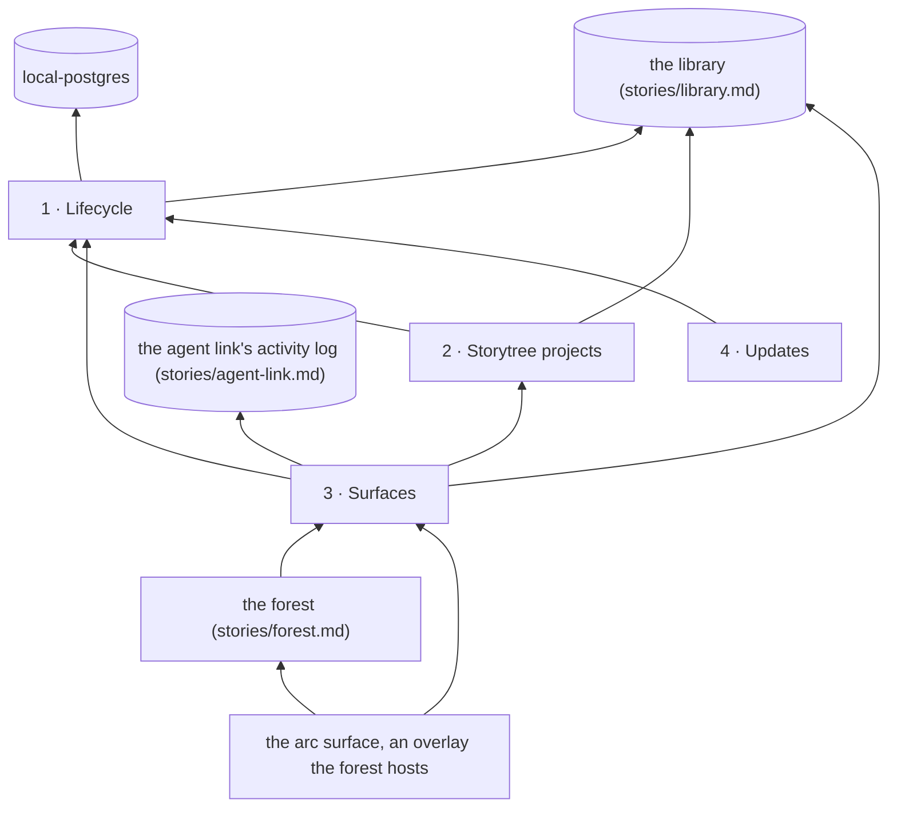

# Story: the app

**What it is.** The app is storytree 0.3's desktop window. It starts and stops the database that
holds every project's library, lists the storytree projects on the computer and shows one at a
time, and hosts the surfaces that show the project on show: the forest, with the arc surface as an
overlay the forest hosts. The page inside it cannot reach the database, so the app carries
everything a surface reads. It keeps itself up to date (capability 4, added 2026-09-27, ADR-0637).

**Approved** by the owner on 2026-09-26. The tree below is ADR-0634 in storytree 0.2's decision log
(`storytree-ai/storytree02`), approved through the question `oq-0-3-app-capability-tree`
(revision 2), and reconciled with ADR-0633, which he decided the same day. Names and scope come from
that record; change them there first.

**Why it is a story of its own.** The app was built before it had a story, in the library arc's
desktop-app step. Answering the forest's review, the owner said "yes we need a storynode for the app
and arc and forest surfaces can depend on it" (ADR-0632 D4). So the app's frame is this story's, and
the forest and the arc surface sit inside it.

**Growing storytree 0.3 comes first** (ADR-0634 D4, the owner's). The work that serves a user
growing their own project waits until storytree 0.3 is in a good place, and is due before first
users. It is parked as `0-3-app-users-own-projects`: the project list keeping itself current, which
project a user's app shows, the first-run fix, the empty app telling a user how to add a project,
and the `storytree` default giving way to "the project just set up, or the one last opened"
(ADR-0625). Nothing of it is cut; only the order moved.

**Rule for building it: port behaviour, not code.** Storytree 0.2's desktop app (`apps/desktop` in
`storytree-ai/storytree02`) is the behavioural reference where the two do the same job. It was a
shell around 0.2's hosted studio, with a Claude login in the system keychain; 0.3's app is a window
onto a local library. Nothing is copied from it wholesale. The app reaches the library only through
its public API (`stories/library.md`, capability 7), and the agent activity log only through the
agent link's (`stories/agent-link.md`, capability 2).

**How each capability is proven.** Lifecycle and Storytree projects were built before this story
existed, so there is no red to observe (ADR-0623): each rests on existing tests, named with its
contracts. Surfaces' new parts are proven red→green, as for the other stories. Their tests are
written and committed first, and seen failing (`red(surfaces): …`). Then the code that makes them
pass is committed (`green(surfaces): …`).

**How 0.3's own library shows this story's health.** `pnpm seed:library` judges a story only by the
tests in its own package, `packages/<name>/src`, matched by contract number. So the app's parts that
are plain logic, apart from Electron, live in `packages/app` (`@storytree/app`), as the forest's do
in `packages/forest`, and Surfaces' new contracts are judged by their tests there. `apps/desktop`
stays the app itself: Electron's main process, the preload and the page. Lifecycle's and Storytree
projects' contracts are proven by tests that `local-postgres`, the agent link and the page hold,
under those packages' own numbering, so the seed leaves them not checked. They are built and tested;
the seed just cannot count those tests for this story.

**The owner's choices** (ADR-0634):
- **A1:** the tree as drawn, three capabilities.
- **N1:** capability 1 is named **Lifecycle**, the standard name for an app starting, running and
  stopping. It covers the stopping and the one-owner rule that "system startup" would leave out.
- **Surfaces** is his word for capability 3: "the app hosts different surfaces".
- **Storytree projects** is his rename of "Switching projects".
- **L1:** the app passes the live reading through. The reading itself stays the arc surface's.
- **D4:** growing storytree 0.3 comes first, and users' own projects wait (above).

Build order: 1 → 2 → 3 → 4.

---

## 1 · Lifecycle

When the app opens it starts the database that holds every project's library, and it keeps it running
until the app is quit: closing the window leaves both running in the background, with a tray icon
whose Quit is the one way to stop them, so agents' work is still recorded. There is one owner at a time: opening the app again brings its window forward, another
program holding the database is named, and while it runs the app leaves notes saying where the
database is and how to open the app, which is how an agent's session finds it or opens it.

- **Depends on:** nothing in this story. It starts the database through `local-postgres`, and
  connects the library through the library's `connect`.
- **Its shelf,** founding book first:
  - **Founding book** (ADR-0621 D4 and D5, ADR-0626 D8): a local Postgres shipped inside the app,
    kept in its own folder (`~/.storytree/0.3`), and never touching 0.2's files.
  - The app owns the database, and the library is only handed its address (ADR-0621 D5).
  - A cloud database exists in the library as an alternative (its capability 8), but the app does
    not offer it in the MVP (ADR-0621 D4, option E1; ADR-0625 D4).
  - The app keeps recording while its window is closed (ADR-0636 D3, the owner's, answering d1 of
    `oq-0-3-cuts-awaiting-owner-decision`): closing the window leaves the app and its database
    running, with a tray icon to quit. 0.2 never had the gap, because its database never stopped.
  - The app updates itself (ADR-0637 D2, the owner's, answering d2): capability 4, Updates.
  - Noticing a stopped database and starting it again in place, as 0.2's studio did, waits
    (ADR-0637 D3, d3): revisit if the database proves unstable in use.
- **As built** (`0-3-desktop-app-shows-the-library`): `apps/desktop`'s main process starts the
  app's own Postgres through `local-postgres`, on `~/.storytree/0.3/pgdata` (or under
  `STORYTREE_HOME`), connects the library, and stops Postgres when the app quits. A second copy of
  the app hands over to the first, whose window comes forward. When another program holds the
  database, the window names it and says to close it. While the app runs, `local-postgres` keeps an
  owner record beside the data (who holds it, and on which port), and the app records how it was
  started in `app.json`. The agent link reads the first to find the database and the second to open
  the app.
- **As built** (`0-3-app-keeps-running-when-closed`, ADR-0636 D3): closing the last window no
  longer quits. The app keeps running with a tray icon (Open storytree 0.3, Quit storytree 0.3);
  Quit, or the system asking the app to end, stops Postgres once and exits only after it has
  stopped. Opening the app again, clicking the icon or choosing Open brings the window back, opened
  again on the project it first showed if it was closed. The policy is `background` and `TRAY_MENU`
  in `packages/app` (`src/lifecycle/`); `apps/desktop` wires them to Electron.
- **Proved by** existing tests: contracts 1 to 3 by `local-postgres`'s own
  (`packages/local-postgres/src/local-postgres.test.ts`), and 4 to 6 by the agent link's 1.4, 1.5
  and 8.3. Those tests carry their own packages' numbering, so `pnpm seed:library` leaves these
  contracts not checked. Contract 7 is proven red→green in `packages/app`, so the seed judges it.

**Contracts:**
1. Starting runs the database on the app's data folder, it answers at the address handed back, and
   stopping stops it.
2. A second start on a data folder that a live process holds is refused, naming that process, and
   its database is left running.
3. A database left running by a process that died is stopped and replaced, and a dead owner's record
   alone is cleared.
4. With the app's database stopped, an agent's session asking where to send its activity is told
   "storytree isn't running" in well under a second.
5. A leftover address from a crashed app counts as not running: the answer comes in well under a
   second and never hangs.
6. With storytree closed, an agent's session start opens it.
7. Closing the window leaves the app and its database running, and the tray's Quit is the one way
   to stop them: it stops the database once, and the app exits only after it has stopped.

## 2 · Storytree projects

The app lists the storytree projects in its database and shows one at a time, and the Project list
at the top right moves the whole app to another project in place. It also decides which project is
on show when the app opens.

- **Depends on:** 1. It reads the library's `listProjects` and `projectTree`.
- **Its shelf,** founding book first:
  - **Founding book** (ADR-0632 D4 and D3): the switcher belongs to the app, outside the surfaces,
    and every surface shows the project it picks.
  - Growing storytree 0.3 comes first (the owner's, ADR-0634 D4). So the switcher stays as built,
    and the app keeps opening on 0.3's own project, until 0.3 is in a good place.
  - **Decided, waiting** (ADR-0625, Consequences; moved here by ADR-0632 D4): "the project just set
    up, or the one last opened" replaces the `storytree` default, when the users' work comes back.
  - **Parked with the users' work:** which project a user's app shows (the old choice O). It is put
    to the owner when that work comes back. The options were: the one you last chose, with a yes
    counting as choosing; the agent's own project; or only what you pick.
- **As built:** the Project list is read once, when the window opens, and lists only projects.
  Choosing another project redraws the page for it, in place. The app opens on `--project <name>`,
  else on storytree 0.3's own project (`storytree`), else the first. Nothing is new here now: the
  users' work is parked (above). That work includes the first-run gap, read from the code and not
  yet seen live: the agent link's setup check opens the app before the user's yes creates the
  project, and the list is read once, so a user's first project appears only after a restart. It
  cannot happen to storytree 0.3's own project, which already exists.
- **Proved by** the page's existing test of the switcher (`apps/desktop/src/view/view.test.ts`).
  It is the page's test, not this story's package's, so `pnpm seed:library` leaves the contract not
  checked.

**Contracts:**
1. The Project list lists every project, with the one on show selected.

## 3 · Surfaces

The app's window hosts the surfaces for the project on show: the forest, which the app opens on
(until it lands, today's plain list), with the arc surface as an overlay that the forest hosts. The
page cannot reach the database, so the app carries everything a surface reads to it, and tells the
surfaces when the project changes.

- **Depends on:** 2, for the project on show, and 1. It reads the library's `projectTree` and
  `changesSince`, and the agent activity log's lines since a point (the agent link's capability 2).
- **Its shelf,** founding book first:
  - **Founding book** (ADR-0632 D1 row 3; ADR-0633 D3 item 14): the forest is the surface the app
    opens on, and the forest hosts the arc surface as an overlay. There is no Forest | Arcs toggle.
  - **L1** (ADR-0634 D3): the live reading stays the arc surface's, and the app only carries what
    it reads. The app owns no timing.
  - A lane that reaches a shared piece first builds it under the other tree's capability name
    (ADR-0632 D3). So the forest and arc surface lanes may build Surfaces' new parts first.
  - Decided with the tree: nothing a surface shows reaches the database directly. Every read goes
    through the app.
  - Decided with the tree: the smoke check checks the surface on show, and each surface says what
    must be on it, under its own proofs.
- **As built** before this story (`0-3-desktop-app-shows-the-library`): the window, a sealed-off
  page that never navigates away or opens another window; the top bar with the Project list; today's
  plain list as the only surface; the page's two reads, the projects and a project's tree, with a
  name that is not a project refused; and the smoke check (`pnpm desktop:smoke`), which opens the
  app without showing it, saves a screenshot, prints the page's text, and passes only if every story
  and capability of the project rendered.
- **New in this story:**
  - the app carries what the live reading asks for (L1): the library's changes and the agent log's
    new lines since a point, for the project on show;
  - the smoke check judges the surface on show by what that surface says it drew.
- **As built** (this story): `pageReads` in `packages/app` answers all four of the page's reads.
  The page reaches the two new ones as `window.storytree.changesSince(project, cursor)` (the
  library's `changesSince`) and `window.storytree.linesSince(project, cursor)` (the agent log's
  `since`). Each returns what came after the cursor, and the cursor to pass next time; 0 reads from
  the start. A name the library does not list is refused before anything is opened, so asking never
  creates a project. The app opens each project's library, and the log, the first time they are
  asked for. Once a surface has drawn a project, it says what it drew in the page's
  `document.body.dataset.drew`, as JSON: `{ surface, stories, capabilities }`, by id, plus any fields
  of its own. The plain list says it as `"list"`. `smokeProblems` in `packages/app` passes the check
  only if every story and capability of the project is in it, and `pnpm desktop:smoke` runs it in
  the real app. The check no longer judges by the page's text, since a surface drawn on a canvas, as
  the forest will be, has none to search.

**Contracts:**
1. The page can ask the app for the library's changes and the agent log's new lines since a point,
   for the project on show, and only newer ones come back.
2. A name that is not a project is refused, and never created.
3. The smoke check, pointed at the surface on show, passes only if that surface says it drew every
   story and capability of the project.

---

## 4 · Updates

The app keeps itself up to date by itself: on the owner's machine it runs from its own copy of
merged main, notices new merges within a few minutes, and rebuilds and restarts itself in the
background, so it never runs unmerged work and nobody rebuilds it by hand. Before first users, an
installed app does the same from published releases.

- **Approved** by the owner on 2026-09-27, as worded above ("Yes, build it"), added to the tree
  ADR-0634 approved. The capability is ADR-0637 D2, the owner's answer to d2: "Can't we also bring
  an auto update feature for 0.3? … i'd hope it works better than 0.2 which seems to constantly
  need updating every time main moves."
- **Depends on:** 1. Restarting stops and starts the database, as quitting and opening do.
- **Its shelf,** founding book first:
  - **Founding book** (ADR-0637 D2): the app keeps itself current. Two halves: for storytree 0.3's
    own development now, the app follows merged main; for users, before first users, an installed
    app updates itself from releases published off merged main. The split is the recording
    session's.
  - 0.2's reference and its pain: ADR-0181's pinned-main runtime, refreshed by hand as main moved,
    and ADR-0207's electron-updater feed, planned and never built.
  - **Parked** with the users' work (`0-3-app-users-own-projects`, due before first users): the
    users' half. It needs an installer (NSIS on Windows), since electron-updater cannot update
    today's portable exe, and `dist.mjs`'s Windows arm64 7z workaround will matter there.
- **As built** (`0-3-app-updates-itself`, the first half): `pnpm app:follow-main` sets it up once,
  with the app quit. It clones the repository into the app's runtime folder
  (`~/.storytree/0.3/runtime`: a bare clone, `repo.git`, and two build slots, `a` and `b`), builds
  main's commit in slot `a`, and starts the app from there in the background. From then on, the app
  run from a slot checks every three minutes: it fetches main, and only main. When main has moved,
  it checks out main's new commit in the other slot and builds it there (`pnpm install`, Electron's
  binary, the bundle), and then restarts into it, with its window shown only if it was showing. A
  failed build is logged and tried again at the next check, and the running app is untouched. The
  app records each start in `app.json`, so an agent's session start opens the current slot. The app
  run from anywhere else, such as `pnpm desktop` in a checkout, never updates itself. The logic is
  `packages/app`'s `src/updates/follow-main.ts`.
- **Proved by** `packages/app/src/updates/follow-main.test.ts`, red→green, against real git with a
  throwaway origin and a stand-in build.

**Contracts:**
1. When merged main moves, the app is built at main's new commit beside the one running, and work
   not merged to main is never run.
2. A build that fails leaves the running app as it is.

## Also out of this story

- **The live reading** (the asks every two seconds or so, and the clock checked once a minute)
  belongs to the arc surface's tree (ADR-0632 D3, ADR-0634 D3). The forest uses it too. The app
  carries its reads and owns no timing.
- **The overlay.** The forest hosts the arc surface as an overlay (ADR-0633 D3 item 14), and the arc
  surface draws it.
- **Replacing the plain list with the forest** is the forest's (`stories/forest.md`, capability 3).
- **Users' own projects** wait until storytree 0.3 is in a good place (ADR-0634 D4), parked as
  `0-3-app-users-own-projects`, due before first users.
- **The app's agent-written cuts**, d1 to d3, are decided (ADR-0636 D3, ADR-0637): d1, keeping
  the app recording with its window closed, is built (Lifecycle, contract 7); d2, the app updating
  itself, is capability 4, Updates; d3 waits.
- **Left out by the owner's own decisions** (ADR-0634 D5): 0.2's one shared cloud database
  (ADR-0621 D4, option E1; ADR-0625 D4); 0.2's desktop app keeping a Claude login in the keychain,
  with a backend beside the hosted studio (ADR-0625 D1 and D4); and the terminal, a note browser and
  0.2's forest (ADR-0625 D4). Creating, renaming or deleting projects from the app, and two projects
  side by side, were never 0.2 behaviour, because 0.2 had no projects, so they are not cuts.
