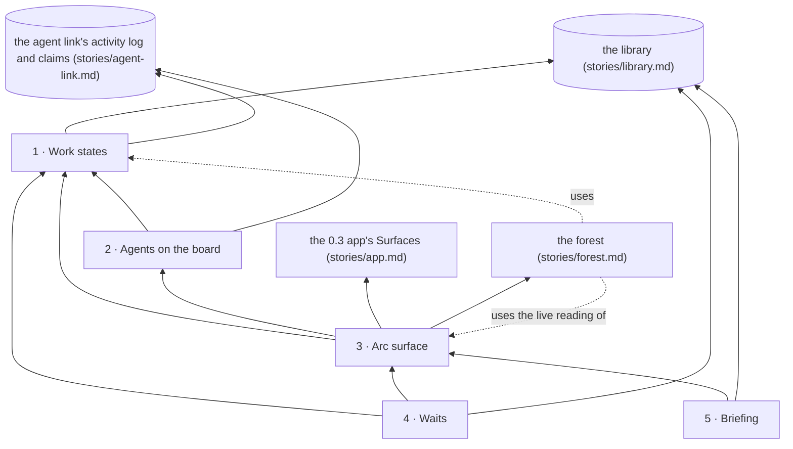

# Story: the arc surface

**What it is.** Over the forest, one read-only overlay shows each arc of the project as a lane,
with a bar for each of its increments: what has landed, what an agent is on right now, what is
queued behind other work, and what is waiting on you. Picking an arc opens its briefing, with what
the arc is about and the questions waiting on your answer, and every state is worked out from what
storytree has recorded, never typed in.

**Approved** by the owner on 2026-09-27. The tree below is ADR-0638 in storytree 0.2's decision log
(`storytree-ai/storytree02`), approved through the question `oq-0-3-arc-surface-capability-tree`
(revision 9) with "approved, please cut fresh sessions for all work on 0.3 that can now proceed".
Names and scope come from that record; change them there first.

**Rule for building it: port behaviour, not code** (ADR-0633 D2). 0.2's arc surface is ported whole,
as an overlay over the forest rather than a separate view behind a toggle (ADR-0633 D3 item 14). Its
behavioural reference is 0.2's `apps/studio/src/components/ArcSurface.tsx`,
`apps/studio/src/lib/arcSurface.ts` and `packages/arc/src/arc-rollup.ts`. It is read-only: the owner
answers by telling his agent, and nothing on the overlay writes. It reads the library only through
its public API (`stories/library.md`), the agent link only through what it records
(`stories/agent-link.md`), and reaches both through the reads the 0.3 app carries for the page
(`stories/app.md`, capability 3). It adds nothing to the library or the agent link of its own.

**How each capability is proven.** Red→green, under minimal viable TDD (ADR-0623). Each
capability's tests are written and committed first, and seen failing (`red(<capability>): …`).
Then the code that makes them pass is committed (`green(<capability>): …`). All but three proofs
are plain functions tested with made-up records, with no database and no app; the other three
(3.4 to 3.6) run in the app with its database.

**The owner's choices** (ADR-0638):
- **B1:** in progress means started and not landed, at part and increment grain. A part starts at
  its first claim, an increment when it is started, and a release leaves it in progress with nobody
  on it.
- **D1:** an idle holder still holds, and nothing ever reads as free to take.
- **C0:** no health on the overlay, as in 0.2. Health stays on the forest.
- **A:** a proposal means not built yet, and never waits on the owner. Only work held on a question
  he has not answered waits on him. There is no approval step for proposals.
- **Increment colours:** green landed; red anything not completed (failed, withdrawn, or closed with
  nothing recorded); yellow waiting or blocked (on his answer, or on other work); grey open. The
  record keeps which kind of close it was, and the hover shows it.
- **L:** the floor-health lamp (0.2's ADR-0314 D7) is not in the MVP overlay and not cut. It comes
  back later, reworked (`0-3-floor-health-lamp-reworked`).
- **Claims:** capability claims and increment-level claims, as in 0.2. An arc reads "claimed" when a
  live session holds any claim on its work, and several sessions may work one arc at once.

Build order: 1 → 2 → 3 → 4 → 5 (4 and 5 in either order).

**What is built so far.** Capability 1 at part grain (contracts 1.1 to 1.3), and the live reading
of capability 3, in `packages/arc-surface` (`@storytree/arc-surface`). The forest reads both
(`stories/forest.md`, ADR-0632 D3), and the forest's lane built them here, under this tree's names. The increment and arc
grains of Work states, and capabilities 2, 4 and 5, wait for the library's and the agent link's
revised trees, which store and read increments, questions and waits (ADR-0638 D4).

---

## 1 · Work states

Every part, increment and arc shows exactly one state, worked out by one rule from the records, so
no two views, and no two lines of one view, can disagree. A part is planned, in progress or landed;
an increment, once closed, is landed or not completed (failed, withdrawn, or closed with nothing
recorded), and before that is waiting on you, queued, held by an agent or open; an arc is waiting,
blocked, claimed, idle, quiet, parked or closed.

- **Depends on:** nothing in this story. It reads the library's records (stories and parts, arcs,
  increments and open questions, and whether each wait still holds, by the library's own reading),
  the agent activity log's claimed and landed lines (the agent link's capability 2), and the agent
  link's claim reading (its capability 5, with increment claims added).
- **Its shelf,** founding book first:
  - **Founding book (ADR-0632 D3):** one rule per kind of work, shared with the forest, which reads
    the part states.
  - **B1:** in progress means started and not landed, at both grains.
  - **D1:** an idle holder still holds, and nothing ever reads as free to take.
  - **Four colours for an increment** (the owner, 2026-09-27): green landed, red not completed,
    yellow waiting or blocked, grey open.
  - **A:** a proposal means not built yet, never waiting on the owner.
  - **Ported from 0.2:** green only for a landing (ADR-0564); yellow for work waiting on the owner
    (ADR-0574); one reading per open increment in a fixed order, waiting on you, then queued, then
    held (ADR-0628 D3); the arc states and their order (ADR-0314 D4, with ADR-0351, ADR-0374,
    ADR-0523 and ADR-0535).
- **As built (part grain):** `workStates(lines)` in `packages/arc-surface`, a pure function of the
  agent activity log's lines, so the page can run it. A part's state follows its own claimed and
  landed lines, the latest winning; a story's follows its parts.

**Contracts:**
1. A part no line names is planned. A claim makes it in progress, a landed report makes it landed,
   and a new claim after landing makes it in progress again.
2. A part that is released, or whose window closes, without landing stays in progress, with nobody
   on it.
3. A story is planned while every part is planned or it has no parts, landed once every part has
   landed, and in progress otherwise.
4. A closed increment reads landed only when a landing was recorded or it carries a pull request.
   Every other close, whether failed, withdrawn or closed with nothing recorded, reads not
   completed (red), with the hover naming which. Nothing reads landed merely because it closed.
5. An open increment gets one reading, first match wins: waiting on you (held on a question you
   have not settled; it drops back the moment you settle it), then queued (its own wait, or its
   arc's, still holds), then held (an agent holds it, idle or not), then open. A proposal reads
   open, and never waiting on you. An active increment whose agent released it reads open, still in
   progress, with nobody on it.
6. An arc reads one of seven states, in 0.2's order: closed or parked, as recorded; then waiting (a
   question on it you have not settled); then blocked (its own wait still holds); then claimed (an
   agent on its work is live); then idle (every agent on it is idle); then quiet.

## 2 · Agents on the board

Every increment and part an agent holds shows which agent: Claude Code or Codex, when its window
opened, the reason it gave when it claimed, and whether it is live or idle, and for how long. It
reads the agent link's own claim reading, so the overlay and the claim tool always agree, and an
idle holder still holds its work.

- **Depends on:** 1. It also reads the agent link's sessions and claims (its capabilities 4 and 5),
  with the increment claims its revised tree adds.
- **Its shelf,** founding book first:
  - **Founding book (ADR-0626 D3 and D4):** one holder per piece of work, taken over only once it
    is idle, and a session whose hooks never ran is flagged, never shown as idle.
  - **Ported from 0.2:** an arc's holders are found only through its own work, so an agent is never
    put on an arc it has not touched; a claim is never a sign of health.
  - **Proposed, approved with the tree:** the bar an agent holds carries a small mark, with the
    agent named on hover; 0.2's "unknown" is called "idle" here, with the same meaning (D1).

**Contracts:**
1. An increment Claude Code holds shows "Claude Code", when that window opened, and its reason. Two
   Claude Code windows are told apart by when they opened.
2. After 30 quiet minutes the holder reads "idle for N min" and still holds the increment. Once it
   releases or lands it, its window closes, or its pull request merges, nobody is on it.
3. A Codex holder whose hooks never ran is flagged "hooks not running".
4. An arc's holders are the agents holding its increments, or a part its increments name, and
   nobody else: an agent on a part none of its increments names is not on the arc.

## 3 · Arc surface

Over the forest, one read-only overlay lists each arc of the project as a lane with a bar for each
increment, finished work first, each bar coloured by its work state, a count of what landed and
what is open (never a percentage), and a chip with the lane's state and who is on it; Active,
Parked and Closed each show their own arcs. It stays current while it is open: about every two
seconds it asks for what changed in the library and the agent log, which the app carries to it, and
it re-checks the clock once a minute, so an agent that goes quiet turns idle without any new record.

- **Depends on:** 1, 2. It also sits in the 0.3 app's Surfaces capability, which hosts it and
  carries its reads (the library's changes and the log's new lines for the project on show), and
  over the forest, which hosts the overlay (until the forest lands, today's plain list does).
- **Its shelf,** founding book first:
  - **Founding book (ADR-0633 D3 item 14):** 0.2's arc surface, ported whole, as an overlay over the
    forest, not a separate view behind a toggle. The forest hosts it, and the app hosts the forest
    (ADR-0634).
  - **Ported from 0.2:** a lane per arc, bars that are units not time, and a count that is never a
    percentage (ADR-0314 D1 and D2); read-only (ADR-0314 D9); Active, Parked and Closed, with no
    "All" (ADR-0374 D5).
  - **The live reading is this capability's** (ADR-0632 D3, ADR-0634 D3): the forest uses it, and
    the app only carries its two reads.
  - **C0:** no health on the overlay.
  - **Proposed, approved with the tree:** the lane chips "waiting" and "blocked" are yellow, matching
    the bars; the count says "open" where 0.2 said "queued", so "queued" means only waiting on other
    work; the smoke check judges this surface by what it says it drew (ADR-0634 D2).
- **As built (the live reading):** `liveReading(options)` in `packages/arc-surface`. It reads
  everything at once, then about every two seconds asks the app's two reads,
  `changesSince(project, cursor)` and `linesSince(project, cursor)`, each carrying its own cursor
  forward, and hands on only what is new. Once a minute it re-reads the clock even when nothing is
  new, so a holder's quiet time can pass without a record. A failed read is reported and the next
  ask tries again from the same place; it never writes. Its clock and timers are handed in, so its
  own tests use a stand-in clock and no app. Contracts 3.4 and 3.5 are proved in the app once the
  overlay is drawn.

**Contracts:**
1. It opens over the surface on show and closes back to it, and nothing on it writes. While its
   first read is on the way it says so, and a read that fails says so rather than drawing an empty
   board.
2. Each lane has one bar per increment, finished ones first and then open ones, longest-waiting
   first. Its count reads like "3 landed · 1 not completed · 2 open", skips zeros, and is never a
   percentage.
3. Lanes sort waiting, blocked, claimed, idle, quiet, then the most recently active. An idle chip
   carries its age on its face ("idle · 42 min"), and its hover names who holds what. Active shows
   by default; Parked and Closed show only their own arcs, and there is no "All".
4. In the app: a claim written while the overlay is open shows on it within about two seconds,
   without reopening.
5. In the app: with no new line, a holder turns idle once the quiet time passes. The test uses a
   stand-in clock.
6. In the app: the smoke check, run on a project with an arc whose increment an agent holds, finds
   every arc and increment drawn, and the held one showing its agent.

## 4 · Waits

Every arc or increment that waits on other work says so and names what it waits for: an arc queued
behind another arc folds away under that arc's lane, behind a small arrow, and an increment waiting
on another increment, on any arc, draws yellow and names its blocker and why. A blocker shows what
it holds up, a wait that will never release by itself says so, and an arc with something waiting on
you is never hidden under its blocker.

- **Depends on:** 1, 3. It also reads the waits the library stores (arc on arc, increment on
  increment, each with its reason) and its reading of whether each still holds.
- **Its shelf,** founding book first:
  - **Founding book (ADR-0633 D3 item 3; ADR-0628 D6):** arc waits and increment waits, as 0.2 has
    them. A waiting increment shows as queued, not takeable, and names what it waits for.
  - **A wait refuses a claim** on the waiting work (ADR-0633 D3 item 4). The agent link refuses it;
    the overlay shows the wait.
  - **Ported from 0.2:** queued arcs fold under their blocker, a chain draws arrows and a set does
    not, with "+N" and "+1 other wait" (ADR-0523); a wait never hides a question (ADR-0314 D3); a
    wait releases when its blocker lands, and keeps holding if the blocker closed without landing
    (ADR-0628 D2).
  - **Yellow** for an increment waiting on other work (the owner, 2026-09-27), with its blocker named
    on hover.
  - **Proposed, approved with the tree:** the queue shows each arc's title, since 0.3's ids are
    generated; a wait's reason shows on hover.

**Contracts:**
1. An arc waiting on an open arc appears only under that arc's arrow, not also at the top. Once the
   blocker closes it returns to the top, with nothing written.
2. A one-behind-one queue draws as a chain (A → B → C). Two arcs behind one blocker draw as a set,
   with no arrow between them. A queued arc that holds up others carries "+N", and one also waiting
   on another arc says "+1 other wait".
3. An arc with a question waiting on you stays at the top while it waits on another arc, and its
   other open bars still read queued.
4. An increment waiting on another names it, its arc and the reason, and the blocker names what it
   holds up. If the blocker closed without landing, or cannot be found, the wait says it will not
   release by itself.

## 5 · Briefing

Picking a lane, or a queued arc, opens its briefing: what the arc is about, then the questions
waiting on your answer there, with the questions you have settled below, under their answers. A
question opens in place, statement first, with its stakes, diagram, options as for and against, a
recommendation marked not binding, and the longer parts folded with their word counts, so you can
read it whole without leaving the overlay.

- **Depends on:** 3. It also reads the library's arc (its intent) and its questions, with all their
  fields.
- **Its shelf,** founding book first:
  - **Founding book (0.2's ADR-0314 D3):** the briefing is where the owner acts, so it shows what is
    waiting on him.
  - **The briefing holds the arc's description and its open questions, and nothing more** (the
    owner, in 0.2 and again on 2026-09-27). Proposals are not listed, because a proposal is not
    waiting on him.
  - **Open questions are in the MVP** (ADR-0633 D3 item 2).
  - **Ported from 0.2:** settled questions stay, under their answers (ADR-0434 D3); a question is
    read in place, with its word counts.
  - **Proposed, approved with the tree:** the intent shows in full, in place, since 0.3 has no note
    browser to link out to (ADR-0625 D4).

**Contracts:**
1. Picking an arc shows its intent, then its open questions under "Waiting on you", or "Nothing is
   waiting on you here", then a note that "blocked" comes only from waits. The overlay opens on the
   first arc with a question waiting on you.
2. A question opens in place: statement first, then stakes, the diagram or "no diagram stored",
   options split into for and against, the recommendation marked not binding, and analogy and
   context folded with their word counts. Each row in the list shows its word count and whether it
   has a diagram.
3. A settled question moves under "Settled" with its answer, and stops counting as waiting.

## Also out of this story

- The floor-health lamp: not cut, parked to come back reworked (L above).
- Anything that writes: the overlay is read-only.
- Health: it stays on the forest (C0).
- What the library and the agent link add for this story (increments, open questions, waits and
  their readings, increment claims) is theirs, decided in their own revised trees
  (`0-3-library-tree-for-adr-0633`, `0-3-agent-link-tree-for-adr-0633`).
