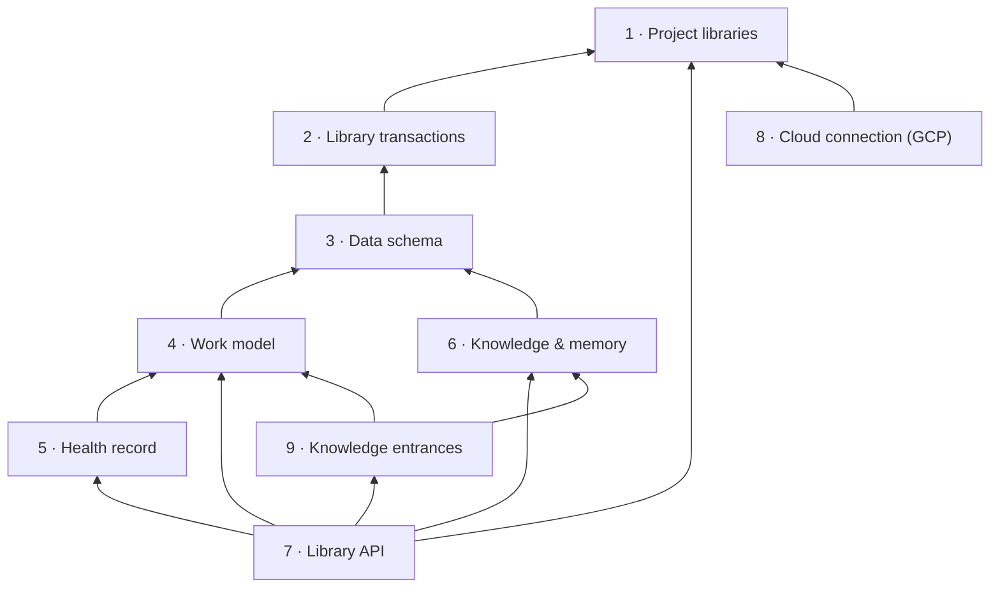

# Story: the library

**What it is.** The library is where one project's records live: the plan of work, how healthy
each piece is, and what the project has learned. Every later storytree 0.3 story reads and writes
the library, and only through its API. People never browse it directly; they see it through the
forest and the arc surface, while agents reach it through the agent link.

**Approved** by the owner on 2026-09-26. The tree below is ADR-0621 in storytree 0.2's decision log
(`storytree-ai/storytree02`). Names and scope come from that record; change them there first.
Capability 9 was added on 2026-09-26 by ADR-0627 in the same log.

**Rule for building it: port behaviour, not code.** Storytree 0.2's `packages/library` and
`packages/storage-protocol` are the behavioural reference. Nothing is copied from them wholesale.

**How each capability is proven.** Red→green. Each capability's tests are written and committed
first, and seen failing (`red(<capability>): …`). Then the code that makes them pass is committed
(`green(<capability>): …`). The git history is the evidence that the red came first.



Build order: 1 → 2 → 3 → (4, 6) → 5 → 7, then 8, then 9.

---

## 1 · Project libraries

Each project gets its own library, a separate database on one Postgres server, created the first
time the project is opened, with its tables set up automatically. Storytree can list the projects on
the server, and nothing written in one project can ever show up in another.

- **Depends on:** nothing.
- **Leaves out (vs 0.2):** Cloud SQL and Google sign-in (that is capability 8), credential
  hydration, the remote store door, 0.2's single shared database with no idea of a project.

**Contracts** (each one a test):
1. `openProject("site")` on a server with no storytree databases creates the project's database and
   its tables.
2. Opening the same project again succeeds and changes nothing (no error, no second database, its
   records are untouched).
3. After opening "site" and "app", `listProjects()` returns exactly `["app", "site"]`. Databases on
   the server that are not storytree projects are never listed.
4. A record saved in "site" cannot be read from "app".
5. A project name that is not lower-case letters, digits and single hyphens (1–40 characters,
   starting with a letter or digit) is refused before anything touches the server, and the error
   names the rule.

## 2 · Library transactions

The only data actions the library allows are: save a record, fetch it, list records of one type,
change only named fields, or retire a record with a reason. Every change is all-or-nothing, and is
written first to a permanent, append-only history, so nothing is ever truly erased.

- **Depends on:** 1.
- **Leaves out (vs 0.2):** the HTTP transport, the separate drift/change store, and the
  whole-document "replace" edit that caused 0.2's lost-update bug. **Kept on purpose:** an
  in-memory twin that runs the SAME test suite as Postgres, so later stories can test without a
  database.

**Contracts** (one shared behaviour suite, run against BOTH the in-memory twin and Postgres):
1. `save` creates a record. Saving the same id again replaces it, and each save appends one history
   entry.
2. `edit` changes only the fields it names; every other field keeps its stored value.
3. `edit` merges onto what is stored NOW, not onto a copy the caller read earlier. If two edits of
   different fields race, both survive.
4. `edit` of a missing record returns `null` and creates nothing.
5. `get` of a missing record returns `null` and never throws.
6. `list(type)` returns only that type's current records (none retired), and `[]` when there are
   none.
7. `retire(id, reason)` removes the record from `get`/`list`, keeps the reason in the history, and
   retiring an already-retired or missing record is a harmless no-op.
8. `history()` returns every change in the order it happened, with strictly increasing sequence
   numbers. `history({ id })` filters to one record, and `history({ since })` returns only entries
   after that sequence number.
9. A `validate` check passed to `save`/`edit` sees the merged result. If it throws, nothing is
   written (no record change and no history entry).

## 3 · Data schema

Every record has a declared type with a fixed set of fields, and a badly filled-in record is refused
with a message naming the problem field. Every record is stamped with the schema version it was
written on, so a later change to a type is handled deliberately rather than silently misread.

- **Depends on:** 2.
- **Types at version 1:** `arc`, `story`, `capability`, `contract`, `health`, `memory`, `decision`,
  `definition`. A decision's optional `frontCoverOf` field (capability 9) was added at version 1:
  every decision written before it still fits the type, so it is not a new version.
- **Leaves out (vs 0.2):** fourteen knowledge kinds, generated renderers and templates, and the
  upgrade machinery. 0.3 starts at version 1 and adds an upgrade step only when the first real
  change happens.

**Contracts:**
1. Saving a `story` with no `title` is refused, the error names `title`, and nothing is written.
2. An unknown field (for example `titel`) is refused and named.
3. An unknown type is refused.
4. Every stored record carries its schema version (1 today).
5. Reading a record stamped with a version NEWER than this code knows is refused with an error
   saying so. It is never guessed at.
6. An `edit` that would leave the record invalid (for example blanking a required field) is
   refused, and nothing is written.

## 4 · Work model

The library holds each project's plan of work: arcs (initiatives), stories (what a user can do),
capabilities (the parts that make a story work) and contracts (single testable promises).
Capabilities and contracts point at their parent. Stories belong to the project directly, and an arc
*may* list the stories it grows, though a research arc may list none. The library refuses broken
structure.

- **Depends on:** 3.
- **Leaves out (vs 0.2):** story files mirrored from the repo (the library is the only copy), arc
  increments, UAT walkthroughs, proof modes, code anchors, and ADR number lists.

**Contracts:**
1. Add a story, a capability under it and a contract under that, and `projectTree()` returns them
   nested: story › capability › contract.
2. An arc listing that story is returned by `arcsFor(storyId)`. An arc listing no stories is
   accepted.
3. A capability naming a missing (or retired) story is refused, as is a contract naming a missing
   capability and an arc listing a missing story.
4. A capability depending on another capability that does not exist is refused.
5. A dependency loop between capabilities (A → B → A, or longer) is refused, and nothing is
   written.

## 5 · Health record

Every story, capability and contract has a health record with two separate columns: what the agent
**reported**, and what storytree **verified** by seeing it for itself. Each column is one of three
states: `passing`, `failing` or `not-checked`. A missing entry always reads as `not-checked`, never
as `passing`.

- **As built:** health is *recorded* on contracts and *derived* for capabilities and stories (the
  roll-up in contract 4 below), so a story or capability never carries a second, conflicting source of
  health; writing health straight onto one is refused with a message saying it rolls up.
- **Depends on:** 4.
- **Leaves out (vs 0.2):** signed verdicts, the prove-it spine, anchors, drift and attestations.
  Also left out is **running the tests**: the library only *stores* the verified result, and a later
  story decides when to run a story's tests and writes it.

**Contracts:**
1. A node with no health entries reads `reported: not-checked, verified: not-checked`.
2. After an agent reports a contract `passing`, it reads `reported: passing, verified:
   not-checked`.
3. After storytree records the same contract verified `failing`, both columns are kept and shown
   side by side (`reported: passing, verified: failing`).
4. A capability or story's health is rolled up from its contracts, column by column: `failing` if
   any contract is failing; `passing` only if it has at least one contract and every one is
   passing; otherwise `not-checked`. A single never-checked contract keeps its story `not-checked`.
5. Every health entry is kept in history with who wrote it and when. A health entry for a node that
   does not exist is refused.

## 6 · Knowledge and memory

Alongside the plan, the library keeps what the project has learned: memory notes, decisions and
definitions of terms. Each can link to the other notes it relates to, and you can find them again
by searching their words. A note never links straight to the work: capability 9 is how the work
reaches its knowledge.

- **Depends on:** 3.
- **Leaves out (vs 0.2):** the ~1,200-artifact corpus (0.3 starts nearly empty), principles,
  guardrails, agents, processes, friction and open questions as separate kinds, the graduation
  lease, decision status and supersession tags, and ranked "related" search.

**Contracts:**
1. A memory note is found by `search` on any word it contains (case-insensitive).
2. `relatedNotes(noteId)` returns every note, decision and definition that links to that note.
3. Editing a decision keeps its old wording in history.
4. A link to a record that does not exist is refused.

## 7 · Library API

One small, fixed list of functions is the only way anything outside the library reads or writes it.
The agent link, arc surface, forest and desktop app all call these, and `changesSince` lets them see
what just changed without re-reading everything.

- **Depends on:** 1, 4, 5 and 6.
- **Leaves out (vs 0.2):** the Library CLI, the browse UI, the HTTP door, and raw SQL. The MCP server
  belongs to the agent-link story, as a thin wrapper over this API.
- **Extended** on 2026-09-26 by ADR-0626 with three edit functions, `editStory`, `editContract` and
  `editArc`, so that an agent can correct a plan through the agent link's tools without retiring and
  re-adding it. They edit the way `editCapability` and `editNote` already do.

**Contracts:**
1. An end-to-end "agent's day" against a real local Postgres: open a project, create an arc, add a
   story, a capability and a contract, report passing, record verified, record a decision as the
   capability's front cover and write a memory inside it, then read `projectTree()` and
   `changesSince(0)`. Every step is visible where the next step expects it.
2. `changesSince(n)` returns only changes after `n`, in order, each carrying the new cursor to pass
   next time.
3. The package's public entry exports exactly the API (listed below) and nothing else, and its
   internals cannot be imported through the package.
4. `editStory`, `editContract` and `editArc` change only the fields they name, merged onto what is
   stored now, and check a new reference as adding does (a contract's capability, an arc's
   stories). Each gives `null`, writing nothing, for an id that is not a live record of its type.

## 8 · Cloud connection (GCP)

Instead of the local Postgres, a user can point storytree at a Postgres database in Google Cloud
(Cloud SQL) and sign in with their Google account rather than a stored password. Everything above
works the same, and each project still gets its own database, now on the cloud server.

- **Depends on:** 1. It is built after 1–7 work on the local path, and no test of 1–7 depends on it.
- **Leaves out:** every cloud except Google, and sharing one cloud library between several people.
- **Live proof status:** PROVEN LIVE on 2026-09-26. Contract 8.1's suite passed against storytree 0.2's Cloud SQL
  instance (Postgres 16), signed in as the owner's Google account.
- **Setup a Cloud SQL owner does once:** on Cloud SQL (Postgres 16), a Google-account database user can never be given the
  right to create databases, because only Google's internal admin may change such a user. So, once, as the
  instance's `postgres` user: `CREATE ROLE storytree_creator NOLOGIN CREATEDB;` and
  `GRANT storytree_creator TO "<google account>";`. The library borrows that role (SET ROLE) whenever it
  creates a project's database, and its refusal message gives exactly these two lines when the role is
  missing.

**Contracts:**
1. Capability 2's behaviour suite, unchanged, passes against a real Cloud SQL instance reached with
   Google sign-in.
2. A missing or bad Google sign-in is refused with a message saying what to fix, never a hang.

## 9 · Knowledge entrances

Every story and capability has its own shelf of front-cover decisions, and a decision can be a
front cover of one of them at most. Notes link only to other notes, so the only way from the work
into the knowledge is through a front cover.

- **Added** on 2026-09-26 by ADR-0627, the owner's "rabbit-hole" model. The two sentences above are
  the ones he approved.
- **Depends on:** 4 and 6. It adds `frontCovers` to 7's list of functions.
- **As built:** a decision's optional `frontCoverOf` field names the one story or capability it is
  a front cover of. One field names one node, so no decision can be the cover of two, and nothing
  has to check for it. A node's shelf is every live decision naming it, founding (oldest) first.
  Replacing a cover takes ordinary writes: the new decision becomes a cover of the same node and
  links to the old one, then the old one's `frontCoverOf` is removed. It leaves the shelf and is
  still reached from the cover that replaced it.
- **Leaves out:** where an agent's new note goes by default, a founding decision for each new story
  and capability, and reading a shelf title by title. Those are the agent link's tools (ADR-0627
  D4, D5, D7). Showing each part's shelf is the forest's drill-down.

**Contracts:**
1. A decision can be the front cover of a story or a capability, and `frontCovers(nodeId)` returns
   that node's live covers, founding (oldest) first, and nothing else.
2. A front cover that names anything but a live story or capability is refused, and nothing is
   written. Only a decision can be a front cover.
3. A note that links to a story, capability, contract, arc or health entry is refused, and nothing
   is written. Notes link only to other notes.

---

## The API later stories program against

A sketch, not a promise of exact signatures. The shape is fixed by the contracts above.

```ts
const storytree = await connect({ url: "postgres://localhost:5432/postgres" }); // 1 (or a cloud config, 8)
await storytree.listProjects();                        // ["my-website"]
const lib = await storytree.openProject("my-website"); // 1: created the first time

const story = await lib.addStory({ title: "Visitor can sign up" });                  // 4
const arc   = await lib.createArc({ title: "Launch v1", stories: [story.id] });        // 4
const cap   = await lib.addCapability({ title: "Email form", story: story.id });      // 4
const k     = await lib.addContract({ title: "Rejects a bad email", capability: cap.id });
await lib.editContract(k.id, { title: "Rejects an email with no @" }); // 7: correct the plan in place
await lib.reportHealth(k.id, "passing", { by: "agent" });   // 5: what the agent says
await lib.recordVerified(k.id, "failing", { by: "storytree" }); // 5: what storytree saw
const cover = await lib.recordDecision({ title: "Send through Mailgun", text: "Simplest API", frontCoverOf: cap.id }); // 9
await lib.writeMemory({ text: "Mailgun needs a verified domain", links: [cover.id] }); // 6: inside the cover
await lib.frontCovers(cap.id);   // 9: the capability's shelf
await lib.projectTree();          // 4 + 5: what the forest reads
await lib.changesSince(cursor);   // 7: what just changed
await storytree.close();
```
